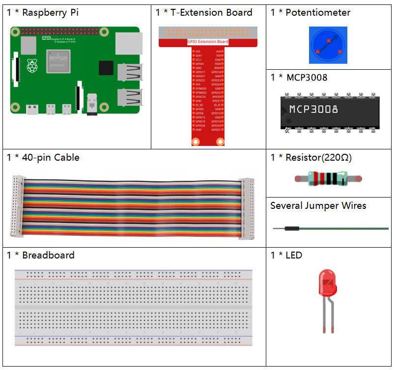
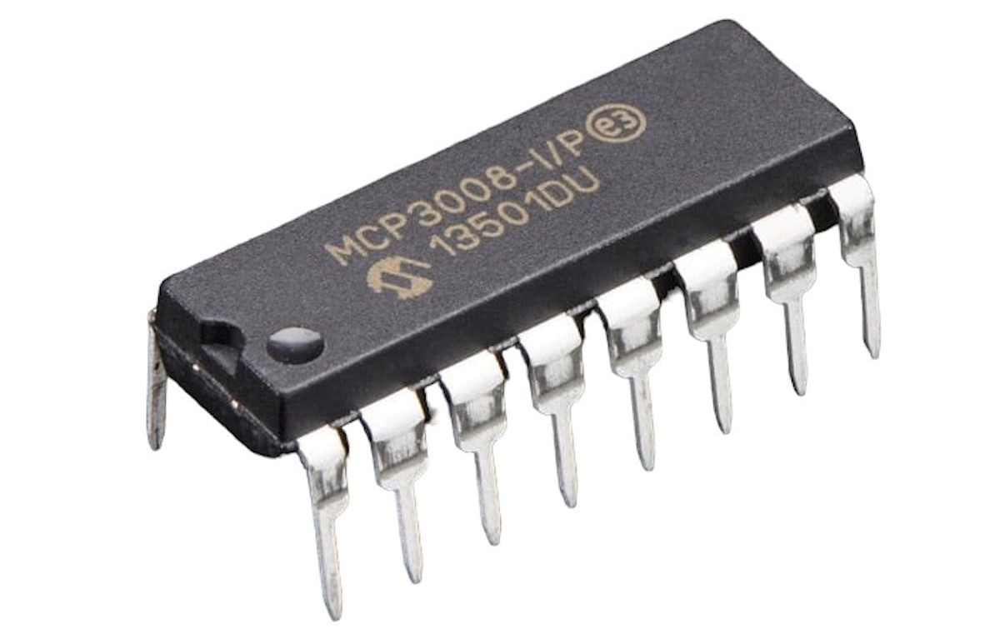
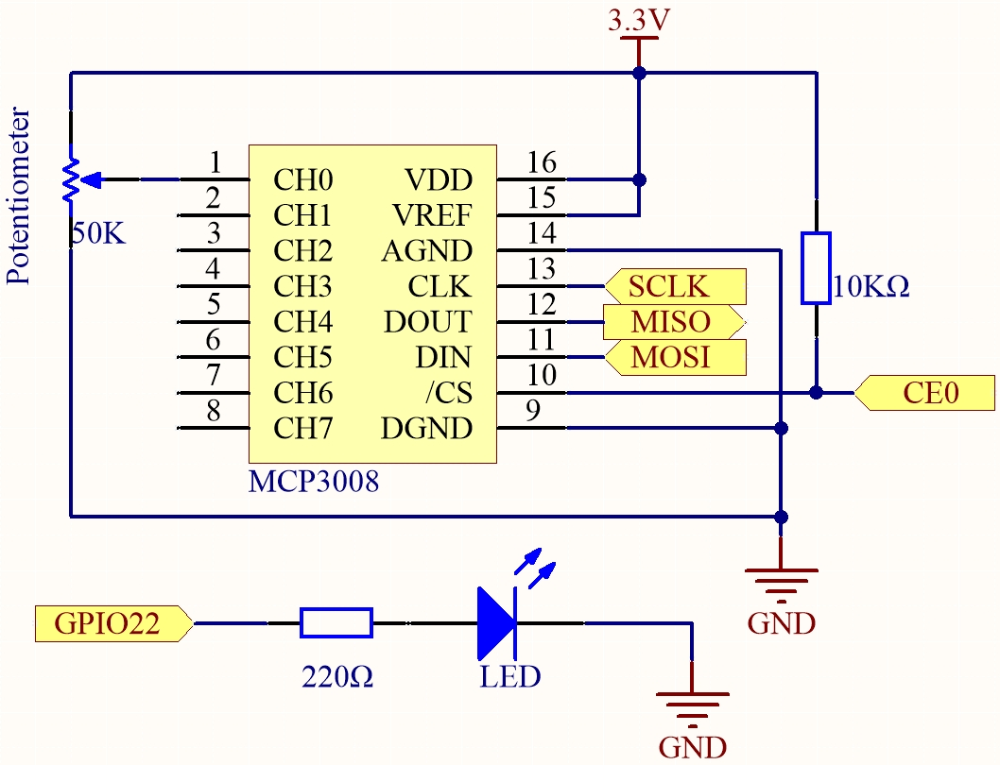
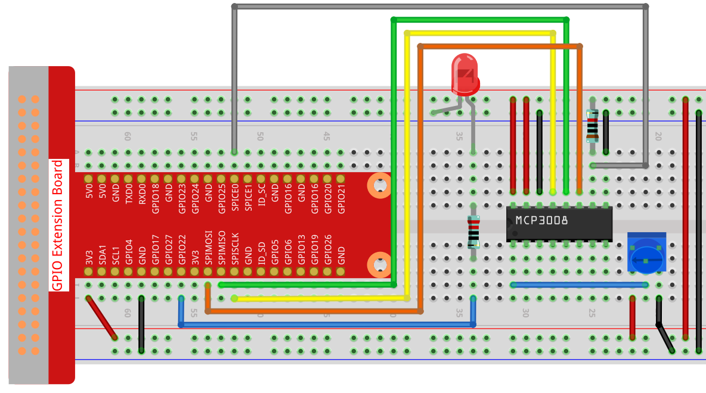

.. note::

    Bonjour, bienvenue dans la communauté Facebook des passionnés de SunFounder Raspberry Pi, Arduino et ESP32 ! Plongez plus profondément dans l’univers du Raspberry Pi, d’Arduino et de l’ESP32 avec d’autres passionnés.

    **Pourquoi rejoindre ?**

    - **Support d’experts** : Résolvez les problèmes après-vente et les défis techniques avec l’aide de notre communauté et de notre équipe.
    - **Apprendre et partager** : Échangez des astuces et tutoriels pour améliorer vos compétences.
    - **Aperçus exclusifs** : Accédez en avant-première aux annonces de nouveaux produits et aperçus.
    - **Réductions spéciales** : Profitez de remises exclusives sur nos derniers produits.
    - **Promotions et concours festifs** : Participez à des concours et à des promotions spéciales pour les fêtes.

    👉 Prêt à explorer et créer avec nous ? Cliquez sur [|link_sf_facebook|] et rejoignez-nous dès aujourd’hui !

.. _2.1.4_c_mcp3008:

2.1.4 Potentiomètre (MCP3008)
================================

.. note::

   .. image:: img/mcp3008_and_adc0834.jpg
      :width: 25%
      :align: left
    

   Selon la version de votre kit, veuillez identifier si vous avez un **ADC0834** ou un **MCP3008** et suivez la section correspondante.

Introduction
------------

La fonction ADC est utilisée pour convertir des signaux analogiques en valeurs numériques.  
Dans cette expérience, nous utilisons la puce ADC MCP3008 pour effectuer cette conversion.  
Un potentiomètre est utilisé pour générer une tension variable, ce qui modifie la grandeur physique.  
Le MCP3008 convertit ensuite cette tension analogique en une valeur numérique pouvant être lue et traitée par le Raspberry Pi.

Composants requis
------------------------------

Dans ce projet, nous avons besoin des composants suivants.

Principe
---------

**MCP3008**

Le MCP3008 est un convertisseur analogique-numérique (ADC) à approximation successive sur 10 bits avec 8 canaux d’entrée et un protocole de communication SPI (Serial Peripheral Interface). Il peut s’interfacer avec un microcontrôleur pour convertir des signaux d’entrée analogiques en données numériques pour un traitement ultérieur.

**Séquence de fonctionnement**

Une conversion sur le MCP3008 commence par la mise à l’état bas de la broche CS (Chip Select), ce qui active la communication avec le composant. Le microcontrôleur envoie ensuite un flux de contrôle de 3 octets via l’interface SPI pour définir la configuration et sélectionner le canal d’entrée.

Le premier octet envoyé contient le bit de démarrage et le bit de sélection simple/différentiel. Les bits suivants indiquent lequel des 8 canaux (CH0–CH7) lire. Les données sont décalées dans le composant à chaque front montant de l’horloge SPI (SCLK) et le résultat de la conversion est renvoyé simultanément.

Un court délai interne est inclus pour permettre la stabilisation du canal sélectionné avant le début de la conversion. Le MCP3008 effectue ensuite une conversion analogique-numérique sur 10 bits à l’aide d’un circuit d’échantillonnage et maintien, ainsi qu’un comparateur à registre à approximation successive (SAR).

Le résultat de la conversion est transmis au microcontrôleur via la ligne MISO (Master In Slave Out). Le bit le plus significatif (MSB) du résultat 10 bits est envoyé en premier, suivi des bits restants. Le microcontrôleur lit le résultat sur le bus SPI pendant ce temps.

Après la transmission complète de la valeur numérique sur 10 bits, le MCP3008 termine le cycle et attend la prochaine commande.

* `Fiche technique de la série MCP3008 <https://www.alldatasheet.com/datasheet-pdf/view/304558/MICROCHIP/MCP3008-ISLASHP.html>`_

.. image:: img/MCP3008detail.png

**Potentiomètre**

Le potentiomètre est également un composant résistif à 3 bornes dont la valeur de résistance peut être ajustée selon une variation régulière.  
Il est généralement constitué d’un élément résistif et d’un curseur mobile. Lorsque le curseur se déplace le long de l’élément résistif, il y a une résistance ou une tension de sortie variable en fonction du déplacement.

.. image:: img/image310.png
    :width: 300
    :align: center

Les fonctions du potentiomètre dans un circuit sont les suivantes :

1. Servir de diviseur de tension

Le potentiomètre est une résistance réglable en continu. Lorsque vous tournez l’axe ou déplacez la glissière du potentiomètre, le contact mobile glisse sur l’élément résistif. À ce moment, une tension peut être fournie en fonction de la tension appliquée au potentiomètre et de l’angle ou de la distance parcourue par le bras mobile.

Schéma de câblage
-----------------

.. list-table::
    :widths: 30 30 30 30
    :header-rows: 1

    *   - Nom T-Board
        - Physique
        - WiringPi
        - BCM

    *   - SPICE0
        - pin24
        - 10
        - 8
    *   - SPIMOSI
        - pin19
        - 12
        - 10
    *   - SPIMISO
        - pin21
        - 13
        - 9
    *   - SPISCLK
        - pin23
        - 14
        - 11
    *   - GPIO22
        - pin15
        - 3
        - 22

Procédures expérimentales
-------------------------

**Étape 1 :** Réaliser le montage.

.. note::
    Placez la puce en vous référant à la position correspondante indiquée sur l’image. Veillez à ce que l’encoche de la puce soit orientée vers la gauche lors de son installation.

Pour les utilisateurs du langage C
^^^^^^^^^^^^^^^^^^^^^^^^^^^^^^^^^^^^^^^^^^^^^^^^^

**Étape 2 :** Ouvrir le fichier de code.

.. raw:: html

   <run></run>

.. code-block::

    cd ~/davinci-kit-for-raspberry-pi/c/2.1.7-2/

**Étape 3 :** Compiler le code.

.. raw:: html

   <run></run>

.. code-block::

    gcc 2.1.7_Potentiometer.c -lwiringPi

**Étape 4 :** Exécuter.

.. raw:: html

   <run></run>

.. code-block::

    sudo ./a.out

Après l’exécution du code, tournez le bouton du potentiomètre : l’intensité de la LED changera en conséquence.

.. note::

    Si cela ne fonctionne pas après exécution, ou si un message d’erreur apparaît : « wiringPi.h: No such file or directory », veuillez vous référer à :ref:`install_wiringpi`.

**Code**

.. code-block:: c

        #include <wiringPi.h>
        #include <wiringPiSPI.h>
        #include <stdio.h>
        #include <softPwm.h>

        #define SPI_CHANNEL 0  // CE0
        #define SPI_SPEED   1000000  // 1MHz
        #define LedPin      3

        int readADC(int channel) {
            if (channel < 0 || channel > 7) return -1;

            unsigned char buffer[3];
            buffer[0] = 1;                             // Bit de démarrage
            buffer[1] = (8 + channel) << 4;            // Mode entrée simple, canal
            buffer[2] = 0;

            wiringPiSPIDataRW(SPI_CHANNEL, buffer, 3);

            int value = ((buffer[1] & 3) << 8) | buffer[2];
            return value;
        }

        int main(void) {
            if (wiringPiSetup() == -1) {
                printf("Initialisation de WiringPi échouée !\n");
                return 1;
            }

            if (wiringPiSPISetup(SPI_CHANNEL, SPI_SPEED) == -1) {
                printf("Configuration SPI échouée !\n");
                return 1;
            }

            softPwmCreate(LedPin, 0, 100);

            while (1) {
                int analogVal = readADC(0);  // CH0
                printf("Valeur ADC : %d\n", analogVal);

                int pwmVal = analogVal * 100 / 1023;  // Normaliser de 0 à 100
                softPwmWrite(LedPin, pwmVal);

                delay(100);
            }

            return 0;
        }

**Explication du code**

.. code-block:: c

    #define SPI_CHANNEL 0  // CE0
    #define SPI_SPEED   1000000  // 1MHz
    #define LedPin      3

On définit le canal SPI comme CE0 (chip enable 0), on fixe la vitesse SPI à 1 MHz et on assigne GPIO3 à la LED.

.. code-block:: c

    int readADC(int channel) {
        if (channel < 0 || channel > 7) return -1;

        unsigned char buffer[3];
        buffer[0] = 1;                             // Bit de démarrage
        buffer[1] = (8 + channel) << 4;            // Mode entrée simple, canal
        buffer[2] = 0;

        wiringPiSPIDataRW(SPI_CHANNEL, buffer, 3);

        int value = ((buffer[1] & 3) << 8) | buffer[2];
        return value;
    }

Cette fonction lit les données analogiques depuis le MCP3008.

* Elle vérifie d’abord si le numéro de canal est dans la plage valide (0 à 7).
* Elle initialise un tableau de 3 octets, où :

  * ``buffer[0] = 1`` : bit de démarrage pour la communication MCP3008.
  * ``buffer[1] = (8 + channel) << 4`` : construit l’octet de configuration pour le mode simple et sélectionne le canal.
  * ``buffer[2] = 0`` : octet de remplissage pour recevoir le résultat.

* ``wiringPiSPIDataRW`` envoie et reçoit les données via le canal SPI.
* La valeur renvoyée est extraite des deux derniers octets grâce à des opérations binaires pour obtenir un résultat ADC sur 10 bits.

.. code-block:: c

    int main(void) {
        if (wiringPiSetup() == -1) {
            printf("Initialisation de WiringPi échouée !\n");
            return 1;
        }

        if (wiringPiSPISetup(SPI_CHANNEL, SPI_SPEED) == -1) {
            printf("Configuration SPI échouée !\n");
            return 1;
        }

        softPwmCreate(LedPin, 0, 100);

        while (1) {
            int analogVal = readADC(0);  // CH0
            printf("Valeur ADC : %d\n", analogVal);

            int pwmVal = analogVal * 100 / 1023;  // Normaliser de 0 à 100
            softPwmWrite(LedPin, pwmVal);

            delay(100);
        }

        return 0;
    }

Dans la fonction principale :

* ``wiringPiSetup()`` initialise la bibliothèque WiringPi.
* ``wiringPiSPISetup()`` configure la communication SPI sur le canal 0 à 1 MHz.
* ``softPwmCreate()`` configure le PWM logiciel sur GPIO3 avec un rapport cyclique initial de 0 et une plage de 0 à 100.

Le programme entre dans une boucle infinie où :

* Il lit la valeur ADC depuis le canal 0 (connecté à un potentiomètre).
* Affiche la valeur ADC dans le terminal.
* Convertit la valeur ADC 10 bits en un rapport cyclique PWM compris entre 0 et 100.
* Écrit la valeur PWM sur la LED, de sorte que la luminosité reflète la position du potentiomètre.

``delay(100)`` met en pause pendant 100 millisecondes avant le cycle suivant.

Pour les utilisateurs Python
^^^^^^^^^^^^^^^^^^^^^^^^^^^^^^^^^^^^^^^^^^^^^

**Étape 2 :** Configurez l’interface SPI et installez la bibliothèque ``spidev`` (voir :ref:`spi_configuration` pour plus de détails). Si vous avez déjà effectué ces étapes, vous pouvez les ignorer.

**Étape 3 :** Ouvrir le fichier de code

.. raw:: html

   <run></run>

.. code-block::

    cd ~/davinci-kit-for-raspberry-pi/python

**Étape 4 :** Exécuter.

.. raw:: html

   <run></run>

.. code-block::

    sudo python3 2.1.7-2_Potentiometer.py

Après l’exécution du code, tournez le bouton du potentiomètre : l’intensité de la LED changera en conséquence.

.. warning::

    Si un message d’erreur apparaît  ``RuntimeError: Cannot determine SOC peripheral base address``, veuillez vous référer à :ref:`faq_soc`

**Code**

.. note::

    Vous pouvez **Modifier/Réinitialiser/Copier/Exécuter/Arrêter** le code ci-dessous. Mais avant cela, vous devez vous placer dans le répertoire source, par exemple ``davinci-kit-for-raspberry-pi/python``. Après modification, vous pouvez l’exécuter directement pour voir l’effet.

.. raw:: html

    <run></run>

.. code-block:: python

    #!/usr/bin/env python3

    import spidev
    import time
    import RPi.GPIO as GPIO

    # GPIO pour la sortie PWM
    PWM_PIN = 22

    # Configuration GPIO
    GPIO.setmode(GPIO.BCM)
    GPIO.setup(PWM_PIN, GPIO.OUT)

    # Initialiser PWM sur GPIO22 à 1000Hz
    pwm = GPIO.PWM(PWM_PIN, 1000)
    pwm.start(0)  # Démarrage avec un rapport cyclique de 0%

    # Initialiser SPI
    spi = spidev.SpiDev()
    spi.open(0, 0)  # Bus 0, CE0
    spi.max_speed_hz = 1000000

    def read_adc(channel):
        """
        Lire une valeur analogique depuis MCP3008
        :param channel: canal ADC (0-7)
        :return: entier 10 bits (0-1023)
        """
        if channel < 0 or channel > 7:
            return -1
        adc = spi.xfer2([1, (8 + channel) << 4, 0])
        value = ((adc[1] & 3) << 8) | adc[2]
        return value

    def MAP(x, in_min, in_max, out_min, out_max):
        """
        Mapper une valeur d’un intervalle à un autre
        """
        return (x - in_min) * (out_max - out_min) / (in_max - in_min) + out_min

    try:
        while True:
            # Lire valeur analogique depuis CH0
            res = read_adc(0)
            print('res = %d' % res)

            # Convertir en rapport cyclique de 0–100%
            duty_cycle = MAP(res, 0, 1023, 0, 100)

            # Mettre à jour le rapport cyclique PWM
            pwm.ChangeDutyCycle(duty_cycle)

            time.sleep(0.2)

    except KeyboardInterrupt:
        pass

    finally:
        pwm.stop()
        GPIO.cleanup()
        spi.close()

**Explication du code**

1. ``RPi.GPIO`` est utilisé pour générer des signaux PWM afin de contrôler une LED. ``spidev`` est utilisé pour la communication SPI avec le MCP3008. ``time`` est utilisé pour ajouter des délais dans la boucle.

   .. code-block:: python

       #!/usr/bin/env python3

       import spidev
       import time
       import RPi.GPIO as GPIO

2. Configurer la broche GPIO 22 pour la sortie PWM avec ``RPi.GPIO``. Configurer la communication SPI avec le MCP3008 (Bus 0, CE0) à 1 MHz.

   .. code-block:: python

       PWM_PIN = 22

       GPIO.setmode(GPIO.BCM)
       GPIO.setup(PWM_PIN, GPIO.OUT)

       pwm = GPIO.PWM(PWM_PIN, 1000)  # fréquence 1 kHz
       pwm.start(0)  # rapport cyclique initial 0%

       spi = spidev.SpiDev()
       spi.open(0, 0)
       spi.max_speed_hz = 1000000

3. Cette fonction lit les données analogiques depuis le MCP3008 sur le canal spécifié (0–7) via SPI. Le résultat est un entier 10 bits allant de 0 à 1023.

   .. code-block:: python

       def read_adc(channel):
           if channel < 0 or channel > 7:
               return -1
           adc = spi.xfer2([1, (8 + channel) << 4, 0])
           value = ((adc[1] & 3) << 8) | adc[2]
           return value

4. Cette fonction mappe une valeur d’une plage numérique à une autre. Elle est utilisée pour convertir les valeurs ADC en pourcentages de rapport cyclique PWM.

   .. code-block:: python

       def MAP(x, in_min, in_max, out_min, out_max):
           return (x - in_min) * (out_max - out_min) / (in_max - in_min) + out_min

5. Dans la boucle principale, le programme lit continuellement la valeur analogique du canal 0 du MCP3008, la mappe à une plage PWM (0–100) et ajuste la luminosité de la LED en conséquence. La boucle s’exécute toutes les 0,2 secondes. Si l’exécution est interrompue (par exemple avec Ctrl+C), le programme arrête le signal PWM et nettoie la configuration GPIO.

   .. code-block:: python

       try:
           while True:
               res = read_adc(0)
               print('res = %d' % res)

               duty_cycle = MAP(res, 0, 1023, 0, 100)
               pwm.ChangeDutyCycle(duty_cycle)

               time.sleep(0.2)

       except KeyboardInterrupt:
           pass

       finally:
           pwm.stop()
           GPIO.cleanup()
           spi.close()
