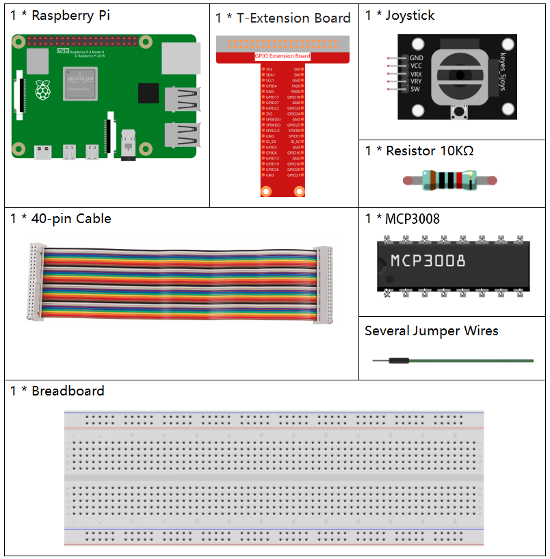

.. note::

    Hallo, willkommen in der SunFounder Raspberry Pi & Arduino & ESP32 Enthusiasten-Community auf Facebook!  
    Tauche tiefer in Raspberry Pi, Arduino und ESP32 mit anderen Enthusiasten ein.

    **Warum beitreten?**

    - **Expertenunterstützung**: Löse Probleme nach dem Kauf und technische Herausforderungen mit Hilfe unserer Community und unseres Teams.
    - **Lernen & Teilen**: Teile Tipps und Tutorials, um deine Fähigkeiten zu verbessern.
    - **Exklusive Vorschauen**: Erhalte frühzeitigen Zugang zu neuen Produktankündigungen und Vorschauen.
    - **Sonderrabatte**: Genieße exklusive Rabatte auf unsere neuesten Produkte.
    - **Festliche Aktionen und Verlosungen**: Nimm an Verlosungen und Feiertagsaktionen teil.

    👉 Bereit, mit uns zu entdecken und zu erschaffen? Klicke auf [|link_sf_facebook|] und tritt noch heute bei!

.. _2.1.6_c_mcp3008:

2.1.6 Joystick (MCP3008)
========================

.. note::

   .. image:: img/mcp3008_and_adc0834.jpg
      :width: 25%
      :align: left
   

   Je nach Kit-Version prüfe bitte, ob du **ADC0834** oder **MCP3008** hast, und fahre mit dem entsprechenden Abschnitt fort.

Einführung
----------

In diesem Projekt lernen wir, wie ein Joystick funktioniert.  
Wir bewegen den Joystick und zeigen die Ergebnisse auf dem Bildschirm an.

Benötigte Komponenten
---------------------

In diesem Projekt benötigen wir die folgenden Komponenten:

Prinzip
-------

**Joystick**

Die Grundidee eines Joysticks besteht darin, die Bewegung eines Steuerknüppels in elektronische Informationen umzuwandeln, die ein Computer verarbeiten kann.

Um den vollen Bewegungsbereich zu erfassen, muss ein Joystick die Position des Sticks auf zwei Achsen messen – die X-Achse (links/rechts) und die Y-Achse (hoch/runter).  
Wie in der Geometrie geben die X-Y-Koordinaten die genaue Position des Sticks an.

Zur Positionsbestimmung überwacht das Joystick-Steuersystem einfach die Stellung jeder Achse.  
Das herkömmliche analoge Joystick-Design macht dies mit zwei Potentiometern (veränderlichen Widerständen).

Der Joystick verfügt außerdem über einen digitalen Eingang, der betätigt wird, wenn der Stick heruntergedrückt wird.

.. image:: img/image318.png

Schaltplan
----------

Beim Auslesen der Joystick-Daten gibt es Unterschiede zwischen den Achsen:  
Die Daten der X- und Y-Achse sind analog, daher muss der MCP3008 verwendet werden, um sie in digitale Werte umzuwandeln.  
Die Z-Achse ist digital, daher kann man sie direkt über GPIO lesen oder ebenfalls über den ADC auslesen.

.. .. image:: img/image319.png

    *   - T-Board-Name
        - physical
        - WiringPi
        - BCM

    *   - SPICE0
        - pin24
        - 10
        - 8
    *   - SPIMOSI
        - pin19
        - 12
        - 10
    *   - SPIMISO
        - pin21
        - 13
        - 9
    *   - SPISCLK
        - pin23
        - 14
        - 11
    *   - GPIO22
        - pin15
        - 3
        - 22

.. image:: img/schematic_2.1.9_joystick_mcp3008.png

Experimentelle Schritte
-----------------------

**Schritt 1:** Baue die Schaltung auf.

.. image:: img/july24_2.1.9_joystick_mcp3008.png

Für C-Sprach-Nutzer
^^^^^^^^^^^^^^^^^^^

**Schritt 2:** Gehe in den Code-Ordner.

.. code-block::

    cd ~/davinci-kit-for-raspberry-pi/c/2.1.6-2/

**Schritt 3:** Kompiliere den Code.

.. code-block::

    gcc 2.1.6_Joystick.c -o joystick -lwiringPi

**Schritt 4:** Führe die ausführbare Datei aus.

.. code-block::

    ./joystick

Nachdem der Code ausgeführt wird, bewege den Joystick – die entsprechenden Werte für x, y und Btn werden auf dem Bildschirm angezeigt.

.. note::

    Falls die Fehlermeldung „wiringPi.h: No such file or directory“ erscheint, siehe :ref:`install_wiringpi`.

**Code**

.. code-block:: c

    #include <wiringPi.h>
    #include <wiringPiSPI.h>
    #include <stdio.h>

    #define SPI_CHANNEL 0
    #define SPI_SPEED   1000000  // 1 MHz
    #define BtnPin      3        // WiringPi 3 = BCM GPIO22

    // Auslesen vom MCP3008-Kanal (0–7)
    int read_ADC(int channel) {
        if (channel < 0 || channel > 7) return -1;

        unsigned char buffer[3];
        buffer[0] = 1;                            // Startbit
        buffer[1] = (8 + channel) << 4;           // Kanal-Konfiguration
        buffer[2] = 0;

        wiringPiSPIDataRW(SPI_CHANNEL, buffer, 3);

        int result = ((buffer[1] & 0x03) << 8) | buffer[2];
        return result;
    }

    int main(void) {
        if (wiringPiSetup() == -1) {
            printf("WiringPi Setup fehlgeschlagen!\n");
            return 1;
        }

        if (wiringPiSPISetup(SPI_CHANNEL, SPI_SPEED) == -1) {
            printf("SPI Setup fehlgeschlagen!\n");
            return 1;
        }

        pinMode(BtnPin, INPUT);
        pullUpDnControl(BtnPin, PUD_UP);

        while (1) {
            int x_val = read_ADC(0);     // VRX an CH0
            int y_val = read_ADC(1);     // VRY an CH1
            int btn_val = digitalRead(BtnPin);  // SW-Taste

            printf("x = %d, y = %d, btn = %d\n", x_val, y_val, btn_val);
            delay(100);
        }

        return 0;
    }

**Code-Erklärung**

1. Initialisiert die Bibliotheken für GPIO- und SPI-Kommunikation.

   .. code-block:: c

       #include <wiringPi.h>
       #include <wiringPiSPI.h>
       #include <stdio.h>

       #define SPI_CHANNEL 0
       #define SPI_SPEED   1000000  // 1 MHz
       #define BtnPin      3        // WiringPi 3 = BCM GPIO22

2. Definiert die Funktion ``read_ADC()``, um analoge Daten vom MCP3008 auszulesen.  
   Diese sendet drei Bytes per SPI und wertet die Antwort zu einem 10-Bit-ADC-Wert aus.

   .. code-block:: c

       int read_ADC(int channel) {
           if (channel < 0 || channel > 7) return -1;
           unsigned char buffer[3];
           buffer[0] = 1;
           buffer[1] = (8 + channel) << 4;
           buffer[2] = 0;
           wiringPiSPIDataRW(SPI_CHANNEL, buffer, 3);
           int result = ((buffer[1] & 0x03) << 8) | buffer[2];
           return result;
       }

3. Die Hauptfunktion initialisiert WiringPi und SPI, richtet den Button-Pin ein und liest kontinuierlich X-, Y- und Button-Werte aus.

   .. code-block:: c

       int main(void) {
           if (wiringPiSetup() == -1) {
               printf("WiringPi Setup fehlgeschlagen!\n");
               return 1;
           }
           if (wiringPiSPISetup(SPI_CHANNEL, SPI_SPEED) == -1) {
               printf("SPI Setup fehlgeschlagen!\n");
               return 1;
           }
           pinMode(BtnPin, INPUT);
           pullUpDnControl(BtnPin, PUD_UP);
           while (1) {
               int x_val = read_ADC(0);
               int y_val = read_ADC(1);
               int btn_val = digitalRead(BtnPin);
               printf("x = %d, y = %d, btn = %d\n", x_val, y_val, btn_val);
               delay(100);
           }
           return 0;
       }

Für Python-Nutzer
^^^^^^^^^^^^^^^^^

**Schritt 2:** Richte die SPI-Schnittstelle ein und installiere ``spidev`` (siehe :ref:`spi_configuration`).

**Schritt 3:** Gehe in den Code-Ordner.

.. code-block::

    cd ~/davinci-kit-for-raspberry-pi/python

**Schritt 4:** Ausführen.

.. code-block::

    sudo python3 2.1.6-2_Joystick.py

Nach dem Start des Codes werden beim Bewegen des Joysticks die entsprechenden Werte für x, y und Btn auf dem Bildschirm angezeigt.

.. warning::

    Falls die Fehlermeldung ``RuntimeError: Cannot determine SOC peripheral base address`` erscheint, siehe :ref:`faq_soc`

**Code**

.. code-block:: python

    #!/usr/bin/env python3

    import RPi.GPIO as GPIO
    import spidev
    import time

    BTN_PIN = 22

    GPIO.setmode(GPIO.BCM)
    GPIO.setup(BTN_PIN, GPIO.IN, pull_up_down=GPIO.PUD_UP)

    spi = spidev.SpiDev()
    spi.open(0, 0)
    spi.max_speed_hz = 1000000

    def read_adc(channel):
        if channel < 0 or channel > 7:
            return -1
        adc = spi.xfer2([1, (8 + channel) << 4, 0])
        value = ((adc[1] & 0x03) << 8) | adc[2]
        return value

    try:
        while True:
            x_val = read_adc(1)
            y_val = read_adc(2)
            Btn_val = GPIO.input(BTN_PIN)
            print('X: %d  Y: %d  Btn: %d' % (x_val, y_val, Btn_val))
            time.sleep(0.2)
    except KeyboardInterrupt:
        pass
    finally:
        spi.close()
        GPIO.cleanup()

**Code-Erklärung**

.. code-block:: python

    #!/usr/bin/env python3

    import RPi.GPIO as GPIO
    import spidev
    import time

In diesem Abschnitt werden die erforderlichen Bibliotheken importiert:

- ``RPi.GPIO`` wird verwendet, um GPIO-Eingaben zu verarbeiten (Joystick-Taster).
- ``spidev`` wird verwendet, um über SPI mit dem MCP3008-ADC-Chip zu kommunizieren.
- ``time`` wird genutzt, um Verzögerungen zwischen den Messungen einzufügen.

.. code-block:: python

    # Definiere GPIO-Pin für Joystick-Taster (SW-Pin)
    BTN_PIN = 22

    # GPIO-Modus festlegen
    GPIO.setmode(GPIO.BCM)
    GPIO.setup(BTN_PIN, GPIO.IN, pull_up_down=GPIO.PUD_UP)

    # Initialisiere SPI-Kommunikation mit MCP3008
    spi = spidev.SpiDev()
    spi.open(0, 0)  # SPI-Bus 0, CE0
    spi.max_speed_hz = 1000000

Dieser Block setzt den GPIO-Modus auf ``BCM``, initialisiert den Joystick-Tastereingang auf GPIO22 mit einem Pull-up-Widerstand und konfiguriert die SPI-Schnittstelle mit dem MCP3008 über Bus 0 und Chip-Enable 0 (CE0) bei 1 MHz.

.. code-block:: python

    def read_adc(channel):
        """
        Liest den analogen Wert vom angegebenen MCP3008-Kanal (0–7)
        :param channel: ADC-Kanalnummer (0–7)
        :return: 10-Bit-Integer-Wert (0–1023)
        """
        if channel < 0 or channel > 7:
            return -1
        adc = spi.xfer2([1, (8 + channel) << 4, 0])
        value = ((adc[1] & 0x03) << 8) | adc[2]
        return value

Definiert die Funktion ``read_adc()``, um analoge Daten von einem bestimmten MCP3008-Kanal zu lesen.  
Sie sendet drei Bytes über SPI und interpretiert die Antwort, um einen 10-Bit-Wert zwischen 0 und 1023 zurückzugeben.

.. code-block:: python

    try:
        # Hauptschleife zum Auslesen und Anzeigen der Joystick-Werte und des Tasterzustands
        while True:
            # Lese X- und Y-Werte von den MCP3008-Kanälen 0 und 1
            x_val = read_adc(0)  # Joystick VRX verbunden mit CH0
            y_val = read_adc(1)  # Joystick VRY verbunden mit CH1

            # Lese den Zustand des Joystick-Tasters (SW)
            Btn_val = GPIO.input(BTN_PIN)  # 0 = gedrückt, 1 = nicht gedrückt

            # Ausgabe der gelesenen Werte
            print('X: %d  Y: %d  Btn: %d' % (x_val, y_val, Btn_val))

            time.sleep(0.2)

    except KeyboardInterrupt:
        pass

    finally:
        spi.close()
        GPIO.cleanup()

Diese Hauptschleife liest und gibt alle 200 ms die analogen X/Y-Positionen des Joysticks sowie den Zustand des Tasters aus.  
Wird das Skript per Tastenkombination (Strg+C) unterbrochen, werden SPI und GPIO ordnungsgemäß geschlossen.
