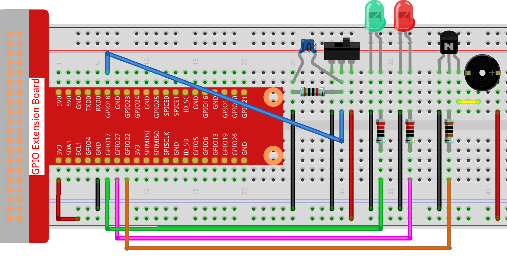

.. note::

    ¡Hola! Bienvenido a la comunidad de entusiastas de SunFounder para Raspberry Pi, Arduino y ESP32 en Facebook. Únete para profundizar en Raspberry Pi, Arduino y ESP32 junto a otros apasionados.

    **¿Por qué unirte?**

    - **Soporte de Expertos**: Resuelve problemas post-venta y desafíos técnicos con la ayuda de nuestra comunidad y equipo.
    - **Aprende y Comparte**: Intercambia consejos y tutoriales para mejorar tus habilidades.
    - **Avances Exclusivos**: Obtén acceso anticipado a anuncios de nuevos productos y vistas previas.
    - **Descuentos Especiales**: Disfruta de descuentos exclusivos en nuestros productos más recientes.
    - **Promociones Festivas y Sorteos**: Participa en sorteos y promociones de temporada.

    👉 ¿Listo para explorar y crear con nosotros? Haz clic en [|link_sf_facebook|] y únete hoy.

3.1.10 Alarma
=====================

Introducción
-----------------

En este curso, vamos a crear un dispositivo de alarma manual. 
Puedes reemplazar el interruptor de palanca con un termistor o 
un sensor fotosensible para hacer una alarma de temperatura o de luz.

Componentes
---------------

.. image:: img/list_Alarm_Bell.png
    :align: center

Diagrama Esquemático
-------------------------

============ ======== ======== ===
T-Board Name physical wiringPi BCM
GPIO17       Pin 11   0        17
GPIO18       Pin 12   1        18
GPIO27       Pin 13   2        27
GPIO22       Pin 15   3        22
============ ======== ======== ===

.. image:: img/Schematic_three_one10.png
   :align: center

Procedimientos Experimentales
---------------------------------

**Paso 1**: Construye el circuito.

**Para Usuarios de Lenguaje C**
^^^^^^^^^^^^^^^^^^^^^^^^^^^^^^^^^^^^

**Paso 2**: Cambia de directorio.

.. raw:: html

   <run></run>

.. code-block:: 

    cd ~/davinci-kit-for-raspberry-pi/c/3.1.10/

**Paso 3**: Compila.

.. raw:: html

   <run></run>

.. code-block:: 

    gcc 3.1.10_AlarmBell.c -lwiringPi -lpthread

**Paso 4**: Ejecuta.

.. raw:: html

   <run></run>

.. code-block:: 

    sudo ./a.out

Después de iniciar el programa, el interruptor de palanca se moverá 
hacia la derecha, y el zumbador emitirá sonidos de alarma. Al mismo 
tiempo, los LED rojo y verde parpadearán a una cierta frecuencia.

.. note::

    Si no funciona después de ejecutarlo, o aparece un mensaje de error: \"wiringPi.h: No such file or directory", consulta :ref:`C code is not working?`.

**Explicación del Código**

.. code-block:: c

    #include <pthread.h>

En este código, se usa una nueva biblioteca, pthread.h, que es un conjunto 
de bibliotecas de hilos comunes y permite la implementación de multihilos. 
Añadimos el parámetro **-lpthread** al momento de la compilación para que 
el LED y el zumbador funcionen de manera independiente.

.. code-block:: c

    void *ledWork(void *arg){       
        while(1)    
        {   
            if(flag==0){
                pthread_exit(NULL);
            }
            digitalWrite(ALedPin,HIGH);
            delay(500);
            digitalWrite(ALedPin,LOW);
            digitalWrite(BLedPin,HIGH);
            delay(500);
            digitalWrite(BLedPin,LOW);
        }
    }

La función ledWork() se encarga de configurar el estado de funcionamiento de 
estos 2 LEDs: mantiene el LED verde encendido durante 0,5 s y luego se apaga; 
de manera similar, mantiene el LED rojo encendido durante 0,5 s y luego se apaga.

.. code-block:: c

    void *buzzWork(void *arg){
        while(1)
        {
            if(flag==0){
                pthread_exit(NULL);
            }
            if((note>=800)||(note<=130)){
                pitch = -pitch;
            }
            note=note+pitch;
            softToneWrite(BeepPin,note);
            delay(10);
        }
    }

La función buzzWork() se utiliza para configurar el estado de funcionamiento 
del zumbador. Aquí establecemos la frecuencia entre 130 y 800, acumulando o 
decayendo en intervalos de 20.

.. code-block:: c

    void on(){
        flag = 1;
        if(softToneCreate(BeepPin) == -1){
            printf("setup softTone failed !");
            return; 
        }    
        pthread_t tLed;     
        pthread_create(&tLed,NULL,ledWork,NULL);    
        pthread_t tBuzz;  
        pthread_create(&tBuzz,NULL,buzzWork,NULL);       
    }

En la función on():

1) Definimos la marca "flag=1", lo que indica el fin del hilo de control.

2) Creamos un pin de tono controlado por software **BeepPin**.

3) Creamos dos hilos independientes para que el LED y el zumbador puedan 
   funcionar al mismo tiempo.

**pthread_t tLed:** Declara un hilo **tLed**.

**pthread_create(&tLed,NULL,ledWork,NULL):** Crea el hilo, y su prototipo es el siguiente:

.. code-block:: c

    int pthread_create(pthread_t *restrict tidp,const pthread_attr_t *restrict_attr, void*(*start_rtn)(void*),void *restrict arg);

**Retorno del Valor**

Si tiene éxito, devuelve "**0**"; de lo contrario, devuelve el **número de error** "\"**-1**\"".

**Parámetros**

| El primer parámetro es un puntero al identificador del hilo.
| El segundo se usa para establecer el atributo del hilo.
| El tercero es la dirección de inicio de la función de ejecución del hilo.
| El último es el que ejecuta la función.

.. code-block:: c

    void off(){
        flag = 0;
        softToneStop(BeepPin);
        digitalWrite(ALedPin,LOW);
        digitalWrite(BLedPin,LOW);
    }

La función off() define \"flag=0\" para salir de los hilos **ledWork** y 
**buzzWork** y luego apaga el zumbador y los LED.

.. code-block:: c

    int main(){       
        setup(); 
        int lastState = 0;
        while(1){
            int currentState = digitalRead(switchPin);
            if ((currentState == 1)&&(lastState==0)){
                on();
            }
            else if((currentState == 0)&&(lastState==1)){
                off();
            }
            lastState=currentState;
        }
        return 0;
    }

Main() contiene todo el proceso del programa: primero lee el valor del 
interruptor deslizante; si el interruptor se cambia a la derecha 
(la lectura es 1), se llama a la función on(), el zumbador emite sonidos 
y los LED rojo y verde parpadean. De lo contrario, el zumbador y los LED 
permanecen apagados.

**Para Usuarios de Lenguaje Python**
^^^^^^^^^^^^^^^^^^^^^^^^^^^^^^^^^^^^^^^

**Paso 2:** Cambia de directorio.

.. raw:: html

   <run></run>

.. code-block:: 

    cd ~/davinci-kit-for-raspberry-pi/python/

**Paso 3:** Ejecuta.

.. raw:: html

   <run></run>

.. code-block:: 

    sudo python3 3.1.10_AlarmBell.py

Después de iniciar el programa, el interruptor de palanca se moverá hacia 
la derecha, y el zumbador emitirá sonidos de alarma. Al mismo tiempo, los 
LED rojo y verde parpadearán a una cierta frecuencia.

**Código**

.. note::

    Puedes **Modificar/Restablecer/Copiar/Ejecutar/Detener** el código a continuación. Pero antes, necesitas dirigirte a la ruta del código fuente, como ``davinci-kit-for-raspberry-pi/python``. 

.. raw:: html

    <run></run>

.. code-block:: python

    import RPi.GPIO as GPIO
    import time
    import threading

    BeepPin=22
    ALedPin=17
    BLedPin=27
    switchPin=18

    Buzz=0
    flag =0
    note=150
    pitch=20

    def setup():
        GPIO.setmode(GPIO.BCM)
        GPIO.setup(BeepPin, GPIO.OUT)
        GPIO.setup(ALedPin,GPIO.OUT,initial=GPIO.LOW)
        GPIO.setup(BLedPin,GPIO.OUT,initial=GPIO.LOW)
        GPIO.setup(switchPin,GPIO.IN)
        global Buzz
        Buzz=GPIO.PWM(BeepPin,note)

    def ledWork():
        while flag:
            GPIO.output(ALedPin,GPIO.HIGH)
            time.sleep(0.5)
            GPIO.output(ALedPin,GPIO.LOW)
            GPIO.output(BLedPin,GPIO.HIGH)
            time.sleep(0.5)
            GPIO.output(BLedPin,GPIO.LOW)

    def buzzerWork():
        global pitch
        global note
        while flag:
            if note >= 800 or note <=130:
                pitch = -pitch
            note = note + pitch 
            Buzz.ChangeFrequency(note)
            time.sleep(0.01)

    def on():
        global flag
        flag = 1
        Buzz.start(50)
        tBuzz = threading.Thread(target=buzzerWork) 
        tBuzz.start()
        tLed = threading.Thread(target=ledWork) 
        tLed.start()    

    def off():
        global flag
        flag = 0
        Buzz.stop()
        GPIO.output(ALedPin,GPIO.LOW)
        GPIO.output(BLedPin,GPIO.LOW)      

    def main():
        lastState=0
        while True:
            currentState =GPIO.input(switchPin)
            if currentState == 1 and lastState == 0:
                on()
            elif currentState == 0 and lastState == 1:
                off()
            lastState=currentState

    
    def destroy():
        off()
        GPIO.cleanup()

    if __name__ == '__main__':
        setup()
        try:
            main()
        except KeyboardInterrupt:
            destroy()
            
**Explicación del Código**

.. code-block:: python

    import threading

Aquí importamos el módulo **Threading**, que permite ejecutar múltiples 
tareas simultáneamente, mientras que los programas normales solo pueden 
ejecutar el código de arriba hacia abajo. Con los módulos **Threading**, 
el LED y el zumbador pueden funcionar por separado.

.. code-block:: python

    def ledWork():
        while flag:
            GPIO.output(ALedPin,GPIO.HIGH)
            time.sleep(0.5)
            GPIO.output(ALedPin,GPIO.LOW)
            GPIO.output(BLedPin,GPIO.HIGH)
            time.sleep(0.5)
            GPIO.output(BLedPin,GPIO.LOW)

La función ledWork() ayuda a establecer el estado de funcionamiento de 
estos 2 LEDs: mantiene el LED verde encendido durante 0,5 s y luego se 
apaga; de manera similar, mantiene el LED rojo encendido durante 0,5 s y 
luego se apaga.

.. code-block:: python

    def buzzerWork():
        global pitch
        global note
        while flag:
            if note >= 800 or note <=130:
                pitch = -pitch
            note = note + pitch 
            Buzz.ChangeFrequency(note)
            time.sleep(0.01)

La función buzzWork() se utiliza para configurar el estado de funcionamiento 
del zumbador. Aquí establecemos la frecuencia entre 130 y 800, acumulando o 
decayendo en intervalos de 20.

.. code-block:: python

    def on():
        global flag
        flag = 1
        Buzz.start(50)
        tBuzz = threading.Thread(target=buzzerWork) 
        tBuzz.start()
        tLed = threading.Thread(target=ledWork) 
        tLed.start()   

En la función on():

1) Definimos la marca \"flag=1\", lo que indica el inicio del hilo de control.

2) Inicia el Buzz y establece el ciclo de trabajo al 50%.

3) Crea **2** hilos separados para que el LED y el zumbador puedan funcionar 
   al mismo tiempo.

   tBuzz = threading.Thread(target=buzzerWork) **:** Crea el
   hilo, cuyo prototipo es el siguiente:

class threading.Thread(group=None, target=None, name=None, args=(), kwargs={}, \*, daemon=None)

Entre los métodos de construcción, el parámetro principal es **target**,
al cual necesitamos asignar un objeto invocable (en este caso, las funciones **ledWork**
y **BuzzWork** ) a **target**.

Luego se llama a **start()** para iniciar el objeto del hilo, por ejemplo,
tBuzz.start() se usa para iniciar el hilo tBuzz recién creado.

.. code-block:: python

    def off():
        global flag
        flag = 0
        Buzz.stop()
        GPIO.output(ALedPin,GPIO.LOW)
        GPIO.output(BLedPin,GPIO.LOW)

La función off() define \"flag=0\" para salir de los hilos **ledWork** y 
**buzzWork** y luego apaga el zumbador y los LED.

.. code-block:: python

    def main():
        lastState=0
        while True:
            currentState =GPIO.input(switchPin)
            if currentState == 1 and lastState == 0:
                on()
            elif currentState == 0 and lastState == 1:
                off()
            lastState=currentState

Main() contiene todo el proceso del programa: primero lee el valor del 
interruptor deslizante; si el interruptor se cambia a la derecha (la 
lectura es 1), se llama a la función on(), el zumbador emite sonidos y 
los LEDs rojo y verde parpadean. De lo contrario, el zumbador y los LEDs 
permanecen apagados.

Imagen del Fenómeno
------------------------

.. image:: img/image267.jpeg
   :align: center