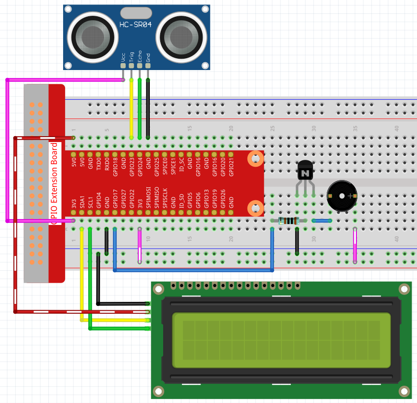

.. note::

    Bonjour et bienvenue dans la communauté SunFounder pour les passionnés de Raspberry Pi, Arduino et ESP32 sur Facebook ! Plongez au cœur de Raspberry Pi, Arduino et ESP32 avec d'autres passionnés.

    **Pourquoi rejoindre ?**

    - **Support d'experts** : Résolvez vos problèmes après-vente et défis techniques avec l'aide de notre communauté et de notre équipe.
    - **Apprendre & Partager** : Échangez des astuces et des tutoriels pour perfectionner vos compétences.
    - **Aperçus exclusifs** : Accédez en avant-première aux annonces de nouveaux produits et aux aperçus exclusifs.
    - **Réductions spéciales** : Profitez de réductions exclusives sur nos nouveaux produits.
    - **Promotions festives et concours** : Participez à des concours et des promotions spéciales pendant les fêtes.

    👉 Prêt à explorer et créer avec nous ? Cliquez sur [|link_sf_facebook|] et rejoignez-nous dès aujourd'hui !
    
3.1.3 Avertisseur de recul
=============================

Introduction
---------------

Dans ce projet, nous utiliserons un écran LCD, un buzzer et des capteurs 
ultrasoniques pour créer un système d'aide au stationnement en marche arrière. 
Nous pouvons l'installer sur un véhicule télécommandé pour simuler le processus 
réel de recul d'une voiture dans un garage.

Composants
------------

.. image:: img/list_Reversing_Alarm.png
    :align: center

Schéma de câblage
--------------------

Le capteur ultrasonique détecte la distance entre lui-même et l'obstacle, qui sera 
affichée sur l'écran LCD sous forme de code. En même temps, le capteur ultrasonique 
fait émettre au buzzer un son d'avertissement de fréquence différente selon la valeur 
de la distance.

============ ======== ======== ===
T-Board Name physical wiringPi BCM
GPIO23       Pin 16   4        23
GPIO24       Pin 18   5        24
GPIO17       Pin 11   0        17
SDA1         Pin 3             
SCL1         Pin 5             
============ ======== ======== ===

.. image:: img/Schematic_three_one3.png
    :width: 800
    :align: center

Procédures expérimentales
---------------------------

**Étape 1 :** Construisez le circuit.

**Pour les utilisateurs de langage C**
^^^^^^^^^^^^^^^^^^^^^^^^^^^^^^^^^^^^^^^^^^

**Étape 2 :** Changez de répertoire.

.. raw:: html

    <run></run>
 
.. code-block:: 
     
    cd ~/davinci-kit-for-raspberry-pi/c/3.1.3/
 
**Étape 3 :** Compilez.

.. raw:: html

   <run></run>

.. code-block:: 

    gcc 3.1.3_ReversingAlarm.c -lwiringPi

**Étape 4 :** Exécutez.

.. raw:: html

   <run></run>

.. code-block:: 

    sudo ./a.out

Lorsque le code s'exécute, le module capteur ultrasonique détecte la distance par 
rapport à l'obstacle et affiche ensuite l'information sur la distance sur l'écran 
LCD1602 ; en outre, le buzzer émet un signal sonore dont la fréquence varie en 
fonction de la distance.

.. note::

    * Si un message d'erreur apparaît ``wiringPi.h: Aucun fichier ou dossier de ce type``, veuillez vous référer à :ref:`install_wiringpi`.
    * Si vous obtenez l'erreur ``Unable to open I2C device: No such file or directory``, vous devez vous référer à :ref:`i2c_config` pour activer I2C et vérifier si le câblage est correct.
    * Si le code et le câblage sont corrects mais que l'écran LCD ne s'affiche toujours pas, vous pouvez tourner le potentiomètre à l'arrière pour augmenter le contraste.

**Code**

.. note::
    Les codes suivants sont incomplets. Si vous souhaitez consulter les codes complets, 
    il est conseillé d'utiliser la commande ``nano 3.1.1_ReversingAlarm.c``.

.. code-block:: c

    #include <wiringPi.h>
    #include <stdio.h>
    #include <sys/time.h>
    #include <wiringPi.h>
    #include <wiringPiI2C.h>
    #include <string.h>

    #define Trig    4
    #define Echo    5
    #define Buzzer  0

    int LCDAddr = 0x27;
    int BLEN = 1;
    int fd;

    // voici la fonction pour l'écran LCD
    void write_word(int data){...}

    void send_command(int comm){...}

    void send_data(int data){...}

    void lcdInit(){...}

    void clear(){...}

    void write(int x, int y, char data[]){...}

    // voici la fonction pour l'ultrasonique
    void ultraInit(void){...}

    float disMeasure(void){...}

    // voici la fonction principale
    int main(void)
    {
        float dis;
        char result[10];
        if(wiringPiSetup() == -1){ 
            printf("setup wiringPi failed !");
            return 1;
        }

        pinMode(Buzzer,OUTPUT);
        fd = wiringPiI2CSetup(LCDAddr);
        lcdInit();
        ultraInit();

        clear();
        write(0, 0, "Ultrasonic Starting"); 
        write(1, 1, "By Sunfounder");   

        while(1){
            dis = disMeasure();
            printf("%.2f cm \n",dis);
            delay(100);
            digitalWrite(Buzzer,LOW);
            if (dis > 400){
                clear();
                write(0, 0, "Error");
                write(3, 1, "Out of range");    
                delay(500);
            }
            else
            {
                clear();
                write(0, 0, "Distance is");
                sprintf(result,"%.2f cm",dis);
                write(5, 1, result);

                if(dis>=50)
                {delay(500);}
                else if(dis<50 & dis>20) {
                    for(int i=0;i<2;i++){
                    digitalWrite(Buzzer,HIGH);
                    delay(50);
                    digitalWrite(Buzzer,LOW);
                    delay(200);
                    }
                }
                else if(dis<=20){
                    for(int i=0;i<5;i++){
                    digitalWrite(Buzzer,HIGH);
                    delay(50);
                    digitalWrite(Buzzer,LOW);
                    delay(50);
                    }
                }
            }   
        }

        return 0;
    }

**Explication du code**

.. code-block:: c

    pinMode(Buzzer,OUTPUT);
    fd = wiringPiI2CSetup(LCDAddr);
    lcdInit();
    ultraInit();

Dans ce programme, nous utilisons de manière synthétique les composants précédemment présentés. Ici, nous utilisons des buzzers, un écran LCD et un capteur ultrasonique. Nous pouvons les initialiser de la même manière que précédemment.

.. code-block:: c

    dis = disMeasure();
     printf("%.2f cm \n",dis);
    digitalWrite(Buzzer,LOW);
    if (dis > 400){
         write(0, 0, "Error");
         write(3, 1, "Out of range");    
    }
    else
    {
        write(0, 0, "Distance is");
        sprintf(result,"%.2f cm",dis);
        write(5, 1, result);
	}

Ici, nous obtenons la valeur du capteur ultrasonique et déterminons la distance par calcul.

Si la valeur de la distance est supérieure à la portée détectable, un message d'erreur 
est affiché sur l'écran LCD. Et si la distance se situe dans la plage acceptable, les 
résultats correspondants seront affichés.

.. code-block:: c

    sprintf(result,"%.2f cm",dis);

Comme le mode de sortie de l'écran LCD ne supporte que les caractères, et que la variable 
`dis` stocke une valeur de type flottant, nous devons utiliser `sprintf()`. Cette fonction 
convertit la valeur flottante en un caractère et la stocke dans la variable chaîne `result[]`. 
`%.2f` signifie conserver deux chiffres après la virgule.

.. code-block:: c

    if(dis>=50)
    {delay(500);}
    else if(dis<50 & dis>20) {
        for(int i=0;i<2;i++){
        digitalWrite(Buzzer,HIGH);
        delay(50);
        digitalWrite(Buzzer,LOW);
        delay(200);
        }
    }
    else if(dis<=20){
        for(int i=0;i<5;i++){
        digitalWrite(Buzzer,HIGH);
        delay(50);
        digitalWrite(Buzzer,LOW);
        delay(50);
        }
    }

Cette condition permet de contrôler le son du buzzer. Selon la distance, elle se divise 
en trois cas, chacun produisant des fréquences sonores différentes. Comme la valeur totale 
du délai est de 500 ms, tous les cas offrent un intervalle de 500 ms pour le capteur ultrasonique.

**Pour les utilisateurs du langage Python**
^^^^^^^^^^^^^^^^^^^^^^^^^^^^^^^^^^^^^^^^^^^^^^^^^^

**Étape 2 :** Changez de répertoire.

.. raw:: html

    <run></run>
 
.. code-block::
 
    cd ~/davinci-kit-for-raspberry-pi/python/
 
**Étape 3 :** Exécutez.

.. raw:: html

   <run></run>

.. code-block:: 

    sudo python3 3.1.3_ReversingAlarm.py

Lorsque le code s'exécute, le module capteur ultrasonique détecte la distance par 
rapport à l'obstacle et affiche ensuite l'information sur la distance sur l'écran 
LCD1602 ; en outre, le buzzer émet un signal sonore dont la fréquence varie en 
fonction de la distance.

.. note::

    * Si vous obtenez l'erreur ``FileNotFoundError: [Errno 2] No such file or directory: '/dev/i2c-1'``, vous devez vous référer à :ref:`i2c_config` pour activer le protocole I2C.
    * Si l'erreur ``ModuleNotFoundError: No module named 'smbus2'`` apparaît, veuillez exécuter la commande ``sudo apt install python3-smbus2``.
    * Si l'erreur ``OSError: [Errno 121] Remote I/O`` se produit, cela signifie que le module est mal câblé ou qu'il est défectueux.
    * Si le code et le câblage sont corrects mais que l'écran LCD ne s'affiche toujours pas, vous pouvez tourner le potentiomètre à l'arrière pour augmenter le contraste.

**Code**

.. note::

    Vous pouvez **modifier/réinitialiser/copier/exécuter/arrêter** le code ci-dessous. Mais avant cela, vous devez vous rendre sur le chemin du code source comme ``davinci-kit-for-raspberry-pi/python``. 
    
.. raw:: html

    <run></run>

.. code-block:: python

    import LCD1602
    import time
    import RPi.GPIO as GPIO

    TRIG = 16
    ECHO = 18
    BUZZER = 11

    def lcdsetup():
        LCD1602.init(0x27, 1)   # init(adresse esclave, éclairage de fond)
        LCD1602.clear()   
        LCD1602.write(0, 0, 'Ultrasonic Starting')
        LCD1602.write(1, 1, 'By SunFounder')
        time.sleep(2)

    def setup():
        GPIO.setmode(GPIO.BOARD)
        GPIO.setup(TRIG, GPIO.OUT)
        GPIO.setup(ECHO, GPIO.IN)
        GPIO.setup(BUZZER, GPIO.OUT, initial=GPIO.LOW)
        lcdsetup()

    def distance():
        GPIO.output(TRIG, 0)
        time.sleep(0.000002)

        GPIO.output(TRIG, 1)
        time.sleep(0.00001)
        GPIO.output(TRIG, 0)

        while GPIO.input(ECHO) == 0:
            a = 0
        time1 = time.time()
        while GPIO.input(ECHO) == 1:
            a = 1
        time2 = time.time()

        during = time2 - time1
        return during * 340 / 2 * 100

    def destroy():
        GPIO.output(BUZZER, GPIO.LOW)
        GPIO.cleanup()
        LCD1602.clear()

    def loop():
        while True:
            dis = distance()
            print (dis, 'cm')
            print ('')
            GPIO.output(BUZZER, GPIO.LOW)
            if (dis > 400):
                LCD1602.clear()
            LCD1602.write(0, 0, 'Error')
            LCD1602.write(3, 1, 'Out of range')
                time.sleep(0.5)
            else:
                LCD1602.clear()
            LCD1602.write(0, 0, 'Distance is')
                LCD1602.write(5, 1, str(round(dis,2)) +' cm')
                if(dis>=50):
                    time.sleep(0.5)
                elif(dis<50 and dis>20):
                    for i in range(0,2,1):
                        GPIO.output(BUZZER, GPIO.HIGH)
                        time.sleep(0.05)
                        GPIO.output(BUZZER, GPIO.LOW)
                        time.sleep(0.2)
                elif(dis<=20):
                    for i in range(0,5,1):
                        GPIO.output(BUZZER, GPIO.HIGH)
                        time.sleep(0.05)
                        GPIO.output(BUZZER, GPIO.LOW)
                        time.sleep(0.05)

    if __name__ == "__main__":
        setup()
        try:       
            loop()
        except KeyboardInterrupt:
            destroy()

**Explication du code**

.. code-block:: python

    def lcdsetup():
        LCD1602.init(0x27, 1)   # init(adresse esclave, éclairage de fond)

    def setup():
        GPIO.setmode(GPIO.BOARD)
        GPIO.setup(TRIG, GPIO.OUT)
        GPIO.setup(ECHO, GPIO.IN)
        GPIO.setup(BUZZER, GPIO.OUT, initial=GPIO.LOW)
        lcdsetup()

Dans ce programme, nous utilisons de manière synthétique les composants précédemment 
décrits. Ici, nous employons des buzzers, un écran LCD et un capteur ultrasonique. 
Nous pouvons les initialiser de la même manière que précédemment.

.. code-block:: python

    dis = distance()
    print (dis, 'cm')
    print ('')
    GPIO.output(BUZZER, GPIO.LOW)
    if (dis > 400):
        LCD1602.clear()
        LCD1602.write(0, 0, 'Error')
        LCD1602.write(3, 1, 'Out of range')
        time.sleep(0.5)
    else:
        LCD1602.clear()
        LCD1602.write(0, 0, 'Distance is')
        LCD1602.write(5, 1, str(round(dis,2)) +' cm')

Ici, nous récupérons les valeurs du capteur ultrasonique et calculons la distance. 
Si la valeur de la distance dépasse la plage de détection, un message d'erreur 
s'affiche sur l'écran LCD. Si la distance est dans la plage de fonctionnement, les 
résultats correspondants seront affichés.

LCD1602.write(5, 1, str(round(dis,2)) +' cm')

Comme la sortie de l'écran LCD ne supporte que les types de caractères, nous devons 
utiliser **str()** pour convertir les valeurs numériques en caractères. Nous arrondissons 
les valeurs à deux décimales.

.. code-block:: python

    if(dis>=50)
    {delay(500);}
    else if(dis<50 & dis>20) {
        for(int i=0;i<2;i++){
            digitalWrite(Buzzer,HIGH);
            delay(50);
            digitalWrite(Buzzer,LOW);
            delay(200);
            }
        }
        else if(dis<=20){
            for(int i=0;i<5;i++){
            digitalWrite(Buzzer,HIGH);
            delay(50);
            digitalWrite(Buzzer,LOW);
            delay(50);
            }
        }

Cette condition est utilisée pour contrôler le son du buzzer. Selon les différences 
de distance, elle est divisée en trois cas, chacun produisant des fréquences sonores 
différentes. Comme la valeur totale du délai est de 500 ms, chaque cas fournit un 
intervalle de 500 ms permettant au capteur ultrasonique de fonctionner.

Image du phénomène
---------------------

.. image:: img/image243.jpeg
   :align: center