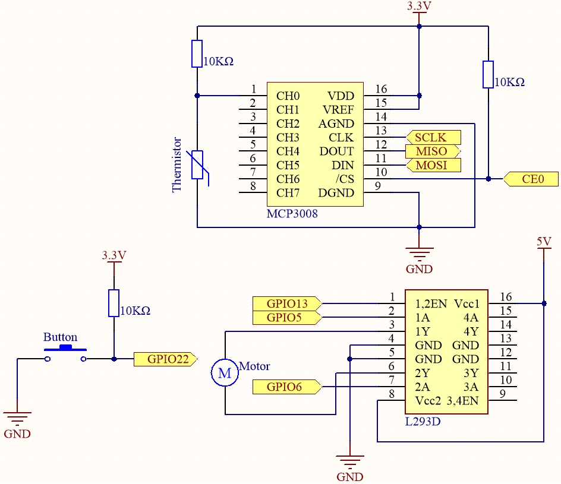
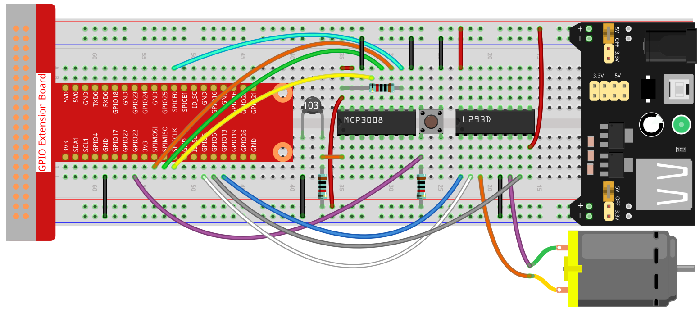

.. note::

    ¡Hola, bienvenido a la comunidad de entusiastas de SunFounder Raspberry Pi & Arduino & ESP32 en Facebook! Sumérgete más en Raspberry Pi, Arduino y ESP32 junto con otros entusiastas.

    **¿Por qué unirse?**

    - **Soporte experto**: Resuelve problemas postventa y desafíos técnicos con la ayuda de nuestra comunidad y equipo.
    - **Aprender y compartir**: Intercambia consejos y tutoriales para mejorar tus habilidades.
    - **Avances exclusivos**: Obtén acceso anticipado a nuevos anuncios de productos y adelantos.
    - **Descuentos especiales**: Disfruta de descuentos exclusivos en nuestros productos más recientes.
    - **Promociones y sorteos festivos**: Participa en sorteos y promociones especiales en épocas festivas.

    👉 ¿Listo para explorar y crear con nosotros? Haz clic en [|link_sf_facebook|] y únete hoy.

.. _3.1.4_c_mcp3008:

3.1.4 Ventilador Inteligente (MCP3008)
==========================================

.. note::

   .. image:: img/mcp3008_and_adc0834.jpg
      :width: 25%
      :align: left
    

   Dependiendo de la versión de tu kit, identifica si tienes **ADC0834** o **MCP3008** y continúa con la sección correspondiente.

Introducción
-----------------

En este proyecto, usaremos motores, botones y termistores para hacer un
ventilador inteligente manual + automático cuya velocidad de viento sea ajustable.

Componentes requeridos
------------------------------

En este proyecto, necesitamos los siguientes componentes.

.. image:: img/list2_Smart_Fan.png
    :align: center

Diagrama esquemático
------------------------

============ ======== ======== ===
T-Board Name physical wiringPi BCM
SPICE0       Pin 24   10       8
SPIMOSI      Pin 19   12       10
SPIMISO      Pin 21   13       9
SPISCLK      Pin 23   14       11
GPIO22       Pin 15   3        22
GPIO5        Pin 29   21       5
GPIO6        Pin 31   22       6
GPIO13       Pin 33   23       13
============ ======== ======== ===

Procedimientos experimentales
------------------------------

**Paso 1:** Montar el circuito.

.. note::
    El módulo de alimentación puede usar una batería de 9V con el conector de batería incluido en el kit. Inserta el jumper del módulo de alimentación en las líneas de alimentación de 5V de la protoboard.

.. image:: img/image118.jpeg
    :align: center

**Para usuarios de lenguaje C**
^^^^^^^^^^^^^^^^^^^^^^^^^^^^^^^^

**Paso 2**: Entra en la carpeta del código.

.. raw:: html

   <run></run>

.. code-block:: 

    cd ~/davinci-kit-for-raspberry-pi/c/3.1.4-2/

**Paso 3**: Compilar.

.. raw:: html

   <run></run>

.. code-block:: 

    gcc 3.1.4_SmartFan.c -o SmartFan -lwiringPi -lm

**Paso 4**: Ejecutar el archivo compilado.

.. raw:: html

   <run></run>

.. code-block:: 

    ./SmartFan

Al ejecutar el código, enciende el ventilador presionando el botón. Cada vez que lo presiones, la velocidad aumentará o disminuirá un nivel. Hay **5** niveles de velocidad: **0~4**. Cuando está en el nivel 4\ :sup:`to` y presionas el botón, el ventilador se detendrá con una velocidad **0**.

Cuando la temperatura sube o baja más de 2℃, la velocidad se ajusta automáticamente un nivel hacia arriba o hacia abajo.

.. note::

    Si no funciona después de ejecutarlo, o aparece el error: \"wiringPi.h: No such file or directory\", por favor revisa :ref:`install_wiringpi`.

Código
--------

.. code-block:: c

    #include <wiringPi.h>
    #include <wiringPiSPI.h>
    #include <stdio.h>
    #include <softPwm.h>
    #include <math.h>

    #define SPI_CHANNEL 0
    #define SPI_SPEED   1000000
    #define MotorPin1   21
    #define MotorPin2   22
    #define MotorEnable 23
    #define BtnPin      3

    int read_ADC(int channel)
    {
        if (channel < 0 || channel > 7) return -1;

        unsigned char buffer[3];
        buffer[0] = 1;                      // Bit de inicio
        buffer[1] = (8 + channel) << 4;     // Modo de entrada simple y canal
        buffer[2] = 0;

        wiringPiSPIDataRW(SPI_CHANNEL, buffer, 3);

        int result = ((buffer[1] & 3) << 8) | buffer[2];
        return result;
    }

    int temperture()
    {
        int analogVal = read_ADC(0);
        double Vr = 3.3 * analogVal / 1023.0;  // Usar 3.3V como Vref para MCP3008
        double Rt = 10000.0 * Vr / (3.3 - Vr);
        double temp = 1 / (((log(Rt / 10000.0)) / 3950.0) + (1 / (273.15 + 25.0)));
        double cel = temp - 273.15;
        double Fah = cel * 1.8 + 32;
        printf("Celsius: %.2f C  Fahrenheit: %.2f F\n", cel, Fah);
        return (int)cel;
    }

    int motor(int level)
    {
        if (level == 0) {
            digitalWrite(MotorEnable, LOW);
            return 0;
        }
        if (level >= 4) {
            level = 4;
        }
        digitalWrite(MotorEnable, HIGH);
        softPwmWrite(MotorPin1, level * 25);
        return level;
    }

    void setup()
    {
        if (wiringPiSetup() == -1) {
            printf("¡Fallo en la configuración de wiringPi!\n");
            return;
        }

        if (wiringPiSPISetup(SPI_CHANNEL, SPI_SPEED) == -1) {
            printf("¡Fallo en la configuración de SPI!\n");
            return;
        }

        softPwmCreate(MotorPin1, 0, 100);
        softPwmCreate(MotorPin2, 0, 100);
        pinMode(MotorEnable, OUTPUT);
        pinMode(BtnPin, INPUT);
    }

    int main(void)
    {
        setup();
        int currentState, lastState = 0;
        int level = 0;
        int currentTemp, markTemp = 0;

        while (1) {
            currentState = digitalRead(BtnPin);
            currentTemp = temperture();

            if (currentTemp <= 0) continue;

            if (currentState == 1 && lastState == 0) {
                level = (level + 1) % 5;
                markTemp = currentTemp;
                delay(500);
            }

            lastState = currentState;

            if (level != 0) {
                if (currentTemp - markTemp <= -2) {
                    level = level - 1;
                    markTemp = currentTemp;
                }
                if (currentTemp - markTemp >= 2) {
                    level = level + 1;
                    markTemp = currentTemp;
                }
            }

            level = motor(level);
        }

        return 0;
    }

Explicación del código
----------------------

.. code-block:: c

    int read_ADC(int channel)
    {
        if (channel < 0 || channel > 7) return -1;

        unsigned char buffer[3];
        buffer[0] = 1;                      // Bit de inicio
        buffer[1] = (8 + channel) << 4;     // Modo de entrada simple y canal
        buffer[2] = 0;

        wiringPiSPIDataRW(SPI_CHANNEL, buffer, 3);

        int result = ((buffer[1] & 3) << 8) | buffer[2];
        return result;
    }

Esta función se usa para leer la entrada analógica del MCP3008 en el canal especificado. Envía un comando SPI de 3 bytes y devuelve un valor digital de 10 bits entre 0–1023.

.. code-block:: c

    int temperture()
    {
        int analogVal = read_ADC(0);
        double Vr = 3.3 * analogVal / 1023.0;  // Usar 3.3V como Vref para MCP3008
        double Rt = 10000.0 * Vr / (3.3 - Vr);
        double temp = 1 / (((log(Rt / 10000.0)) / 3950.0) + (1 / (273.15 + 25.0)));
        double cel = temp - 273.15;
        double Fah = cel * 1.8 + 32;
        printf("Celsius: %.2f C  Fahrenheit: %.2f F\n", cel, Fah);
        return (int)cel;
    }

La función ``temperture()`` lee la señal analógica del termistor a través del MCP3008, calcula el voltaje, la resistencia y luego la convierte a grados Celsius y Fahrenheit usando la fórmula del termistor (aproximación Steinhart–Hart).

.. code-block:: c

    int motor(int level)
    {
        if (level == 0) {
            digitalWrite(MotorEnable, LOW);
            return 0;
        }
        if (level >= 4) {
            level = 4;
        }
        digitalWrite(MotorEnable, HIGH);
        softPwmWrite(MotorPin1, level * 25);
        return level;
    }

La función ``motor()`` controla la velocidad del ventilador mediante PWM. El nivel va de 0–4, donde 0 apaga el ventilador y cada nivel incrementa el ciclo de trabajo un 25%.

.. code-block:: c

    void setup()
    {
        if (wiringPiSetup() == -1) {
            printf("¡Fallo en la configuración de wiringPi!\n");
            return;
        }

        if (wiringPiSPISetup(SPI_CHANNEL, SPI_SPEED) == -1) {
            printf("¡Fallo en la configuración de SPI!\n");
            return;
        }

        softPwmCreate(MotorPin1, 0, 100);
        softPwmCreate(MotorPin2, 0, 100);
        pinMode(MotorEnable, OUTPUT);
        pinMode(BtnPin, INPUT);
    }

La función ``setup()`` inicializa WiringPi, configura SPI, establece PWM y los pines GPIO necesarios para el control del motor y la lectura del botón.

.. code-block:: c

    int main(void)
    {
        setup();
        int currentState, lastState = 0;
        int level = 0;
        int currentTemp, markTemp = 0;

        while (1) {
            currentState = digitalRead(BtnPin);
            currentTemp = temperture();

            if (currentTemp <= 0) continue;

            if (currentState == 1 && lastState == 0) {
                level = (level + 1) % 5;
                markTemp = currentTemp;
                delay(500);
            }

            lastState = currentState;

            if (level != 0) {
                if (currentTemp - markTemp <= -2) {
                    level = level - 1;
                    markTemp = currentTemp;
                }
                if (currentTemp - markTemp >= 2) {
                    level = level + 1;
                    markTemp = currentTemp;
                }
            }

            level = motor(level);
        }

        return 0;
    }

La función ``main()`` contiene el bucle del programa:

1. Verifica constantemente el estado del botón y lee la temperatura actual.  
2. Al presionar el botón, el nivel del ventilador aumenta (ciclo 0–4) y guarda la temperatura.  
3. Si la temperatura cambia ±2°C, ajusta automáticamente la velocidad del ventilador.  
4. Llama a ``motor(level)`` para actualizar el PWM según el nivel actual.

**Para usuarios de lenguaje Python**
^^^^^^^^^^^^^^^^^^^^^^^^^^^^^^^^^^^^

**Paso 2:** Configura la interfaz SPI e instala la biblioteca ``spidev`` (consulta :ref:`spi_configuration` para instrucciones detalladas). Si ya has completado estos pasos, puedes omitirlos.

**Paso 3**: Entra en la carpeta del código.

.. raw:: html

   <run></run>

.. code-block::

    cd ~/davinci-kit-for-raspberry-pi/python

**Paso 4**: Ejecutar.

.. raw:: html

   <run></run>

.. code-block::

    sudo python3 3.1.4-2_SmartFan.py

Al ejecutar el código, enciende el ventilador presionando el botón. Cada vez que lo presiones, la velocidad aumentará o disminuirá un nivel. Hay **5** niveles de velocidad: **0~4**. Cuando está en el nivel 4\ :sup:`to` y presionas el botón, el ventilador se detiene con velocidad **0**.

Cuando la temperatura sube o baja más de 2℃, la velocidad se ajusta automáticamente un nivel hacia arriba o hacia abajo.

Código
--------

.. note::
    Puedes **Modificar/Restablecer/Copiar/Ejecutar/Detener** el código siguiente. Pero antes, debes ir a la ruta del código fuente como ``davinci-kit-for-raspberry-pi/python``. Después de modificarlo, puedes ejecutarlo directamente para ver el efecto.

.. raw:: html

    <run></run>

.. code-block:: python

    #!/usr/bin/env python3

    import RPi.GPIO as GPIO
    import spidev
    import time
    import math

    # Configuración de pines
    BTN_PIN = 22            # Botón GPIO (pin físico 15)
    MOTOR_IN1 = 5           # Motor adelante
    MOTOR_IN2 = 6           # Motor atrás
    MOTOR_EN = 13           # Pin PWM habilitación

    # Configuración de GPIO
    GPIO.setmode(GPIO.BCM)
    GPIO.setup(BTN_PIN, GPIO.IN, pull_up_down=GPIO.PUD_UP)
    GPIO.setup(MOTOR_IN1, GPIO.OUT)
    GPIO.setup(MOTOR_IN2, GPIO.OUT)
    GPIO.setup(MOTOR_EN, GPIO.OUT)

    # Configuración de PWM para control de velocidad del motor
    pwm = GPIO.PWM(MOTOR_EN, 1000)  # Frecuencia 1 kHz
    pwm.start(0)

    # Inicializar SPI para MCP3008
    spi = spidev.SpiDev()
    spi.open(0, 0)  # Bus 0, CE0
    spi.max_speed_hz = 1000000  # 1 MHz

    # Variables globales
    level = 0
    currentTemp = 0
    markTemp = 0

    def read_adc(channel):
        if channel < 0 or channel > 7:
            return -1
        adc = spi.xfer2([1, (8 + channel) << 4, 0])
        value = ((adc[1] & 0x03) << 8) | adc[2]
        return value

    def temperature():
        analogVal = read_adc(0)
        Vr = 3.3 * analogVal / 1023.0
        Rt = 10000.0 * Vr / (3.3 - Vr)
        tempK = 1.0 / (((math.log(Rt / 10000.0)) / 3950.0) + (1.0 / (273.15 + 25.0)))
        Cel = tempK - 273.15
        return Cel

    def motor_run(level):
        if level == 0:
            GPIO.output(MOTOR_IN1, GPIO.LOW)
            GPIO.output(MOTOR_IN2, GPIO.LOW)
            pwm.ChangeDutyCycle(0)
            return 0
        if level >= 4:
            level = 4
        GPIO.output(MOTOR_IN1, GPIO.HIGH)
        GPIO.output(MOTOR_IN2, GPIO.LOW)
        pwm.ChangeDutyCycle(level * 25)  # Mapear nivel (1–4) a 25%–100%
        return level

    def changeLevel(channel):
        global level, currentTemp, markTemp
        print("Botón presionado")
        level = (level + 1) % 5
        markTemp = currentTemp

    # Agregar detección de evento para pulsación de botón
    GPIO.add_event_detect(BTN_PIN, GPIO.FALLING, callback=changeLevel, bouncetime=300)

    def main():
        global level, currentTemp, markTemp
        markTemp = temperature()
        while True:
            currentTemp = temperature()
            if level != 0:
                if currentTemp - markTemp <= -2:
                    level -= 1
                    markTemp = currentTemp
                elif currentTemp - markTemp >= 2:
                    if level < 4:
                        level += 1
                    markTemp = currentTemp
            level = motor_run(level)
            time.sleep(0.2)

    try:
        main()
    except KeyboardInterrupt:
        pass
    finally:
        pwm.stop()
        GPIO.cleanup()
        spi.close()

Explicación del código
----------------------

#. Importar los módulos requeridos:

   - ``RPi.GPIO`` para control de GPIO (botón y motor),  
   - ``spidev`` para comunicarse con el ADC MCP3008,  
   - ``time`` para retardos,  
   - ``math`` para cálculos de temperatura con funciones logarítmicas.

   .. code-block:: python

       #!/usr/bin/env python3

       import RPi.GPIO as GPIO
       import spidev
       import time
       import math

#. Configurar pines GPIO:

   - Botón en GPIO22 (con resistencia de pull-up interna),  
   - Control del motor usando GPIO5 (adelante), GPIO6 (atrás) y GPIO13 (PWM habilitación).

   .. code-block:: python

       BTN_PIN = 22
       MOTOR_IN1 = 5
       MOTOR_IN2 = 6
       MOTOR_EN = 13

       GPIO.setmode(GPIO.BCM)
       GPIO.setup(BTN_PIN, GPIO.IN, pull_up_down=GPIO.PUD_UP)
       GPIO.setup(MOTOR_IN1, GPIO.OUT)
       GPIO.setup(MOTOR_IN2, GPIO.OUT)
       GPIO.setup(MOTOR_EN, GPIO.OUT)

       pwm = GPIO.PWM(MOTOR_EN, 1000)
       pwm.start(0)

#. Inicializar comunicación SPI con el MCP3008 (Bus 0, Chip Enable 0) a 1 MHz.

   .. code-block:: python

       spi = spidev.SpiDev()
       spi.open(0, 0)
       spi.max_speed_hz = 1000000

#. Definir la función ``read_adc()`` para leer un valor analógico de 10 bits (0–1023) del canal MCP3008 especificado (0–7).

   .. code-block:: python

       def read_adc(channel):
           if channel < 0 or channel > 7:
               return -1
           adc = spi.xfer2([1, (8 + channel) << 4, 0])
           value = ((adc[1] & 0x03) << 8) | adc[2]
           return value

#. Definir la función ``temperature()`` para:

   - Convertir el voltaje analógico a resistencia,  
   - Aplicar la ecuación de Steinhart–Hart para calcular la temperatura en Celsius.

   .. code-block:: python

       def temperature():
           analogVal = read_adc(0)
           Vr = 3.3 * analogVal / 1023.0
           Rt = 10000.0 * Vr / (3.3 - Vr)
           tempK = 1.0 / (((math.log(Rt / 10000.0)) / 3950.0) + (1.0 / (273.15 + 25.0)))
           Cel = tempK - 273.15
           return Cel

#. Definir ``motor_run()`` para:

   - Detener el motor en nivel 0,  
   - Hacer funcionar el motor hacia adelante con velocidad creciente según el nivel 1–4, con un ciclo de trabajo PWM del 25% al 100%.

   .. code-block:: python

       def motor_run(level):
           if level == 0:
               GPIO.output(MOTOR_IN1, GPIO.LOW)
               GPIO.output(MOTOR_IN2, GPIO.LOW)
               pwm.ChangeDutyCycle(0)
               return 0
           if level >= 4:
               level = 4
           GPIO.output(MOTOR_IN1, GPIO.HIGH)
           GPIO.output(MOTOR_IN2, GPIO.LOW)
           pwm.ChangeDutyCycle(level * 25)
           return level

#. Definir la función de devolución de llamada ``changeLevel()`` para pulsación de botón, que:

   - Incrementa el nivel del motor cíclicamente (0 a 4),  
   - Registra la temperatura actual como nueva referencia.

   .. code-block:: python

       def changeLevel(channel):
           global level, currentTemp, markTemp
           print("Botón presionado")
           level = (level + 1) % 5
           markTemp = currentTemp

       GPIO.add_event_detect(BTN_PIN, GPIO.FALLING, callback=changeLevel, bouncetime=300)

#. Definir el bucle ``main()`` para:

   - Supervisar el cambio de temperatura respecto a la temperatura de referencia,  
   - Disminuir el nivel si la temperatura baja 2°C o más,  
   - Aumentar el nivel si la temperatura sube 2°C o más,  
   - Ajustar la velocidad del motor cada 0,2 segundos.

   .. code-block:: python

       def main():
           global level, currentTemp, markTemp
           markTemp = temperature()
           while True:
               currentTemp = temperature()
               if level != 0:
                   if currentTemp - markTemp <= -2:
                       level -= 1
                       markTemp = currentTemp
                   elif currentTemp - markTemp >= 2:
                       if level < 4:
                           level += 1
                       markTemp = currentTemp
               level = motor_run(level)
               time.sleep(0.2)

#. Ejecutar la función principal y asegurar la limpieza correcta al presionar Ctrl+C (detener motor, limpiar GPIO, cerrar SPI).

   .. code-block:: python

       try:
           main()
       except KeyboardInterrupt:
           pass
       finally:
           pwm.stop()
           GPIO.cleanup()
           spi.close()
