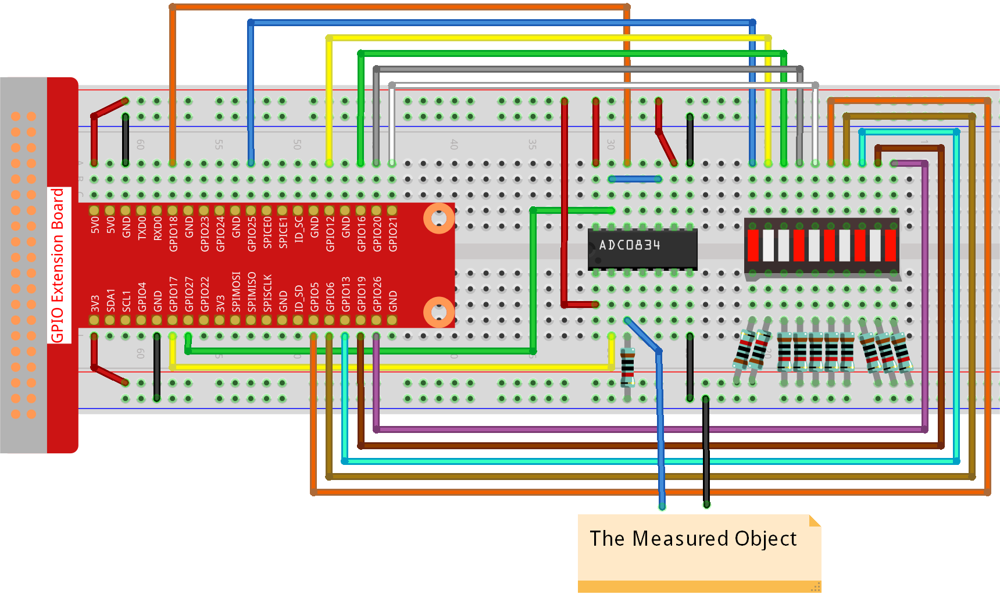

.. note::

    ¡Hola! Bienvenido a la comunidad de entusiastas de SunFounder para Raspberry Pi, Arduino y ESP32 en Facebook. Sumérgete en el mundo de Raspberry Pi, Arduino y ESP32 junto a otros entusiastas.

    **¿Por qué unirse?**

    - **Soporte de Expertos**: Resuelve problemas postventa y desafíos técnicos con ayuda de nuestra comunidad y equipo.
    - **Aprende y Comparte**: Intercambia consejos y tutoriales para mejorar tus habilidades.
    - **Avances Exclusivos**: Acceso anticipado a anuncios de nuevos productos y adelantos.
    - **Descuentos Especiales**: Disfruta de descuentos exclusivos en nuestros productos más recientes.
    - **Promociones Festivas y Sorteos**: Participa en sorteos y promociones especiales por temporadas.

    👉 ¿Listo para explorar y crear con nosotros? Haz clic en [|link_sf_facebook|] y únete hoy mismo.

3.1.5 Indicador de Batería
================================

.. note::

   .. image:: img/mcp3008_and_adc0834.jpg
      :width: 25%
      :align: left
    

   Dependiendo de la versión de tu kit, identifica si tienes **ADC0834** o **MCP3008** y procede con la sección correspondiente.

Introducción
-----------------

En este curso, crearemos un dispositivo indicador de batería que puede 
mostrar visualmente el nivel de carga en una barra LED.

Componentes
------------

.. image:: img/list_Battery_Indicator.png
    :align: center

Diagrama de Esquemático
---------------------------

============ ======== ======== ===
T-Board Name physical wiringPi BCM
GPIO17       Pin 11   0        17
GPIO18       Pin 12   1        18
GPIO27       Pin 13   2        27
GPIO25       Pin 22   6        25
GPIO12       Pin 32   26       12
GPIO16       Pin 36   27       16
GPIO20       Pin 38   28       20
GPIO21       Pin 40   29       21
GPIO5        Pin 29   21       5
GPIO6        Pin 31   22       6
GPIO13       Pin 33   23       13
GPIO19       Pin 35   24       19
GPIO26       Pin 37   25       26
============ ======== ======== ===

.. image:: img/Schematic_three_one5.png
   :align: center

Procedimientos Experimentales
--------------------------------

**Paso 1:** Monta el circuito.

**Para Usuarios de Lenguaje C**
^^^^^^^^^^^^^^^^^^^^^^^^^^^^^^^^^^

**Paso 2:** Dirígete a la carpeta del código.

.. raw:: html

   <run></run>

.. code-block:: 

    cd ~/davinci-kit-for-raspberry-pi/c/3.1.5/

**Paso 3:** Compila el código.

.. raw:: html

   <run></run>

.. code-block:: 

    gcc 3.1.5_BatteryIndicator.c -lwiringPi

**Paso 4:** Ejecuta el archivo.

.. raw:: html

   <run></run>

.. code-block:: 

    sudo ./a.out

Cuando el programa se ejecute, conecta el pin 3 del ADC0834 y el pin GND de 
forma separada, luego conéctalos a los dos polos de una batería. Puedes ver 
que el LED correspondiente en la barra LED se enciende para mostrar el nivel 
de carga (rango de medición: 0-5V).

.. note::

    Si el programa no funciona después de ejecutarse, o aparece un error como: \"wiringPi.h: No such file or directory", consulta :ref:`faq_c_nowork`.

**Explicación del Código**

.. code-block:: c

    void LedBarGraph(int value){
        for(int i=0;i<10;i++){
            digitalWrite(pins[i],HIGH);
        }
        for(int i=0;i<value;i++){
            digitalWrite(pins[i],LOW);
        }
    }

Esta función controla el encendido o apagado de los 10 LEDs en la barra 
LED. Primero, se establece un nivel alto en los LEDs para apagarlos, luego, 
se determina cuántos LEDs encender según el valor analógico recibido.

.. code-block:: c

    int main(void)
    {
        uchar analogVal;
        if(wiringPiSetup() == -1){ //when initialize wiring failed,print messageto screen
            printf("setup wiringPi failed !");
            return 1;
        }
        pinMode(ADC_CS,  OUTPUT);
        pinMode(ADC_CLK, OUTPUT);
        for(int i=0;i<10;i++){       //make led pins' mode is output
            pinMode(pins[i], OUTPUT);
            digitalWrite(pins[i],HIGH);
        }
        while(1){
            analogVal = get_ADC_Result(0);
            LedBarGraph(analogVal/25);
            delay(100);
        }
        return 0;
    }

analogVal genera valores (**0-255**) según el voltaje (**0-5V**). Por ejemplo, 
si se detecta un voltaje de 3V en una batería, el valor correspondiente de **152** 
se muestra en el voltímetro.

Los **10** LEDs de la barra LED se utilizan para mostrar las lecturas de **analogVal**. 
255/10 = 25, así que cada **25** unidades de valor analógico que aumentan, se enciende 
un LED adicional. Por ejemplo, si “analogVal = 150” (aproximadamente 3V), se encienden 6 LEDs.

**Para Usuarios de Lenguaje Python**
^^^^^^^^^^^^^^^^^^^^^^^^^^^^^^^^^^^^^^

**Paso 2:** Dirígete a la carpeta del código.

.. raw:: html

   <run></run>

.. code-block::

    cd ~/davinci-kit-for-raspberry-pi/python/

**Paso 3:** Ejecuta el archivo.

.. raw:: html

   <run></run>

.. code-block::

    sudo python3 3.1.5_BatteryIndicator.py

Cuando el programa se ejecute, conecta el pin 3 del ADC0834 y el pin 
GND de forma separada, luego conéctalos a los dos polos de una batería. 
Podrás ver que el LED correspondiente en la barra LED se enciende para 
mostrar el nivel de carga (rango de medición: 0-5V).

**Código**

.. note::

    Puedes **Modificar/Restablecer/Copiar/Ejecutar/Detener** el código a 
    continuación. Pero antes de hacerlo, debes ir a la ruta del código 
    fuente como ``davinci-kit-for-raspberry-pi/python``. 
    
.. raw:: html

    <run></run>

.. code-block:: python

    import RPi.GPIO as GPIO
    import ADC0834
    import time

    ledPins = [25, 12, 16, 20, 21, 5, 6, 13, 19, 26]

    def setup():
        GPIO.setmode(GPIO.BCM)
        ADC0834.setup()
        for i in ledPins:
            GPIO.setup(i, GPIO.OUT)
            GPIO.output(i, GPIO.HIGH)

    def LedBarGraph(value):
        for i in ledPins:
            GPIO.output(i,GPIO.HIGH)
        for i in range(value):
            GPIO.output(ledPins[i],GPIO.LOW)

    def destroy():
        GPIO.cleanup()

    def loop():
        while True:
            analogVal = ADC0834.getResult()
            LedBarGraph(int(analogVal/25))

    if __name__ == '__main__':
        setup()
        try:
            loop()
        except KeyboardInterrupt:  # Cuando se presiona 'Ctrl+C', se ejecutará destroy().
            destroy()

**Explicación del Código**

.. code-block:: python

    def LedBarGraph(value):
        for i in ledPins:
            GPIO.output(i,GPIO.HIGH)
        for i in range(value):
            GPIO.output(ledPins[i],GPIO.LOW)

Esta función controla el encendido o apagado de los **10** LEDs en la 
barra de LED. Primero, se establece un nivel alto en los LEDs para 
apagarlos, y luego se decide cuántos LEDs se encenderán cambiando el 
valor analógico recibido.

.. code-block:: python

    def loop():
        while True:
            analogVal = ADC0834.getResult()
            LedBarGraph(int(analogVal/25))

analogVal genera valores (**0-255**) según el voltaje (**0-5V**). 
Por ejemplo, si se detecta un voltaje de 3V en una batería, el valor 
correspondiente de **152** se muestra en el voltímetro.

Los **10** LEDs de la barra se utilizan para mostrar las lecturas de 
**analogVal**. 255/10 = 25, por lo tanto, cada vez que el valor analógico 
aumenta en **25**, se enciende un LED adicional. Por ejemplo, si “analogVal=150” 
(aproximadamente 3V), se encienden 6 LEDs.

Imagen del Fenómeno
----------------------

.. image:: img/image249.jpeg
   :align: center
