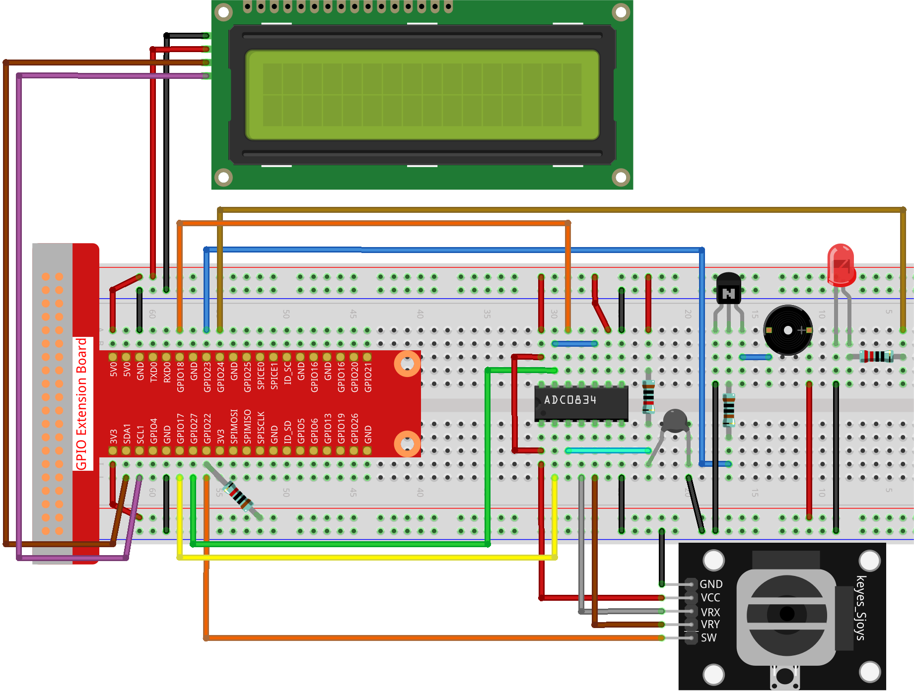

.. note:: 

    Ciao, benvenuto nella Community SunFounder per appassionati di Raspberry Pi, Arduino e ESP32 su Facebook! Unisciti a noi per approfondire le conoscenze su Raspberry Pi, Arduino e ESP32 insieme ad altri entusiasti.

    **Perché unirsi a noi?**

    - **Supporto esperto**: Risolvi problemi post-vendita e sfide tecniche con il supporto della nostra community e del nostro team.
    - **Impara e condividi**: Scambia consigli e tutorial per migliorare le tue competenze.
    - **Anteprime esclusive**: Accedi in anteprima agli annunci di nuovi prodotti e alle anticipazioni.
    - **Sconti speciali**: Goditi sconti esclusivi sui nostri prodotti più recenti.
    - **Promozioni e concorsi festivi**: Partecipa ai concorsi e alle promozioni durante le festività.

    👉 Pronto a esplorare e creare con noi? Clicca [|link_sf_facebook|] e unisciti oggi stesso!

3.1.8 Monitor di Surriscaldamento
====================================

.. note::

   .. image:: img/mcp3008_and_adc0834.jpg
      :width: 25%
      :align: left
    

   A seconda della versione del kit, identifica se hai **ADC0834** o **MCP3008** e procedi con la sezione corrispondente.

Introduzione
--------------

Potresti voler creare un dispositivo di monitoraggio della temperatura che 
si adatta a diverse situazioni. Ad esempio, in una fabbrica, potremmo voler 
avere un sistema di allarme e spegnimento automatico quando c’è un surriscaldamento 
del circuito. In questa lezione, utilizzeremo un termistore, un joystick, 
un buzzer, un LED e un display LCD per creare un dispositivo intelligente 
di monitoraggio della temperatura con una soglia regolabile.

Componenti
--------------

.. image:: img/list_Overheat_Monitor.png
    :align: center

.. image:: img/list_Overheat_Monitor2.png
    :align: center

Schema del Circuito
-----------------------

============ ======== ======== ===
T-Board Name physical wiringPi BCM
GPIO17       Pin 11   0        17
GPIO18       Pin 12   1        18
GPIO27       Pin 13   2        27
GPIO22       Pin15    3        22
GPIO23       Pin16    4        23
GPIO24       Pin18    5        24
SDA1         Pin 3             
SCL1         Pin 5             
============ ======== ======== ===

.. image:: img/Schematic_three_one8.png
   :width: 700
   :align: center

Procedure Sperimentali
---------------------------

**Passo 1:** Costruisci il circuito.

**Per Utenti C**
^^^^^^^^^^^^^^^^^^^

**Passo 2**: Accedi alla cartella del codice.

.. raw:: html

   <run></run>

.. code-block:: 

    cd ~/davinci-kit-for-raspberry-pi/c/3.1.8/

**Passo 3**: Compila il codice.

.. raw:: html

   <run></run>

.. code-block:: 

    gcc 3.1.8_OverheatMonitor.c -lwiringPi -lm

**Passo 4**: Esegui il file eseguibile.

.. raw:: html

   <run></run>

.. code-block:: 

    sudo ./a.out

All’avvio del codice, la temperatura corrente e la soglia di alta temperatura 
**40** sono visualizzate su **I2C LCD1602**. Se la temperatura corrente supera 
la soglia, il buzzer e il LED si attivano per avvisarti.

.. note::

    Se non funziona dopo l'esecuzione, o compare un errore come: \"wiringPi.h: No such file or directory\", consulta :ref:`faq_c_nowork`.

Il **Joystick** consente di regolare la soglia della temperatura massima. 
Muovendo il **Joystick** lungo gli assi X e Y è possibile aumentare o 
diminuire la soglia di alta temperatura. Premendo nuovamente il **Joystick** 
la soglia si resetta al valore iniziale.

**Spiegazione del Codice**

.. code-block:: c

    int get_joystick_value(){
        uchar x_val;
        uchar y_val;
        x_val = get_ADC_Result(1);
        y_val = get_ADC_Result(2);
        if (x_val > 200){
            return 1;
        }
        else if(x_val < 50){
            return -1;
        }
        else if(y_val > 200){
            return -10;
        }
        else if(y_val < 50){
            return 10;
        }
        else{
            return 0;
        }
    }

Questa funzione legge i valori di X e Y. Se **X>200**, restituisce \"**1**\"; 
se **X<50**, restituisce \"**-1**\"; se **y>200**, restituisce \"**-10**\"; 
e se **y<50**, restituisce \"**10**\".

.. code-block:: c

    void upper_tem_setting(){
        write(0, 0, "Upper Adjust:");
        int change = get_joystick_value();
        upperTem = upperTem + change;
        char str[6];
        snprintf(str,3,"%d",upperTem);
        write(0,1,str);
        int len;
        len = strlen(str);
        write(len,1,"             ");
        delay(100);
    }

Questa funzione serve a regolare la soglia e a visualizzarla sull’I2C LCD1602.

.. code-block:: c

    double temperature(){
        unsigned char temp_value;
        double Vr, Rt, temp, cel, Fah;
        temp_value = get_ADC_Result(0);
        Vr = 5 * (double)(temp_value) / 255;
        Rt = 10000 * (double)(Vr) / (5 - (double)(Vr));
        temp = 1 / (((log(Rt/10000)) / 3950)+(1 / (273.15 + 25)));
        cel = temp - 273.15;
        Fah = cel * 1.8 +32;
        return cel;
    }

Leggi il valore analogico del **CH0** (termistore) su **ADC0834** e 
convertilo in valore di temperatura.

.. code-block:: c

    void monitoring_temp(){
        char str[6];
        double cel = temperature();
        snprintf(str,6,"%.2f",cel);
        write(0, 0, "Temp: ");
        write(6, 0, str);
        snprintf(str,3,"%d",upperTem);
        write(0, 1, "Upper: ");
        write(7, 1, str);
        delay(100);
        if(cel >= upperTem){
            digitalWrite(buzzPin, HIGH);
            digitalWrite(LedPin, HIGH);
        }
        else if(cel < upperTem){
            digitalWrite(buzzPin, LOW);
            digitalWrite(LedPin, LOW);
        }
    }

Quando il codice viene eseguito, la temperatura attuale e la soglia di 
alta temperatura **40** vengono visualizzate su **I2C LCD1602**. Se la 
temperatura corrente supera la soglia, il buzzer e il LED si attivano 
per avvisarti.

.. code-block:: c

    int main(void)
    {
        setup();
        int lastState =1;
        int stage=0;
        while (1)
        {
            int currentState = digitalRead(Joy_BtnPin);
            if(currentState==1 && lastState == 0){
                stage=(stage+1)%2;
                delay(100);
                lcd_clear();
            }
            lastState=currentState;
            if (stage==1){
                upper_tem_setting();
            }
            else{
                monitoring_temp();
            }
        }
        return 0;
    }

La funzione main() contiene l’intero processo del programma come segue:

1) All’avvio del programma, il valore iniziale di **stage** è **0**, e la 
temperatura corrente e la soglia di alta temperatura **40** vengono visualizzate 
su **I2C LCD1602**. Se la temperatura corrente supera la soglia, il buzzer 
e il LED si attivano per avvisarti.

2) Premi il Joystick, e **stage** passerà a **1**, permettendoti di regolare 
la soglia di alta temperatura. Muovendo il Joystick lungo gli assi X e Y è 
possibile aumentare o diminuire la soglia attuale. Premendo nuovamente il 
Joystick, la soglia si resetta al valore iniziale.

**Per Utenti Python**
^^^^^^^^^^^^^^^^^^^^^^^^^^

**Passo 2**: Vai alla cartella del codice.

.. raw:: html

   <run></run>

.. code-block:: 

    cd ~/davinci-kit-for-raspberry-pi/python/

**Passo 3**: Esegui il file eseguibile.

.. raw:: html

   <run></run>

.. code-block:: 

    sudo python3 3.1.8_OverheatMonitor.py

All'avvio del codice, la temperatura corrente e la soglia di alta temperatura 
**40** sono visualizzate su **I2C LCD1602**. Se la temperatura corrente supera 
la soglia, il buzzer e il LED si attivano per avvisarti.

Il **Joystick** consente di regolare la soglia di alta temperatura. Muovendo 
il **Joystick** lungo gli assi X e Y è possibile aumentare o diminuire la 
soglia attuale. Premendo nuovamente il **Joystick**, la soglia si resetta al 
valore iniziale.

**Codice**

.. note::

    Puoi **Modificare/Reimpostare/Copiare/Eseguire/Arrestare** il codice qui sotto. Prima di farlo, però, devi accedere al percorso del codice sorgente, ad esempio ``davinci-kit-for-raspberry-pi/python``.
    
.. raw:: html

    <run></run>

.. code-block:: python

    import LCD1602
    import RPi.GPIO as GPIO
    import ADC0834
    import time
    import math

    Joy_BtnPin = 22
    buzzPin = 23
    ledPin = 24

    upperTem = 40

    def setup():
        ADC0834.setup()
        GPIO.setmode(GPIO.BCM)
        GPIO.setup(ledPin, GPIO.OUT, initial=GPIO.LOW)
        GPIO.setup(buzzPin, GPIO.OUT, initial=GPIO.LOW)
        GPIO.setup(Joy_BtnPin, GPIO.IN, pull_up_down=GPIO.PUD_UP)
        LCD1602.init(0x27, 1)

    def get_joystick_value():
        x_val = ADC0834.getResult(1)
        y_val = ADC0834.getResult(2)
        if(x_val > 200):
            return 1
        elif(x_val < 50):
            return -1
        elif(y_val > 200):
            return -10
        elif(y_val < 50):
            return 10
        else:
            return 0

    def upper_tem_setting():
        global upperTem
        LCD1602.write(0, 0, 'Upper Adjust: ')
        change = int(get_joystick_value())
        upperTem = upperTem + change
        strUpperTem = str(upperTem)
        LCD1602.write(0, 1, strUpperTem)
        LCD1602.write(len(strUpperTem),1, '              ')
        time.sleep(0.1)

    def temperature():
        analogVal = ADC0834.getResult()
        Vr = 5 * float(analogVal) / 255
        Rt = 10000 * Vr / (5 - Vr)
        temp = 1/(((math.log(Rt / 10000)) / 3950) + (1 / (273.15+25)))
        Cel = temp - 273.15
        Fah = Cel * 1.8 + 32
        return round(Cel,2)

    def monitoring_temp():
        global upperTem
        Cel=temperature()
        LCD1602.write(0, 0, 'Temp: ')
        LCD1602.write(0, 1, 'Upper: ')
        LCD1602.write(6, 0, str(Cel))
        LCD1602.write(7, 1, str(upperTem))
        time.sleep(0.1)
        if Cel >= upperTem:
            GPIO.output(buzzPin, GPIO.HIGH)
            GPIO.output(ledPin, GPIO.HIGH)
        else:
            GPIO.output(buzzPin, GPIO.LOW)
            GPIO.output(ledPin, GPIO.LOW)       

    def loop():
        lastState=1
        stage=0
        while True:
            currentState=GPIO.input(Joy_BtnPin)
            if currentState==1 and lastState ==0:
                stage=(stage+1)%2
                time.sleep(0.1)    
                LCD1602.clear()
            lastState=currentState
            if stage == 1:
                upper_tem_setting()
            else:
                monitoring_temp()
        
    def destroy():
        LCD1602.clear() 
        ADC0834.destroy()
        GPIO.cleanup()

    if __name__ == '__main__':     # Programma inizia da qui
        try:
            setup()
            while True:
                loop()
        except KeyboardInterrupt:   # Quando si preme 'Ctrl+C', viene eseguita la funzione destroy().
            destroy()
            
**Spiegazione del Codice**

.. code-block:: python

    def get_joystick_value():
        x_val = ADC0834.getResult(1)
        y_val = ADC0834.getResult(2)
        if(x_val > 200):
            return 1
        elif(x_val < 50):
            return -1
        elif(y_val > 200):
            return -10
        elif(y_val < 50):
            return 10
        else:
            return 0

Questa funzione legge i valori di X e Y. Se **X>200**, restituisce
\"**1**\"; se **X<50**, restituisce \"**-1**\"; se **Y>200**, restituisce
\"**-10**\"; e se **Y<50**, restituisce \"**10**\".

.. code-block:: python

    def upper_tem_setting():
        global upperTem
        LCD1602.write(0, 0, 'Upper Adjust: ')
        change = int(get_joystick_value())
        upperTem = upperTem + change
    LCD1602.write(0, 1, str(upperTem))
    LCD1602.write(len(strUpperTem),1, '              ')
        time.sleep(0.1)

Questa funzione regola la soglia e la visualizza su
I2C LCD1602.

.. code-block:: python

    def temperature():
        analogVal = ADC0834.getResult()
        Vr = 5 * float(analogVal) / 255
        Rt = 10000 * Vr / (5 - Vr)
        temp = 1/(((math.log(Rt / 10000)) / 3950) + (1 / (273.15+25)))
        Cel = temp - 273.15
        Fah = Cel * 1.8 + 32
        return round(Cel,2)

Legge il valore analogico del **CH0** (termistore) su **ADC0834** e lo
converte in valore di temperatura.

.. code-block:: python

    def monitoring_temp():
        global upperTem
        Cel=temperature()
        LCD1602.write(0, 0, 'Temp: ')
        LCD1602.write(0, 1, 'Upper: ')
        LCD1602.write(6, 0, str(Cel))
        LCD1602.write(7, 1, str(upperTem))
        time.sleep(0.1)
        if Cel >= upperTem:
            GPIO.output(buzzPin, GPIO.HIGH)
            GPIO.output(ledPin, GPIO.HIGH)
        else:
            GPIO.output(buzzPin, GPIO.LOW)
            GPIO.output(ledPin, GPIO.LOW)

Quando il codice è in esecuzione, la temperatura attuale e la soglia di
alta temperatura **40** vengono visualizzate su **I2C LCD1602**. Se la
temperatura corrente supera la soglia, il buzzer e il LED si attivano
per avvisarti.

.. code-block:: python

    def loop():
        lastState=1
        stage=0
        while True:
            currentState=GPIO.input(Joy_BtnPin)
            if currentState==1 and lastState ==0:
                stage=(stage+1)%2
                time.sleep(0.1)    
                LCD1602.clear()
            lastState=currentState
            if stage == 1:
                upper_tem_setting()
            else:
                monitoring_temp()

La funzione main() include l’intero processo del programma come segue:

1) Quando il programma inizia, il valore iniziale di **stage** è **0**, 
   e la temperatura corrente e la soglia di alta temperatura **40** sono 
   visualizzate su **I2C LCD1602**. Se la temperatura corrente supera la 
   soglia, il buzzer e il LED si attivano per avvisarti.

2) Premi il Joystick, e **stage** sarà impostato a **1** permettendoti di 
   regolare la soglia di alta temperatura. Muovendo il Joystick lungo gli 
   assi X e Y è possibile aumentare o diminuire la soglia attuale. Premendo 
   nuovamente il Joystick, la soglia torna al valore iniziale.

Immagine del Fenomeno
-------------------------

.. image:: img/image259.jpeg
   :align: center