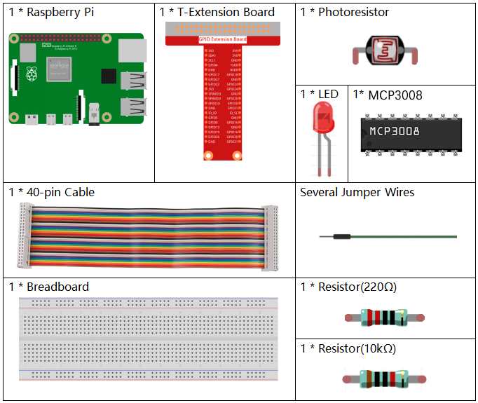
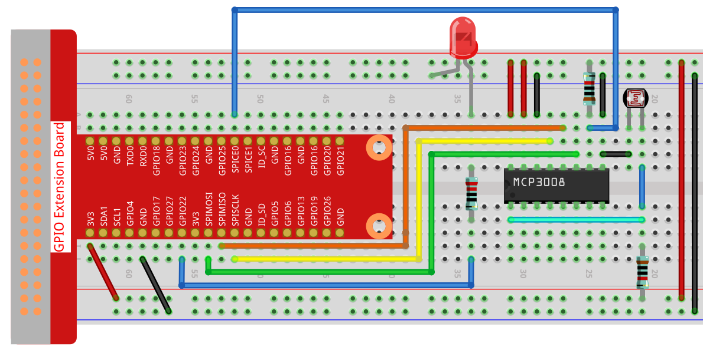

.. note::

    ¡Hola, bienvenido a la comunidad de entusiastas de SunFounder Raspberry Pi & Arduino & ESP32 en Facebook! Sumérgete más en Raspberry Pi, Arduino y ESP32 con otros entusiastas.

    **¿Por qué unirse?**

    - **Soporte experto**: Resuelve problemas postventa y desafíos técnicos con la ayuda de nuestra comunidad y equipo.
    - **Aprender y compartir**: Intercambia consejos y tutoriales para mejorar tus habilidades.
    - **Vistas previas exclusivas**: Obtén acceso anticipado a anuncios de nuevos productos y adelantos.
    - **Descuentos especiales**: Disfruta de descuentos exclusivos en nuestros productos más nuevos.
    - **Promociones y sorteos festivos**: Participa en sorteos y promociones navideñas.

    👉 ¿Listo para explorar y crear con nosotros? Haz clic en [|link_sf_facebook|] y únete hoy.

.. _2.2.1_c_pi5_mcp3008:

2.2.1 Fotoresistor (MCP3008)
============================

.. note::

   .. image:: ../img/mcp3008_and_adc0834.jpg
      :width: 25%
      :align: left
    

   Dependiendo de la versión de tu kit, identifica si tienes **ADC0834** o **MCP3008** y procede con la sección correspondiente.

Introducción
------------

El fotoresistor es un componente comúnmente utilizado para medir la intensidad de la luz ambiental.  
Ayuda al controlador a distinguir entre día y noche y a realizar funciones de control lumínico, como el encendido automático de lámparas nocturnas.  
Este proyecto es muy similar al del potenciómetro, y podrías pensar que simplemente cambia el voltaje, pero en este caso lo hace en función de la luz.

Componentes necesarios
-----------------------

En este proyecto, necesitamos los siguientes componentes. 

Principio
---------

Un fotoresistor o fotorresistencia es una resistencia variable controlada por la luz.  
La resistencia de un fotoresistor disminuye a medida que aumenta la intensidad de la luz incidente; en otras palabras, presenta **fotoconductividad**.  
Un fotoresistor puede aplicarse en circuitos detectores de luz y en circuitos de conmutación activados por luz u oscuridad.

.. image:: ../img/image196.png
    :width: 200
    :align: center

Diagrama esquemático
--------------------

.. list-table::
    :widths: 30 30 30 30
    :header-rows: 1

    *   - Nombre T-Board
        - Físico
        - WiringPi
        - BCM

    *   - SPICE0
        - pin24
        - 10
        - 8
    *   - SPIMOSI
        - pin19
        - 12
        - 10
    *   - SPIMISO
        - pin21
        - 13
        - 9
    *   - SPISCLK
        - pin23
        - 14
        - 11
    *   - GPIO22
        - pin15
        - 3
        - 22

.. image:: ../img/schematic_2.2.1_photoresistor_mcp3008.png

Procedimiento experimental
--------------------------

**Paso 1:** Montar el circuito.

**Paso 2:** Ir a la carpeta del código.

.. raw:: html

   <run></run>

.. code-block:: 

    cd ~/davinci-kit-for-raspberry-pi/c/2.2.1-2/

**Paso 3:** Compilar el código.

.. raw:: html

   <run></run>

.. code-block:: 

    gcc 2.2.1_Photoresistor.c -o photoresistor -lwiringPi -lm

**Paso 4:** Ejecutar el archivo compilado.

.. raw:: html

   <run></run>

.. code-block:: 

    ./photoresistor

Cuando el código esté en ejecución, el brillo del LED cambiará de acuerdo con la intensidad de luz detectada por el fotoresistor.

.. note::

    Si no funciona después de ejecutarlo, o aparece el error: "wiringPi.h: No such file or directory", consulta :ref:`install_wiringpi`.

**Código**

.. code-block:: c

    #include <wiringPi.h>
    #include <wiringPiSPI.h>
    #include <stdio.h>
    #include <softPwm.h>

    #define SPI_CHANNEL 0      // Usar canal SPI 0 (CE0)
    #define SPI_SPEED   1000000 // Velocidad SPI de 1 MHz
    #define LedPin      3       // GPIO3 (WiringPi) para PWM del LED

    // Leer valor ADC del MCP3008, canal 0~7
    int readMCP3008(int channel) {
        if (channel < 0 || channel > 7) return -1;

        unsigned char buffer[3];
        buffer[0] = 1;                          // Bit de inicio
        buffer[1] = (8 + channel) << 4;         // SGL/DIF = 1, D2-D0 = canal
        buffer[2] = 0;

        wiringPiSPIDataRW(SPI_CHANNEL, buffer, 3);

        // Combinar el resultado
        int result = ((buffer[1] & 3) << 8) | buffer[2];
        return result;
    }

    int main(void) {
        if (wiringPiSetup() == -1) {
            printf("¡Error al iniciar wiringPi!\n");
            return 1;
        }

        if (wiringPiSPISetup(SPI_CHANNEL, SPI_SPEED) == -1) {
            printf("¡Error en la configuración SPI!\n");
            return 1;
        }

        softPwmCreate(LedPin, 0, 100); // Inicializar PWM por software

        while (1) {
            int analogVal = readMCP3008(0); // Leer del CH0
            printf("Valor ADC: %d\n", analogVal);

            // Escalar valor ADC de 10 bits (0–1023) al rango PWM (0–100)
            int pwmVal = analogVal * 100 / 1023;
            softPwmWrite(LedPin, pwmVal);

            delay(100);
        }

        return 0;
    }

**Explicación del código**

El código aquí es el mismo que en el apartado **2.1.4 Potenciómetro**.  
Si tienes alguna otra pregunta, revisa la explicación de código de :ref:`2.1.4_c_pi5_mcp3008` para más detalles.
