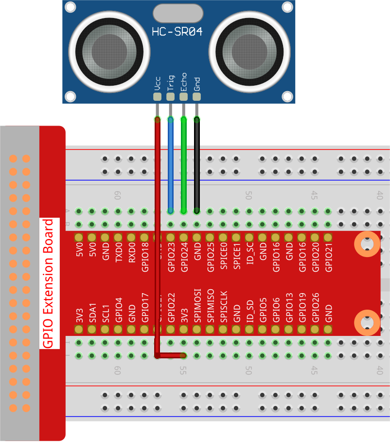

.. note::

    Bonjour et bienvenue dans la communauté des passionnés de SunFounder Raspberry Pi, Arduino et ESP32 sur Facebook ! Plongez dans l'univers de Raspberry Pi, Arduino et ESP32 avec d'autres passionnés.

    **Pourquoi nous rejoindre ?**

    - **Support d'experts** : Résolvez les problèmes après-vente et relevez vos défis techniques grâce à l'aide de notre communauté et de notre équipe.
    - **Apprenez & Partagez** : Échangez des astuces et des tutoriels pour perfectionner vos compétences.
    - **Aperçus exclusifs** : Bénéficiez d'un accès anticipé aux nouvelles annonces de produits et aux avant-premières.
    - **Réductions spéciales** : Profitez de réductions exclusives sur nos nouveaux produits.
    - **Promotions festives et concours** : Participez à des concours et des promotions à l'occasion des fêtes.

    👉 Prêt à explorer et à créer avec nous ? Cliquez sur [|link_sf_facebook|] et rejoignez-nous dès aujourd'hui !

2.2.5 Module de Capteur Ultrasonique
=======================================

Introduction
---------------

Le capteur ultrasonique utilise des ultrasons pour détecter avec précision des objets et mesurer les distances. Il émet des ondes ultrasonores et les convertit en signaux électroniques.

Composants
-------------

.. image:: img/list_2.2.5.png

Principe
-----------

**Ultrason**

Le module de télémétrie ultrasonique permet une mesure sans contact de 
2 cm à 400 cm, avec une précision pouvant atteindre 3 mm. Il assure une 
stabilité du signal jusqu'à 5 m, puis celui-ci s'affaiblit progressivement 
au-delà de cette distance, jusqu'à disparaître au niveau des 7 m.

Le module comprend des émetteurs ultrasoniques, un récepteur et un circuit de 
contrôle. Les principes de base sont les suivants :

1. Utiliser une bascule IO pour générer un signal de niveau haut pendant au 
moins 10 µs.

2. Le module envoie automatiquement huit impulsions à 40 kHz et détecte s'il y 
a un retour de signal.

3. Si le signal est de retour, la durée du niveau haut de la sortie IO correspond 
au temps écoulé entre l'émission de l'onde ultrasonique et sa réception. La distance 
est calculée selon la formule suivante : distance = (durée du niveau haut x vitesse 
du son (340 m/s)) / 2.

.. image:: img/image217.png
    :width: 200

.. image:: img/image328.png
    :width: 500

Le schéma de synchronisation est illustré ci-dessous. Il vous suffit de fournir une 
impulsion de 10 µs pour l'entrée du déclencheur afin de démarrer la télémétrie. 
Ensuite, le module émettra une rafale d'ultrasons de 8 cycles à 40 kHz et augmentera 
son écho. Vous pouvez calculer la distance en mesurant l'intervalle de temps entre 
l'envoi du signal de déclenchement et la réception de l'écho.

Formule : us / 58 = centimètres ou us / 148 = pouces ; ou : distance = temps du niveau 
haut \* vitesse (340 m/s) / 2. Il est conseillé d'utiliser un cycle de mesure supérieur 
à 60 ms pour éviter les collisions entre le signal de déclenchement et le signal de retour.

.. image:: img/image218.png
    :width: 800

Schéma de câblage
--------------------

.. image:: img/image329.png

Procédures expérimentales
---------------------------

**Étape 1 :** Construisez le circuit.

**Étape 2 :** Accédez au dossier du code.

.. raw:: html

   <run></run>

.. code-block::

    cd ~/davinci-kit-for-raspberry-pi/c/2.2.5/

**Étape 3 :** Compilez le code.

.. raw:: html

   <run></run>

.. code-block::

    gcc 2.2.5_Ultrasonic.c -lwiringPi

**Étape 4 :** Exécutez le fichier exécutable.

.. raw:: html

   <run></run>

.. code-block::

    sudo ./a.out

Une fois le code exécuté, le module de capteur ultrasonique détecte la distance 
entre l'obstacle situé en face de lui et le module lui-même, puis la valeur de 
cette distance est affichée à l'écran.

.. note::

    Si cela ne fonctionne pas après l'exécution ou s'il y a un message d'erreur 
    indiquant: \"wiringPi.h: Aucun fichier ou répertoire de ce type », veuillez 
    vous référer à :ref:`faq_c_nowork`.

**Code**

.. code-block:: c

    #include <wiringPi.h>
    #include <stdio.h>
    #include <sys/time.h>

    #define Trig    4
    #define Echo    5

    void ultraInit(void)
    {
        pinMode(Echo, INPUT);
        pinMode(Trig, OUTPUT);
    }

    float disMeasure(void)
    {
        struct timeval tv1;
        struct timeval tv2;
        long time1, time2;
        float dis;

        digitalWrite(Trig, LOW);
        delayMicroseconds(2);

        digitalWrite(Trig, HIGH);
        delayMicroseconds(10);      
        digitalWrite(Trig, LOW);
                                  
        while(!(digitalRead(Echo) == 1));   
        gettimeofday(&tv1, NULL);           

        while(!(digitalRead(Echo) == 0));   
        gettimeofday(&tv2, NULL);           

        time1 = tv1.tv_sec * 1000000 + tv1.tv_usec;   
        time2  = tv2.tv_sec * 1000000 + tv2.tv_usec;

        dis = (float)(time2 - time1) / 1000000 * 34000 / 2;  

        return dis;
    }

    int main(void)
    {
        float dis;
        if(wiringPiSetup() == -1){ // En cas d'échec d'initialisation de wiringPi, afficher un message à l'écran
            printf("setup wiringPi failed !");
            return 1;
        }

        ultraInit();
        
        while(1){
            dis = disMeasure();
            printf("%0.2f cm\n\n",dis);
            delay(300);
        }

        return 0;
    }

**Explication du Code**

.. code-block:: c

    void ultraInit(void)
    {
        pinMode(Echo, INPUT);
        pinMode(Trig, OUTPUT);
    }

Initialise les broches du capteur ultrasonique ; en même temps, définit Echo 
comme entrée et Trig comme sortie.

.. code-block:: c

    float disMeasure(void){};

Cette fonction permet de mesurer la distance détectée par le capteur ultrasonique 
en calculant le temps de retour de l'écho.

.. code-block:: c

    struct timeval tv1;
    struct timeval tv2;

`struct timeval` est une structure utilisée pour stocker l'heure actuelle. 
La structure complète est la suivante :

.. code-block:: c

    struct timeval
    {
    __time_t tv_sec;        /* Secondes */
    __suseconds_t tv_usec;  /* Microsecondes */
    };

Ici, `tv_sec` représente les secondes écoulées depuis l'Ère Unix lors de 
la création de `struct timeval`. `tv_usec` correspond aux microsecondes, 
soit une fraction de seconde.

.. code-block:: c

    digitalWrite(Trig, HIGH);
    delayMicroseconds(10);     
    digitalWrite(Trig, LOW);

Envoie une impulsion ultrasonore de 10 µs.

.. code-block:: c

    while(!(digitalRead(Echo) == 1));
    gettimeofday(&tv1, NULL);

Cette boucle vide est utilisée pour s'assurer qu'au moment de l'envoi du 
signal de déclenchement, il n'y a pas de signal d'écho parasite, puis pour 
obtenir l'heure actuelle.

.. code-block:: c

    while(!(digitalRead(Echo) == 0)); 
    gettimeofday(&tv2, NULL);

Cette boucle vide est utilisée pour s'assurer que l'étape suivante n'est 
effectuée que lorsque le signal d'écho est reçu, puis pour obtenir à nouveau 
l'heure actuelle.

.. code-block:: c

    time1 = tv1.tv_sec * 1000000 + tv1.tv_usec;
    time2  = tv2.tv_sec * 1000000 + tv2.tv_usec;

Convertit le temps stocké par `struct timeval` en microsecondes complètes.

.. code-block:: c

    dis = (float)(time2 - time1) / 1000000 * 34000 / 2;  

La distance est calculée à partir de l'intervalle de temps et de la vitesse de 
propagation du son. La vitesse du son dans l'air est de 34000 cm/s.
