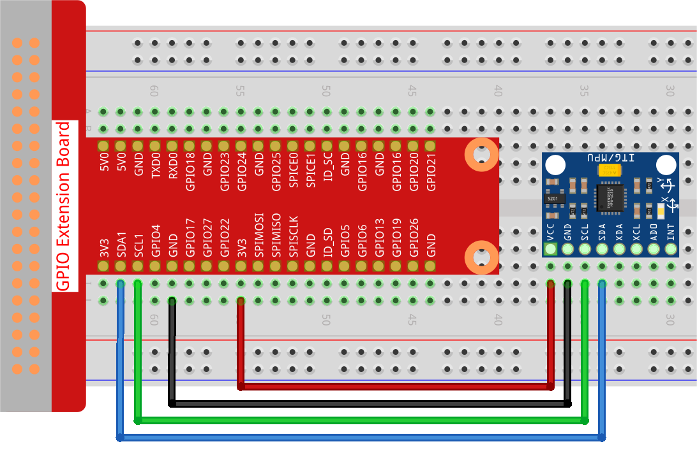

.. note::

    Bonjour et bienvenue dans la communauté des passionnés de SunFounder Raspberry Pi, Arduino et ESP32 sur Facebook ! Plongez dans l'univers de Raspberry Pi, Arduino et ESP32 avec d'autres passionnés.

    **Pourquoi nous rejoindre ?**

    - **Support d'experts** : Résolvez les problèmes après-vente et relevez vos défis techniques grâce à l'aide de notre communauté et de notre équipe.
    - **Apprendre et Partager** : Échangez des astuces et des tutoriels pour perfectionner vos compétences.
    - **Aperçus exclusifs** : Bénéficiez d'un accès anticipé aux nouvelles annonces de produits et aux avant-premières.
    - **Réductions spéciales** : Profitez de réductions exclusives sur nos nouveaux produits.
    - **Promotions festives et concours** : Participez à des concours et à des promotions lors des fêtes.

    👉 Prêt à explorer et à créer avec nous ? Cliquez sur [|link_sf_facebook|] et rejoignez-nous dès aujourd'hui !

2.2.6 Module MPU6050
=======================

Introduction
---------------

Le MPU-6050 est le premier et le seul dispositif de suivi de mouvement 6 axes 
au monde (gyroscope 3 axes et accéléromètre 3 axes), conçu pour les smartphones, 
tablettes et capteurs portables. Il se distingue par ses faibles besoins énergétiques, 
son faible coût et ses performances élevées.

Dans cette expérience, nous utilisons l'I2C pour obtenir les valeurs des capteurs 
d'accélération et de gyroscope à trois axes du MPU6050 et les afficher à l'écran.

Composants
--------------

.. image:: img/list_2.2.6.png

Principe
----------

**MPU6050**

Le MPU-6050 est un dispositif de suivi de mouvement à 6 axes (combinant un gyroscope 
3 axes et un accéléromètre 3 axes).

Ses trois systèmes de coordonnées se définissent ainsi :

Placez le MPU6050 à plat sur la table, assurez-vous que la face avec l'étiquette est 
orientée vers le haut et qu'un point se trouve dans le coin supérieur gauche. La direction 
perpendiculaire vers le haut correspond à l'axe Z du composant. La direction de gauche à 
droite est considérée comme l'axe X. De même, la direction de l'arrière vers l'avant est 
définie comme l'axe Y.

.. image:: img/image223.png

**Accéléromètre 3 axes**

L'accéléromètre fonctionne sur le principe de l'effet piézoélectrique, la capacité de 
certains matériaux à générer une charge électrique en réponse à une contrainte mécanique 
appliquée.

Imaginez ici un cube avec une petite bille à l'intérieur, comme illustré ci-dessus. Les 
parois de ce cube sont constituées de cristaux piézoélectriques. Chaque fois que vous 
inclinez le cube, la bille est forcée de se déplacer dans la direction de l'inclinaison 
sous l'effet de la gravité. La paroi contre laquelle la bille heurte génère de minuscules 
courants piézoélectriques. Il y a trois paires de parois opposées dans ce cube. Chaque 
paire correspond à un axe dans l'espace 3D : les axes X, Y et Z. En fonction du courant 
produit par les parois piézoélectriques, on peut déterminer la direction de l'inclinaison 
et son intensité.

.. image:: img/image224.png

Nous pouvons utiliser le MPU6050 pour détecter son accélération sur chaque axe de 
coordonnées (à l'état stationnaire sur un bureau, l'accélération de l'axe Z est de 
1 unité de gravité, tandis que celle des axes X et Y est de 0). Si le composant est 
incliné ou soumis à un état de pesanteur ou de surpoids, la lecture correspondante changera.

Quatre plages de mesure peuvent être sélectionnées par programmation : 
+/-2g, +/-4g, +/-8g et +/-16g (2g par défaut) correspondant à chaque précision. 
Les valeurs varient de -32768 à 32767.

La lecture de l'accéléromètre est convertie en valeur d'accélération en mappant 
la lecture de la plage de lecture à la plage de mesure.

Accélération = (Données brutes de l'accéléromètre / 65536 \* plage d'accélération maximale) g

Prenons l'axe X par exemple, lorsque les données brutes de l'axe X de l'accéléromètre 
sont 16384 et que la plage sélectionnée est de +/-2g :

**Accélération le long de l'axe X = (16384 / 65536 \* 4) g** **=1g**

**Gyroscope 3 axes**

Les gyroscopes fonctionnent selon le principe de l'accélération de Coriolis. Imaginez 
une structure en forme de fourche qui oscille constamment d'avant en arrière. Elle est 
maintenue en place grâce à des cristaux piézoélectriques. Chaque fois que vous essayez 
d'incliner cette structure, les cristaux subissent une force dans la direction de 
l'inclinaison, due à l'inertie de la fourche en mouvement. Les cristaux produisent alors 
un courant en lien avec l'effet piézoélectrique, et ce courant est amplifié.

.. image:: img/image225.png
    :width: 800
    :align: center

Le gyroscope dispose également de quatre plages de mesure : +/- 250, +/- 500, +/- 1000, 
et +/- 2000. La méthode de calcul et l'accélération sont globalement similaires.

La formule pour convertir la lecture en vitesse angulaire est la suivante :

Vitesse angulaire = (Données brutes du gyroscope / 65536 \* plage maximale du gyroscope) °/s

Par exemple, pour l'axe X, si les données brutes de l'axe X du gyroscope sont 16384 
et que la plage est de +/- 250°/s :

**Vitesse angulaire le long de l'axe X = (16384 / 65536 \* 500)°/s** **=125°/s**

Schéma de câblage
-----------------------

Le MPU6050 communique avec le microcontrôleur via l'interface du bus I2C. Les broches 
SDA1 et SCL1 doivent être connectées aux broches correspondantes.

.. image:: img/image330.png
    :width: 600
    :align: center

Procédures expérimentales
----------------------------

**Étape 1 :** Construisez le circuit.

**Étape 2 :** Configurez l'I2C (voir :ref:`i2c_config`. Si l'I2C est déjà configuré, passez cette étape.)

**Étape 3 :** Accédez au dossier du code.

.. raw:: html

   <run></run>

.. code-block::

    cd ~/davinci-kit-for-raspberry-pi/c/2.2.6/

**Étape 4 :** Compilez le code.

.. raw:: html

   <run></run>

.. code-block::

    gcc 2.2.6_mpu6050.c -lwiringPi -lm

**Étape 5 :** Exécutez le fichier exécutable.

.. raw:: html

   <run></run>

.. code-block::

    sudo ./a.out

Une fois le code exécuté, l'angle de déviation des axes X et Y ainsi que 
l'accélération et la vitesse angulaire de chaque axe, mesurés par le MPU6050, 
seront affichés à l'écran après calcul.

.. note::

    Si cela ne fonctionne pas après l'exécution, ou s'il y a un message d'erreur indiquant : « wiringPi.h : Aucun fichier ou répertoire de ce type », veuillez vous référer à :ref:`faq_c_nowork`.

**Code**

.. code-block:: c

    #include  <wiringPiI2C.h>
    #include <wiringPi.h>
    #include  <stdio.h>
    #include  <math.h>
    int fd;
    int acclX, acclY, acclZ;
    int gyroX, gyroY, gyroZ;
    double acclX_scaled, acclY_scaled, acclZ_scaled;
    double gyroX_scaled, gyroY_scaled, gyroZ_scaled;

    int read_word_2c(int addr)
    {
        int val;
        val = wiringPiI2CReadReg8(fd, addr);
        val = val << 8;
        val += wiringPiI2CReadReg8(fd, addr+1);
        if (val >= 0x8000)
            val = -(65536 - val);
        return val;
    }

    double dist(double a, double b)
    {
        return sqrt((a*a) + (b*b));
    }

    double get_y_rotation(double x, double y, double z)
    {
        double radians;
        radians = atan2(x, dist(y, z));
        return -(radians * (180.0 / M_PI));
    }

    double get_x_rotation(double x, double y, double z)
    {
        double radians;
        radians = atan2(y, dist(x, z));
        return (radians * (180.0 / M_PI));
    }

    int main()
    {
        fd = wiringPiI2CSetup (0x68);
        wiringPiI2CWriteReg8 (fd,0x6B,0x00); // désactiver le mode veille 
    printf("set 0x6B=%X\n",wiringPiI2CReadReg8 (fd,0x6B));
    
        while(1) {

            gyroX = read_word_2c(0x43);
            gyroY = read_word_2c(0x45);
            gyroZ = read_word_2c(0x47);

            gyroX_scaled = gyroX / 131.0;
            gyroY_scaled = gyroY / 131.0;
            gyroZ_scaled = gyroZ / 131.0;

            // Afficher les valeurs pour les axes X, Y et Z du capteur gyroscopique.
        printf("My gyroX_scaled: %f\n", gyroY X_scaled);
        delay(100);
        printf("My gyroY_scaled: %f\n", gyroY Y_scaled);
        delay(100);
        printf("My gyroZ_scaled: %f\n", gyroY Z_scaled);
            delay(100);

            acclX = read_word_2c(0x3B);
            acclY = read_word_2c(0x3D);
            acclZ = read_word_2c(0x3F);

            acclX_scaled = acclX / 16384.0;
            acclY_scaled = acclY / 16384.0;
            acclZ_scaled = acclZ / 16384.0;

            // Afficher les valeurs X, Y et Z du capteur d'accélération.
        printf("My acclX_scaled: %f\n", acclX_scaled);
        delay(100);
        printf("My acclY_scaled: %f\n", acclY_scaled);
        delay(100);
        printf("My acclZ_scaled: %f\n", acclZ_scaled);
        delay(100);

        printf("My X rotation: %f\n", get_x_rotation(acclX_scaled, acclY_scaled, acclZ_scaled));
        delay(100);
        printf("My Y rotation: %f\n", get_y_rotation(acclX_scaled, acclY_scaled, acclZ_scaled));
        delay(100);

            delay(100);
        }
        return 0;
    }

**Explication du Code**

.. code-block:: c

    int read_word_2c(int addr)
    {
    int val;
    val = wiringPiI2CReadReg8(fd, addr);
    val = val << 8;
    val += wiringPiI2CReadReg8(fd, addr+1);
    if (val >= 0x8000)
        val = -(65536 - val);
    return val;
    }

Lit les données du capteur envoyées par le MPU6050.

.. code-block:: c

    double get_y_rotation(double x, double y, double z)
    {
    double radians;
    radians = atan2(x, dist(y, z));
    return -(radians * (180.0 / M_PI));
    }

Calcule l'angle de déviation sur l'axe Y.

.. code-block:: c

    double get_x_rotation(double x, double y, double z)
    {
    double radians;
    radians = atan2(y, dist(x, z));
    return (radians * (180.0 / M_PI));
    }

Calcule l'angle de déviation sur l'axe X.

.. code-block:: c

    gyroX = read_word_2c(0x43);
    gyroY = read_word_2c(0x45);
    gyroZ = read_word_2c(0x47);

    gyroX_scaled = gyroX / 131.0;
    gyroY_scaled = gyroY / 131.0;
    gyroZ_scaled = gyroZ / 131.0;

    // Affiche les valeurs des axes X, Y et Z du capteur gyroscopique.
    printf("My gyroX_scaled: %f\n", gyroY X_scaled);
    printf("My gyroY_scaled: %f\n", gyroY Y_scaled);
    printf("My gyroZ_scaled: %f\n", gyroY Z_scaled);

Lit les valeurs des axes X, Y et Z du capteur gyroscopique, convertit les données brutes en valeurs de vitesse angulaire, puis les affiche.

.. code-block:: c

    acclX = read_word_2c(0x3B);
    acclY = read_word_2c(0x3D);
    acclZ = read_word_2c(0x3F);

    acclX_scaled = acclX / 16384.0;
    acclY_scaled = acclY / 16384.0;
    acclZ_scaled = acclZ / 16384.0;
        
    // Affiche les valeurs X, Y et Z du capteur d'accélération.
    printf("My acclX_scaled: %f\n", acclX_scaled);
    printf("My acclY_scaled: %f\n", acclY_scaled);
    printf("My acclZ_scaled: %f\n", acclZ_scaled);

Lit les valeurs des axes X, Y et Z du capteur d'accélération, convertit les données brutes en valeurs d'accélération (en unité de gravité), puis les affiche.

.. code-block:: c

    printf("My X rotation: %f\n", get_x_rotation(acclX_scaled, acclY_scaled, acclZ_scaled));
    printf("My Y rotation: %f\n", get_y_rotation(acclX_scaled, acclY_scaled, acclZ_scaled));

Affiche les angles de déviation des axes X et Y.

