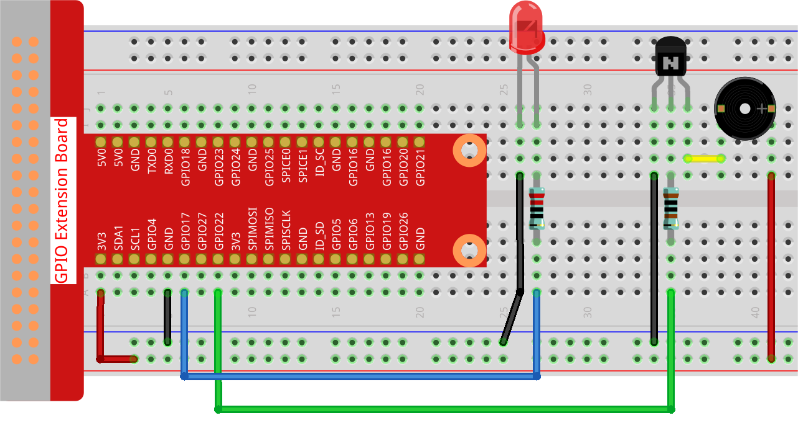

.. note::

    ¡Hola! Bienvenido a la Comunidad de Entusiastas de SunFounder para Raspberry Pi, Arduino y ESP32 en Facebook. Sumérgete más en el mundo de Raspberry Pi, Arduino y ESP32 junto a otros apasionados.

    **¿Por qué unirte?**

    - **Soporte Experto**: Resuelve problemas postventa y desafíos técnicos con la ayuda de nuestra comunidad y equipo.
    - **Aprende y Comparte**: Intercambia consejos y tutoriales para mejorar tus habilidades.
    - **Preestrenos Exclusivos**: Accede anticipadamente a anuncios de nuevos productos.
    - **Descuentos Especiales**: Disfruta de descuentos exclusivos en nuestros productos más recientes.
    - **Promociones Festivas y Sorteos**: Participa en sorteos y promociones especiales.

    👉 ¿Listo para explorar y crear con nosotros? Haz clic en [|link_sf_facebook|] y únete hoy.

3.1.11 Generador de Código Morse
=====================================

Introducción
--------------

En esta lección, vamos a crear un generador de código Morse. Escribe una 
serie de letras en inglés en la Raspberry Pi para verlas en código Morse.

Componentes
--------------

.. image:: img/3.1.10.png
    :align: center

Diagrama de Esquemático
--------------------------

============ ======== ======== ===
T-Board Name physical wiringPi BCM
GPIO17       Pin 11   0        17
GPIO22       Pin 15   3        22
============ ======== ======== ===

.. image:: img/Schematic_three_one11.png
   :align: center

Procedimientos Experimentales
--------------------------------

**Paso 1:** Construye el circuito. (Presta atención a los polos del zumbador: 
el polo positivo tiene la etiqueta + y el otro es el negativo).

**Paso 2**: Abre el archivo de código.

.. raw:: html

   <run></run>

.. code-block::

    cd ~/davinci-kit-for-raspberry-pi/c/3.1.11/

**Paso 3**: Compila el código.

.. raw:: html

   <run></run>

.. code-block::

    gcc 3.1.11_MorseCodeGenerator.c -lwiringPi

**Paso 4**: Ejecuta el archivo ejecutable.

.. raw:: html

   <run></run>

.. code-block:: 

    sudo ./a.out

Después de ejecutar el programa, escribe una serie de caracteres, y el 
zumbador y el LED emitirán las señales correspondientes en código Morse.

.. note::

    Si no funciona después de ejecutar el código o aparece un mensaje de error: \"wiringPi.h: No such file or directory\", consulta :ref:`faq_c_nowork`.

**Explicación del Código**

.. code-block:: c

    struct MORSE{
        char word;
        unsigned char *code;
    };

    struct MORSE morseDict[]=
    {
        {'A',"01"}, {'B',"1000"}, {'C',"1010"}, {'D',"100"}, {'E',"0"}, 
        {'F',"0010"}, {'G',"110"}, {'H',"0000"}, {'I',"00"}, {'J',"0111"}, 
        {'K',"101"}, {'L',"0100"}, {'M',"11"}, {'N',"10"}, {'O',"111"}, 
        {'P',"0110"}, {'Q',"1101"}, {'R',"010"}, {'S',"000"}, {'T',"1"},
        {'U',"001"}, {'V',"0001"}, {'W',"011"}, {'X',"1001"}, {'Y',"1011"}, 
        {'Z',"1100"},{'1',"01111"}, {'2',"00111"}, {'3',"00011"}, {'4',"00001"}, 
        {'5',"00000"},{'6',"10000"}, {'7',"11000"}, {'8',"11100"}, {'9',"11110"},
        {'0',"11111"},{'?',"001100"}, {'/',"10010"}, {',',"110011"}, {'.',"010101"},
        {';',"101010"},{'!',"101011"}, {'@',"011010"}, {':',"111000"}
    };

Esta estructura MORSE es el diccionario de código Morse, que contiene caracteres 
de la A-Z, números del 0-9 y signos \"?\" \"/\" \":\" \",\" \".\" \";\" \"!\" \"@\" .

.. code-block:: c

    char *lookup(char key,struct MORSE *dict,int length)
    {
        for (int i=0;i<length;i++)
        {
            if(dict[i].word==key){
                return dict[i].code;
            }
        }     
    }

La función **lookup()** permite “consultar el diccionario”. Define una 
**key** y busca palabras que coincidan con **key** en la estructura 
**morseDict**, devolviendo el \"**code**\" correspondiente a la palabra encontrada.

.. code-block:: c

    void on(){
        digitalWrite(ALedPin,HIGH);
        digitalWrite(BeepPin,HIGH);     
    }

Se crea la función on() para encender el zumbador y el LED.

.. code-block:: c

    void off(){
        digitalWrite(ALedPin,LOW);
        digitalWrite(BeepPin,LOW);
    }

La función off() apaga el zumbador y el LED.

.. code-block:: c

    void beep(int dt){
        on();
        delay(dt);
        off();
        delay(dt);
    }

Define la función beep() para que el zumbador y el LED emitan 
sonidos y parpadeen a intervalos de tiempo específicos **dt**.

.. code-block:: c

    void morsecode(char *code){
        int pause = 250;
        char *point = NULL;
        int length = sizeof(morseDict)/sizeof(morseDict[0]);
        for (int i=0;i<strlen(code);i++)
        {
            point=lookup(code[i],morseDict,length);
            for (int j=0;j<strlen(point);j++){
                if (point[j]=='0')
                {
                    beep(pause/2);
                }else if(point[j]=='1')
                {
                    beep(pause);
                }
                delay(pause);
            }
        }
    }

La función morsecode() procesa el código Morse de los caracteres de 
entrada, haciendo que el \"1\" del código emita sonidos o luces de 
mayor duración y el \"0\" emita luces y sonidos breves. Por ejemplo, 
al ingresar \"SOS\", se generará una señal que contiene tres puntos, 
tres guiones y luego tres puntos \" · · · - - - · · · \".

.. code-block:: c

    int toupper(int c)
    {
        if ((c >= 'a') && (c <= 'z'))
            return c + ('A' - 'a');
        return c;
    }
    char *strupr(char *str)
    {
        char *orign=str;
        for (; *str!='\0'; str++)
            *str = toupper(*str);
    return orign;
    }

Antes de codificar, es necesario unificar las letras en mayúsculas.

.. code-block:: c

    void main(){
        setup();
        char *code;
        int length=8;
        code = (char*)malloc(sizeof(char)*length);
        while (1){
            printf("Please input the messenger:");
            delay(100);
            scanf("%s",code);
            code=strupr(code);
            printf("%s\n",code);
            delay(100);
            morsecode(code);
        }
    }

Cuando escribes los caracteres relevantes en el teclado, code=strupr(code) 
convierte las letras en mayúsculas. Printf() luego imprime el texto claro 
en la pantalla de la computadora, y la función morsecode() hace que el 
zumbador y el LED emitan el código Morse.

Nota que la longitud del carácter de entrada no debe exceder el **length** 
(este valor puede modificarse).

