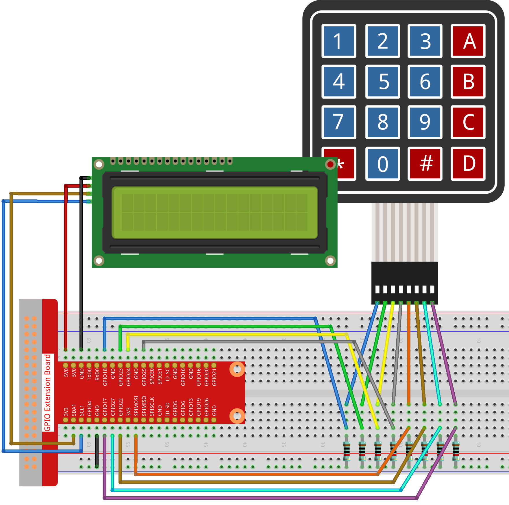

.. note::

    Bonjour et bienvenue dans la communauté Facebook des passionnés de SunFounder Raspberry Pi, Arduino et ESP32 ! Plongez plus profondément dans l'univers des Raspberry Pi, Arduino et ESP32 avec d'autres passionnés.

    **Pourquoi rejoindre ?**

    - **Support d'experts** : Résolvez vos problèmes techniques et après-vente avec l'aide de notre communauté et de notre équipe.
    - **Apprendre et Partager** : Échangez des astuces et des tutoriels pour améliorer vos compétences.
    - **Aperçus exclusifs** : Accédez en avant-première aux annonces de nouveaux produits.
    - **Réductions spéciales** : Bénéficiez de réductions exclusives sur nos nouveaux produits.
    - **Promotions festives et concours** : Participez à des concours et promotions pendant les fêtes.

    👉 Prêt à explorer et créer avec nous ? Cliquez sur [|link_sf_facebook|] et rejoignez-nous dès aujourd'hui !

3.1.12 JEU - Devinez le nombre
==================================

Introduction
----------------

« Devinez le Nombre » est un jeu amusant où vous et vos amis tour à tour entrez 
un nombre (0~99). La plage de nombres possibles se réduit progressivement jusqu'à 
ce qu'un joueur devine le bon chiffre. Celui qui trouve le bon nombre perd et subit 
une pénalité. Par exemple, si le nombre secret est 51 (invisible pour les joueurs) 
et que le joueur ① entre 50, la plage passe à 50~99 ; si le joueur ② entre 70, la 
plage se réduit à 50~70 ; si le joueur ③ entre 51, ce joueur est le perdant. Ici, 
nous utilisons un clavier pour saisir les nombres et un écran LCD pour afficher les résultats.

Composants
-----------------

.. image:: img/list_GAME_Guess_Number.png
    :align: center

Schéma de câblage
--------------------

============ ======== ======== =======
T-Board Name physical wiringPi BCM
GPIO18       Pin 12   1        18
GPIO23       Pin 16   4        23
GPIO24       Pin 18   5        24
GPIO25       Pin 22   6        25
SPIMOSI      Pin 19   12       10
GPIO22       Pin 15   3        22
GPIO27       Pin 13   2        27
GPIO17       Pin 11   0        17
SDA1         Pin 3    SDA1(8)  SDA1(2)
SCL1         Pin 5    SCL1(9)  SDA1(3)
============ ======== ======== =======

.. image:: img/Schematic_three_one12.png
   :align: center

Procédures expérimentales
------------------------------

**Étape 1 :** Construire le circuit.

**Étape 2 :** Configurer I2C (voir l'Annexe. Si I2C est déjà configuré, passez cette étape.)

**Étape 3 :** Changer de répertoire.

.. raw:: html

   <run></run>

.. code-block::

    cd ~/davinci-kit-for-raspberry-pi/c/3.1.12/

**Étape 4 :** Compiler.

.. raw:: html

   <run></run>

.. code-block::

    gcc 3.1.12_GAME_GuessNumber.c -lwiringPi

**Étape 5 :** Exécuter.

.. raw:: html

   <run></run>

.. code-block::

    sudo ./a.out

Lorsque le programme démarre, la page initiale s'affiche sur le LCD :

.. code-block:: 

   Welcome!
   Press A to go!

Appuyez sur 'A' et le jeu commence. La page de jeu apparaît alors sur l’écran LCD.

.. code-block:: 

   Enter number:
   0 ‹point‹ 99

.. note::

   Si cela ne fonctionne pas après l'exécution, ou s'il y a un message d'erreur: \"wiringPi.h: Aucun fichier ou répertoire de ce type", veuillez vous référer à :ref:`faq_c_nowork`.

Un nombre aléatoire « **point** » est généré mais n'est pas affiché sur le 
LCD au début du jeu. Votre objectif est de le deviner. Le nombre que vous 
saisissez s'affiche en bas de la première ligne jusqu'à la fin du calcul. 
(Appuyez sur 'D' pour lancer la comparaison. Si le nombre saisi est supérieur 
à **10**, la comparaison automatique commence.)

La plage de nombres de « point » s'affiche sur la deuxième ligne. Vous devez 
entrer un nombre dans cette plage. À chaque saisie, la plage se réduit ; si 
vous devinez le nombre secret, le message « Vous avez gagné ! » apparaîtra.

**Explication du code**

La première partie du code contient les fonctions essentielles pour le **clavier** 
et le **LCD1602 I2C**. Vous pouvez consulter les sections :ref:`1.1.7_i2c_lcd_c_pi5` et 
**2.1.5 Keypad** pour plus de détails.

Voici ce que nous devons savoir :

.. code-block:: c

    /****************************************/
    //Début du programme
    /****************************************/
    void init(void){
        fd = wiringPiI2CSetup(LCDAddr);
        lcd_init();
        lcd_clear();
        for(int i=0 ; i<4 ; i++) {
            pinMode(rowPins[i], OUTPUT);
            pinMode(colPins[i], INPUT);
        }
        lcd_clear();
        write(0, 0, "Welcome!");
        write(0, 1, "Press A to go!");
    }

Cette fonction est utilisée pour définir initialement le **LCD1602 I2C** et le **clavier**, et pour afficher « Bienvenue ! » et « Appuyez sur A ! ».

.. code-block:: c

    void init_new_value(void){
        srand(time(0));
        pointValue = rand()%100;
        upper = 99;
        lower = 0;
        count = 0;
        printf("point is %d\n",pointValue);
    }

Cette fonction génère un nombre aléatoire nommé « **point** » et réinitialise la plage d'affichage.

.. code-block:: c

    bool detect_point(void){
        if(count > pointValue){
            if(count < upper){
                upper = count;
            }
        }
        else if(count < pointValue){
            if(count > lower){
                lower = count;
            }
        }
        else if(count = pointValue){
            count = 0;
            return 1;
        }
        count = 0;
        return 0;
    }

La fonction detect_point() compare le nombre saisi avec le nombre secret « point ». 
Si les valeurs ne correspondent pas, **count** ajuste les valeurs de **upper** et 
**lower** et renvoie « **0** » ; sinon, si elles correspondent, la fonction retourne « **1** ».

.. code-block:: c

    void lcd_show_input(bool result){
        char *str=NULL;
        str =(char*)malloc(sizeof(char)*3);
        lcd_clear();
        if (result == 1){
            write(0,1,"You've got it!");
            delay(5000);
            init_new_value();
            lcd_show_input(0);
            return;
        }
        write(0,0,"Enter number:");
        Int2Str(str,count);
        write(13,0,str);
        Int2Str(str,lower);
        write(0,1,str);
        write(3,1,"<Point<");
        Int2Str(str,upper);
        write(12,1,str);
    }

Cette fonction affiche les entrées de l'utilisateur sur le LCD. Si le nombre est correct, elle affiche « Vous avez gagné ! » et redémarre le jeu. Sinon, elle met à jour la plage des nombres possibles et affiche les valeurs actuelles de **lower** et **upper**.

Cette fonction est utilisée pour afficher la page de jeu. Remarquez la fonction 
**Int2Str(str,count)**, qui convertit les variables **count**, **lower** et **upper** 
de **entier** en **chaîne de caractères** afin d'assurer leur affichage correct sur le **LCD**.

.. code-block:: c

    int main(){
        unsigned char pressed_keys[BUTTON_NUM];
        unsigned char last_key_pressed[BUTTON_NUM];
        if(wiringPiSetup() == -1){ //when initialize wiring failed,print messageto screen
            printf("setup wiringPi failed !");
            return 1; 
        }
        init();
        init_new_value();
        while(1){
            keyRead(pressed_keys);
            bool comp = keyCompare(pressed_keys, last_key_pressed);
            if (!comp){
                if(pressed_keys[0] != 0){
                    bool result = 0;
                    if(pressed_keys[0] == 'A'){
                        init_new_value();
                        lcd_show_input(0);
                    }
                    else if(pressed_keys[0] == 'D'){
                        result = detect_point();
                        lcd_show_input(result);
                    }
                    else if(pressed_keys[0] >='0' && pressed_keys[0] <= '9'){
                        count = count * 10;
                        count = count + (pressed_keys[0] - 48);
                        if (count>=10){
                            result = detect_point();
                        }
                        lcd_show_input(result);
                    }
                }
                keyCopy(last_key_pressed, pressed_keys);
            }
            delay(100);
        }
        return 0;   
    }

**main()** contient l'ensemble du processus du programme, comme décrit ci-dessous :

1) Initialiser le **LCD1602 I2C** et le **clavier**.

2) Utiliser **init_new_value()** pour générer un nombre aléatoire compris entre **0 et 99**.

3) Détecter si un bouton est pressé et lire l'entrée du clavier.

4) Si le bouton '**A**' est pressé, un nombre aléatoire compris entre **0 et 99** est 
   généré et le jeu commence.

5) Si le bouton '**D**' est détecté, le programme entre dans la phase de jugement et 
   affiche le résultat sur le LCD. Cette étape permet de juger le résultat même si un 
   seul chiffre est entré, puis le bouton '**D**' est pressé.

6) Si un bouton entre **0 et 9** est pressé, la valeur de **count** est modifiée ; si 
   **count** est supérieur à **10**, le jugement est déclenché.

7) Les changements du jeu et les valeurs associées sont affichés sur le **LCD1602**.
