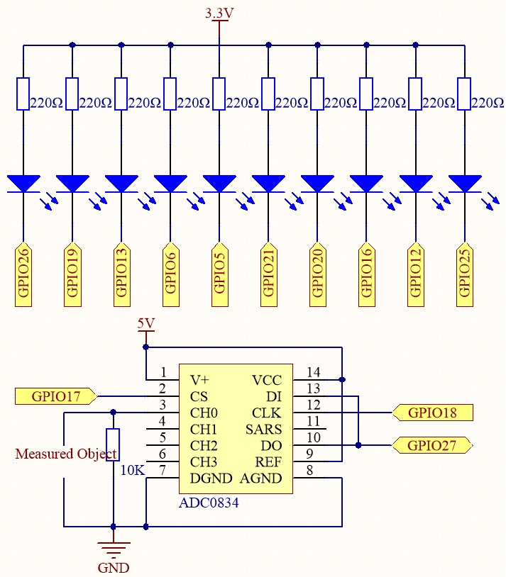

.. note::

    Bonjour et bienvenue dans la communauté des passionnés de SunFounder Raspberry Pi, Arduino et ESP32 sur Facebook ! Plongez dans l'univers de Raspberry Pi, Arduino et ESP32 avec d'autres passionnés.

    **Pourquoi nous rejoindre ?**

    - **Support d'experts** : Résolvez les problèmes après-vente et relevez vos défis techniques grâce à l'aide de notre communauté et de notre équipe.
    - **Apprenez et Partagez** : Échangez des astuces et des tutoriels pour perfectionner vos compétences.
    - **Aperçus exclusifs** : Bénéficiez d'un accès anticipé aux nouvelles annonces de produits et aux avant-premières.
    - **Réductions spéciales** : Profitez de réductions exclusives sur nos nouveaux produits.
    - **Promotions festives et concours** : Participez à des concours et à des promotions lors des fêtes.

    👉 Prêt à explorer et à créer avec nous ? Cliquez sur [|link_sf_facebook|] et rejoignez-nous dès aujourd'hui !

3.1.5 Indicateur de Batterie
================================

.. note::

   .. image:: ../img/mcp3008_and_adc0834.jpg
      :width: 25%
      :align: left
    

   Selon la version de votre kit, identifiez si vous disposez du **ADC0834** ou du **MCP3008** et suivez la section correspondante.

Introduction
----------------

Dans ce cours, nous allons créer un indicateur de batterie capable d'afficher 
visuellement le niveau de charge sur le bargraphe LED.

Composants
------------

.. image:: img/list_Battery_Indicator.png
    :align: center

Schéma de câblage
-------------------

============ ======== ======== ===
T-Board Name physical wiringPi BCM
GPIO17       Pin 11   0        17
GPIO18       Pin 12   1        18
GPIO27       Pin 13   2        27
GPIO25       Pin 22   6        25
GPIO12       Pin 32   26       12
GPIO16       Pin 36   27       16
GPIO20       Pin 38   28       20
GPIO21       Pin 40   29       21
GPIO5        Pin 29   21       5
GPIO6        Pin 31   22       6
GPIO13       Pin 33   23       13
GPIO19       Pin 35   24       19
GPIO26       Pin 37   25       26
============ ======== ======== ===

Procédures expérimentales
----------------------------

**Étape 1 :** Construisez le circuit.

.. image:: img/image248.png
   :width: 800
   :align: center

**Étape 2 :** Accédez au dossier du code.

.. raw:: html

   <run></run>

.. code-block:: 

    cd ~/davinci-kit-for-raspberry-pi/c/3.1.5/

**Étape 3 :** Compilez le code.

.. raw:: html

   <run></run>

.. code-block:: 

    gcc 3.1.5_BatteryIndicator.c -lwiringPi

**Étape 4 :** Exécutez le fichier exécutable.

.. raw:: html

   <run></run>

.. code-block:: 

    sudo ./a.out

Lorsque le programme est lancé, connectez le **3e** broche de l'ADC0834 et 
le **GND** séparément à chaque pôle de la batterie. Le bargraphe LED affichera 
le niveau de la batterie correspondant (plage de mesure : **0-5V**).

.. note::

    Si cela ne fonctionne pas après l'exécution, ou s'il y a un message d'erreur indiquant : « wiringPi.h : Aucun fichier ou répertoire de ce type », veuillez consulter :ref:`C code is not working?`.

**Explication du Code**

.. code-block:: c

    void LedBarGraph(int value){
        for(int i=0;i<10;i++){
            digitalWrite(pins[i],HIGH);
        }
        for(int i=0;i<value;i++){
            digitalWrite(pins[i],LOW);
        }
    }

Cette fonction contrôle l'allumage ou l'extinction des **10** LEDs du bargraphe. 
Initialement, les **10** LEDs sont éteintes (niveau `HIGH`), puis le nombre de 
LEDs allumées est déterminé en fonction de la valeur analogique reçue.

.. code-block:: c

    int main(void)
    {
        uchar analogVal;
        if(wiringPiSetup() == -1){ //when initialize wiring failed,print messageto screen
            printf("setup wiringPi failed !");
            return 1;
        }
        pinMode(ADC_CS,  OUTPUT);
        pinMode(ADC_CLK, OUTPUT);
        for(int i=0;i<10;i++){       //make led pins' mode is output
            pinMode(pins[i], OUTPUT);
            digitalWrite(pins[i],HIGH);
        }
        while(1){
            analogVal = get_ADC_Result(0);
            LedBarGraph(analogVal/25);
            delay(100);
        }
        return 0;
    }

`analogVal` génère des valeurs (**0-255**) en fonction des variations de tension 
(**0-5V**). Par exemple, si une batterie de **3V** est détectée, la valeur 
correspondante de **152** est affichée sur le voltmètre.

Les **10** LEDs du bargraphe sont utilisées pour afficher les lectures de `analogVal`. 
255/10=25, donc chaque augmentation de **25** du `analogVal` allume une LED supplémentaire. 
Par exemple, si `analogVal = 150` (environ **3V**), **6** LEDs seront allumées.

