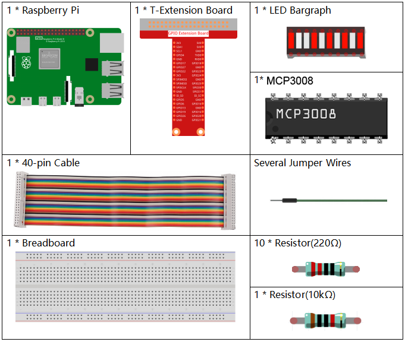
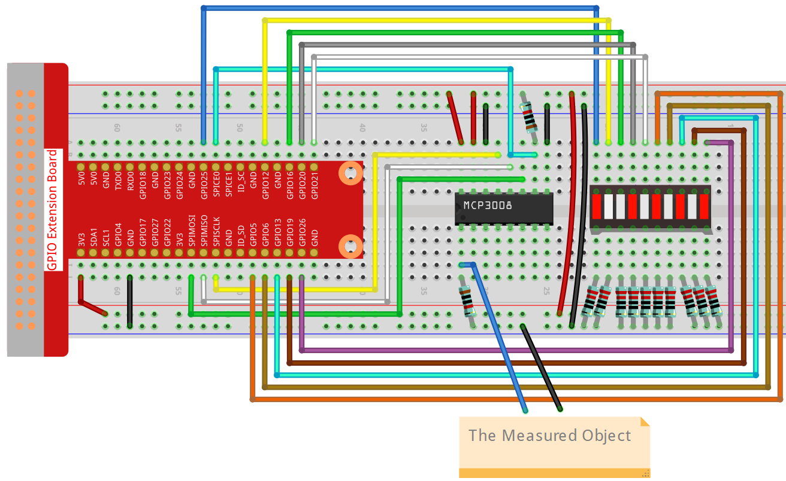

.. note::

    Ciao, benvenuto nella Community SunFounder Raspberry Pi & Arduino & ESP32 Enthusiasts su Facebook! Approfondisci Raspberry Pi, Arduino ed ESP32 insieme ad altri appassionati.

    **Perché unirsi?**

    - **Supporto esperto**: Risolvi problemi post-vendita e sfide tecniche con l’aiuto della nostra community e del nostro team.
    - **Impara e Condividi**: Scambia suggerimenti e tutorial per migliorare le tue competenze.
    - **Anteprime esclusive**: Accedi in anteprima agli annunci di nuovi prodotti e alle anticipazioni.
    - **Sconti speciali**: Godi di sconti esclusivi sui nostri prodotti più recenti.
    - **Promozioni festive e Giveaway**: Partecipa a concorsi e promozioni durante le festività.

    👉 Pronto a esplorare e creare con noi? Clicca [|link_sf_facebook|] e unisciti oggi stesso!

.. _3.1.5_c_pi5_mcp3008:

3.1.5 Indicatore di Batteria (MCP3008)
======================================

.. note::

   .. image:: ../img/mcp3008_and_adc0834.jpg
      :width: 25%
      :align: left
    

   A seconda della versione del kit, identifica se hai **ADC0834** o **MCP3008** e procedi con la sezione corrispondente.

Introduzione
------------

In questo progetto, realizzeremo un indicatore di batteria che può visualizzare visivamente il livello di carica su una barra LED.

.. warning::

    Non utilizzare componenti a batteria che superino i 3,3V per evitare sovraccarichi che potrebbero danneggiare il chip o il Raspberry Pi.

Componenti richiesti
--------------------

In questo progetto, avremo bisogno dei seguenti componenti.

Schema elettrico
----------------

============ ======== ======== ===
T-Board Name physical wiringPi BCM
SPICE0       Pin 24   10       8
SPIMOSI      Pin 19   12       10
SPIMISO      Pin 21   13       9
SPISCLK      Pin 23   14       11
GPIO25       Pin 22   6        25
GPIO12       Pin 32   26       12
GPIO16       Pin 36   27       16
GPIO20       Pin 38   28       20
GPIO21       Pin 40   29       21
GPIO5        Pin 29   21       5
GPIO6        Pin 31   22       6
GPIO13       Pin 33   23       13
GPIO19       Pin 35   24       19
GPIO26       Pin 37   25       26
============ ======== ======== ===

.. image:: ../img/schematic_battery_indicator_mcp3008.png
   :align: center

Procedure sperimentali
----------------------

**Passo 1:** Montare il circuito.

**Passo 2:** Accedere alla cartella del codice.

.. raw:: html

   <run></run>

.. code-block::

    cd ~/davinci-kit-for-raspberry-pi/c/3.1.5-2/

**Passo 3:** Compilare il codice.

.. raw:: html

   <run></run>

.. code-block::

    gcc 3.1.5_BatteryIndicator.c -lwiringPi

**Passo 4:** Eseguire il file compilato.

.. raw:: html

   <run></run>

.. code-block::

    sudo ./a.out

Dopo l'avvio del programma, collega separatamente un filo dal 3° pin del MCP3008 e dal GND, quindi collegali ai due poli di una batteria. Vedrai che il LED corrispondente sulla barra LED si accenderà per indicare il livello di carica (campo di misura: 0-5V).

.. note::

    Se non funziona dopo l'esecuzione, o compare l'errore: \"wiringPi.h: No such file or directory\", fare riferimento a :ref:`install_wiringpi`.

Codice
------

.. code-block:: c

    #include <wiringPi.h>
    #include <wiringPiSPI.h>
    #include <stdio.h>

    #define SPI_CHANNEL 0
    #define SPI_SPEED   1000000  // 1MHz
    #define VREF        3.3      

    int pins[10] = {6, 26, 27, 28, 29, 21, 22, 23, 24, 25};

    int read_ADC(int channel)
    {
        if (channel < 0 || channel > 7) return -1;

        unsigned char buffer[3];
        buffer[0] = 1;  // Start bit
        buffer[1] = (8 + channel) << 4;  // Modalità single-ended
        buffer[2] = 0;

        wiringPiSPIDataRW(SPI_CHANNEL, buffer, 3);

        int value = ((buffer[1] & 3) << 8) | buffer[2];
        return value;
    }

    void LedBarGraph(int value) {
        for (int i = 0; i < 10; i++) {
            if (i < value)
                digitalWrite(pins[i], HIGH);  
            else
                digitalWrite(pins[i],LOW);
        }
    }

    int main(void)
    {
        if (wiringPiSetup() == -1) {
            printf("setup wiringPi failed!\n");
            return 1;
        }

        if (wiringPiSPISetup(SPI_CHANNEL, SPI_SPEED) == -1) {
            printf("SPI setup failed!\n");
            return 1;
        }

        for (int i = 0; i < 10; i++) {
            pinMode(pins[i], OUTPUT);
            digitalWrite(pins[i], HIGH);
        }

        while (1) {
            int analogVal = read_ADC(0);  // MCP3008 CH0
            if (analogVal < 0) continue;

            float voltage = analogVal * VREF / 1023.0;
            int level = analogVal * 10 / 1024;  
            if (level > 10) level = 10;  

            LedBarGraph(level);

            printf("ADC Value: %d\tVoltage: %.2f V\tLevel: %d\n", analogVal, voltage, level);

            delay(200);
        }

        return 0;
    }

Spiegazione del codice
----------------------

.. code-block:: c

    int read_ADC(int channel)
    {
        if (channel < 0 || channel > 7) return -1;

        unsigned char buffer[3];
        buffer[0] = 1;  // Start bit
        buffer[1] = (8 + channel) << 4;  // Modalità single-ended, CH0~CH7
        buffer[2] = 0;

        wiringPiSPIDataRW(SPI_CHANNEL, buffer, 3);

        int value = ((buffer[1] & 3) << 8) | buffer[2];  // Combina il risultato a 10 bit
        return value;
    }

Questa funzione legge valori analogici dal chip MCP3008 tramite SPI.  
Il parametro ``channel`` seleziona uno degli 8 ingressi analogici (CH0–CH7).  
L’MCP3008 restituisce un valore digitale a 10 bit compreso tra 0 e 1023, che rappresenta la tensione analogica.

.. code-block:: c

    void LedBarGraph(int value) {
        for (int i = 0; i < 10; i++) {
            if (i < value)
                digitalWrite(pins[i], HIGH);  // Accende il LED (cablaggio attivo HIGH)
            else
                digitalWrite(pins[i], LOW);   // Spegne il LED
        }
    }

Questa funzione controlla una barra LED a 10 segmenti.  
Ogni LED rappresenta 1/10 dell’intervallo di tensione.  
I LED vengono accesi in ordine fino al livello specificato.  

Nota: Questa versione presuppone che gli anodi dei LED siano collegati ai GPIO e i catodi a GND (attivo HIGH).

.. code-block:: c

    int main(void)
    {
        if (wiringPiSetup() == -1) {
            printf("setup wiringPi failed!\n");
            return 1;
        }

        if (wiringPiSPISetup(SPI_CHANNEL, SPI_SPEED) == -1) {
            printf("SPI setup failed!\n");
            return 1;
        }

        for (int i = 0; i < 10; i++) {
            pinMode(pins[i], OUTPUT);
            digitalWrite(pins[i], HIGH);  // Inizializza tutti i LED su ON
        }

        while (1) {
            int analogVal = read_ADC(0);  // Legge la tensione su CH0
            if (analogVal < 0) continue;

            float voltage = analogVal * VREF / 1023.0;
            int level = analogVal * 10 / 1024;  // Mappa a livelli 0–10
            if (level > 10) level = 10;

            LedBarGraph(level);  // Mostra il livello sui LED

            printf("ADC Value: %d\tVoltage: %.2f V\tLevel: %d\n", analogVal, voltage, level);

            delay(200);  // Frequenza di aggiornamento: 5 Hz
        }

        return 0;
    }

Logica principale del programma:

- Inizializza wiringPi e la comunicazione SPI.
- Imposta i pin GPIO come uscite per controllare la barra LED a 10 segmenti.
- Legge continuamente la tensione analogica tramite MCP3008 (CH0).
- Converte la lettura in tensione usando ``VREF = 3.3V``.
- Scala la tensione su un livello da 0 a 10 e accende i LED corrispondenti.
- Mostra il valore ADC grezzo, la tensione (in volt) e il livello LED sulla console seriale.

Questo progetto funge da indicatore visivo del livello di batteria o da voltmetro analogico.
