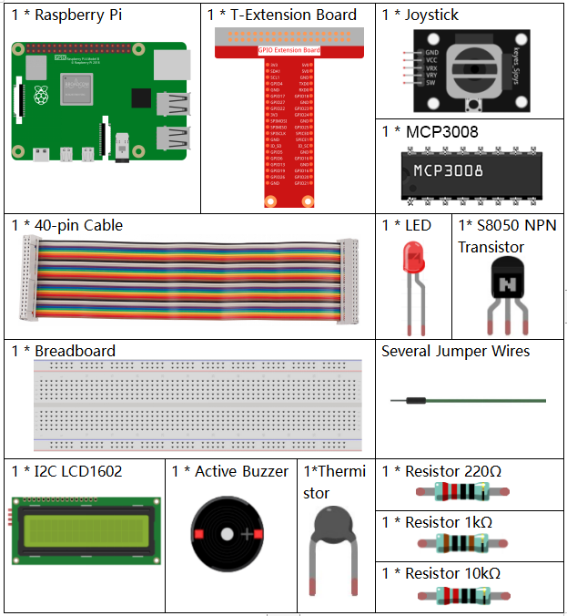
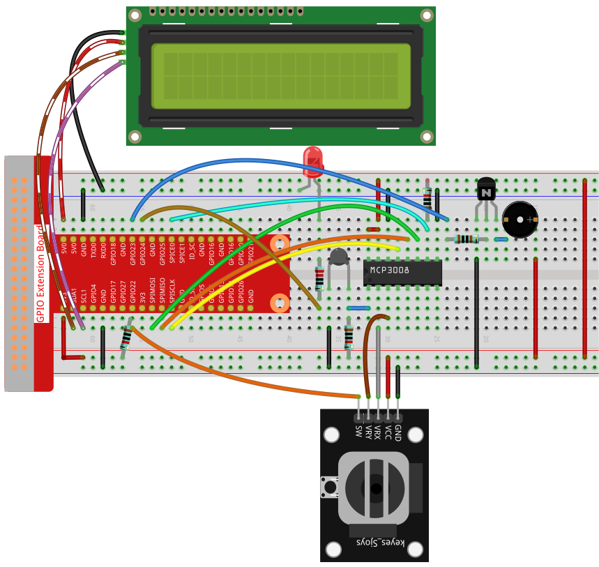

.. note::

    Bonjour et bienvenue dans la communauté Facebook des passionnés de SunFounder Raspberry Pi, Arduino et ESP32 ! Plongez plus profondément dans l’univers du Raspberry Pi, de l’Arduino et de l’ESP32 avec d’autres passionnés.

    **Pourquoi rejoindre ?**

    - **Assistance experte** : Résolvez les problèmes après-vente et les défis techniques avec l’aide de notre communauté et de notre équipe.
    - **Apprendre & partager** : Échangez des astuces et des tutoriels pour améliorer vos compétences.
    - **Aperçus exclusifs** : Accédez en avant-première aux annonces de nouveaux produits et aux aperçus.
    - **Réductions spéciales** : Profitez de remises exclusives sur nos tout derniers produits.
    - **Promotions festives et cadeaux** : Participez à des concours et à des promotions spéciales pendant les fêtes.

    👉 Prêt à explorer et créer avec nous ? Cliquez sur [|link_sf_facebook|] et rejoignez-nous dès aujourd’hui !

.. _3.1.8_c_pi5_mcp3008:

3.1.8 Moniteur de surchauffe (MCP3008)
======================================

.. note::

   .. image:: ../img/mcp3008_and_adc0834.jpg
      :width: 25%
      :align: left
    

   Selon la version de votre kit, identifiez si vous avez **ADC0834** ou **MCP3008** et poursuivez avec la section correspondante.

Introduction
------------

Vous pourriez vouloir fabriquer un dispositif de surveillance de surchauffe applicable à diverses situations.  
Par exemple, dans une usine, on peut vouloir déclencher une alarme et arrêter automatiquement la machine lorsqu’un circuit surchauffe.  

Dans ce projet, nous utiliserons une thermistance, un joystick, un buzzer, une LED et un écran LCD pour réaliser un dispositif intelligent de surveillance de température dont le seuil est réglable.

Composants nécessaires
----------------------

Pour ce projet, nous avons besoin des composants suivants :

Schéma de câblage
-----------------

============ ======== ======== ===
Nom T-Board  Physique wiringPi BCM
SPICE0       Pin 24   10       8
SPIMOSI      Pin 19   12       10
SPIMISO      Pin 21   13       9
SPISCLK      Pin 23   14       11
GPIO22       Pin 15   3        22
GPIO23       Pin 16   4        23
GPIO24       Pin 18   5        24
SDA1         Pin 3             
SCL1         Pin 5             
============ ======== ======== ===

.. image:: ../img/Schematic_three_one8.png
   :align: center

Procédure expérimentale
-----------------------

**Étape 1 :** Montez le circuit.

**Étape 2** : Accédez au dossier du code.

.. code-block:: 

    cd ~/davinci-kit-for-raspberry-pi/c/3.1.8-2/

**Étape 3** : Compilez le code.

.. code-block:: 

    gcc 3.1.8_OverheatMonitor.c -lm -lwiringPi

**Étape 4** : Exécutez le fichier compilé.

.. code-block:: 

    sudo ./a.out

Lorsque le code s’exécute, la température actuelle et le seuil de haute température **40** sont affichés sur l’**écran LCD1602 I2C**.  
Si la température actuelle dépasse le seuil, le buzzer et la LED s’activent pour vous alerter.

Le **joystick** vous permet de régler le seuil de haute température.  
En déplaçant le **joystick** sur l’axe X ou Y, vous pouvez augmenter ou diminuer le seuil actuel.  
Appuyez à nouveau sur le **joystick** pour réinitialiser le seuil à sa valeur initiale.

.. note::

    * Si le message d’erreur ``wiringPi.h: No such file or directory`` apparaît, veuillez vous référer à :ref:`install_wiringpi`.
    * Si vous obtenez l’erreur ``Unable to open I2C device: No such file or directory``, consultez :ref:`i2c_config` pour activer l’I2C et vérifier le câblage.
    * Si le code et le câblage sont corrects mais que l’écran LCD n’affiche toujours rien, tournez le potentiomètre au dos pour augmenter le contraste.

Code
--------------

.. code-block:: c

    #include <wiringPi.h>
    #include <stdio.h>
    #include <wiringPiI2C.h>
    #include <wiringPiSPI.h>
    #include <string.h>
    #include <math.h>

    typedef unsigned char uchar;
    typedef unsigned int  uint;

    #define Joy_BtnPin 3      // GPIO22 -> WiringPi 3
    #define buzzPin    4      // GPIO23 -> WiringPi 4
    #define LedPin     5      // GPIO24 -> WiringPi 5
    #define SPI_CHANNEL 0
    #define SPI_SPEED   1000000

    int LCDAddr    = 0x27;
    int BLEN       = 1;
    int fd;
    int upperTem   = 40;

    // Global variable to store the last joystick change
    int lastJoystickChange = 0;

    int read_ADC(int channel) {
        if (channel < 0 || channel > 7) return -1;
        unsigned char buffer[3];
        buffer[0] = 1;
        buffer[1] = (8 + channel) << 4;
        buffer[2] = 0;
        wiringPiSPIDataRW(SPI_CHANNEL, buffer, 3);
        return ((buffer[1] & 0x03) << 8) | buffer[2];
    }

    void write_word(int data){
        int temp = data;
        if (BLEN)      temp |= 0x08;
        else           temp &= 0xF7;
        wiringPiI2CWrite(fd, temp);
    }

    void send_command(int comm){
        int buf = comm & 0xF0;
        buf |= 0x04; write_word(buf); delay(2); buf &= 0xFB; write_word(buf);
        buf = (comm & 0x0F) << 4;
        buf |= 0x04; write_word(buf); delay(2); buf &= 0xFB; write_word(buf);
    }

    void send_data(int data){
        int buf = data & 0xF0;
        buf |= 0x05; write_word(buf); delay(2); buf &= 0xFB; write_word(buf);
        buf = (data & 0x0F) << 4;
        buf |= 0x05; write_word(buf); delay(2); buf &= 0xFB; write_word(buf);
    }

    void lcd_init(){
        send_command(0x33); delay(5);
        send_command(0x32); delay(5);
        send_command(0x28); delay(5);
        send_command(0x0C); delay(5);
        send_command(0x01); wiringPiI2CWrite(fd, 0x08);
    }

    void lcd_clear(){
        send_command(0x01);
    }

    void write_lcd(int x, int y, const char data[]){
        int addr = 0x80 + 0x40 * y + x;
        send_command(addr);
        for (int i = 0; i < (int)strlen(data); i++)
            send_data(data[i]);
    }

    int get_joystick_value(){
        int x = read_ADC(1);
        int y = read_ADC(2);

        // Dead-band filtering to reduce small fluctuations
        if (x > 900)      return  1;   //    else if (x < 100) return -1;   //     else if (y > 900) return -10;  //     else if (y < 100) return  10;  //    else              return   0; 
    }

    void upper_tem_setting(){
        write_lcd(0,0, "Upper Adjust:");

        int change = get_joystick_value();

        // Only respond to actual direction change
        if (change != 0 && change != lastJoystickChange) {
            upperTem += change;
            lastJoystickChange = change;
        }
        else if (change == 0) {
            // Allow next change after returning to center
            lastJoystickChange = 0;
        }

        // Display current upperTem
        char str[6];
        snprintf(str, sizeof(str), "%d", upperTem);
        write_lcd(0,1, str);
        // Clear remaining LCD characters
        write_lcd(strlen(str),1, "            ");

        delay(100);
    }

    double temperature(){
        int raw = read_ADC(0);
        double Vr = 3.3 * ((double)raw / 1023.0);
        double Rt = 10000.0 * Vr / (3.3 - Vr);
        double tempK = 1.0 / ((log(Rt/10000.0)/3950.0) + 1.0/(273.15+25.0));
        return tempK - 273.15;
    }

    void monitoring_temp(){
        char str[6];
        double cel = temperature();
        snprintf(str, sizeof(str), "%.2f", cel);
        write_lcd(0,0, "Temp: ");
        write_lcd(6,0, str);

        snprintf(str, sizeof(str), "%d", upperTem);
        write_lcd(0,1, "Upper: ");
        write_lcd(7,1, str);
        delay(100);

        if (cel >= upperTem) {
            digitalWrite(buzzPin, HIGH);
            digitalWrite(LedPin,  HIGH);
        } else {
            digitalWrite(buzzPin, LOW);
            digitalWrite(LedPin,  LOW);
        }
    }

    void setup_all(){
        fd = wiringPiI2CSetup(LCDAddr);
        lcd_init();
        if (wiringPiSetup() == -1 ||
            wiringPiSPISetup(SPI_CHANNEL, SPI_SPEED) == -1) {
            printf("Setup failed!\n");
            return;
        }
        pinMode(Joy_BtnPin, INPUT);
        pullUpDnControl(Joy_BtnPin, PUD_UP);
        pinMode(buzzPin, OUTPUT);
        pinMode(LedPin,  OUTPUT);
    }

    int main(void){
        setup_all();

        int lastBtnState = HIGH;
        int stage = 0;

        while (1) {
            int curBtn = digitalRead(Joy_BtnPin);
            // Switch mode when button changes from LOW to HIGH (button released)
            if (curBtn == HIGH && lastBtnState == LOW) {
                stage = (stage + 1) % 2;
                lastJoystickChange = 0;  // Clear debounce status
                delay(100);
                lcd_clear();
            }
            lastBtnState = curBtn;

            if (stage == 1)
                upper_tem_setting();
            else
                monitoring_temp();
        }

        return 0;
    }

Explication du code
-------------------

.. code-block:: c

    int read_ADC(int channel) {
        if (channel < 0 || channel > 7) return -1;
        unsigned char buffer[3];
        buffer[0] = 1;
        buffer[1] = (8 + channel) << 4;
        buffer[2] = 0;
        wiringPiSPIDataRW(SPI_CHANNEL, buffer, 3);
        return ((buffer[1] & 0x03) << 8) | buffer[2];
    }

Lit une valeur analogique sur 10 bits depuis le canal (CH0–CH7) du MCP3008 via SPI et renvoie un entier entre 0 et 1023.

.. code-block:: c

    int get_joystick_value() {
        int x = read_ADC(1);
        int y = read_ADC(2);

        if (x > 900)      return 1;   // Droite
        else if (x < 100) return -1;  // Gauche
        else if (y > 900) return -10; // Haut
        else if (y < 100) return 10;  // Bas
        else              return 0;
    }

Lit les valeurs analogiques X et Y du joystick sur CH1 et CH2.  
Renvoie un entier indiquant la direction du mouvement selon les seuils définis.

.. code-block:: c

    void upper_tem_setting() {
        write_lcd(0,0, "Upper Adjust:");

        int change = get_joystick_value();

        if (change != 0 && change != lastJoystickChange) {
            upperTem += change;
            lastJoystickChange = change;
        }
        else if (change == 0) {
            lastJoystickChange = 0;
        }

        char str[6];
        snprintf(str, sizeof(str), "%d", upperTem);
        write_lcd(0,1, str);
        write_lcd(strlen(str),1, "            ");

        delay(100);
    }

Permet à l’utilisateur d’ajuster le seuil de température maximale à l’aide du joystick.  
Évite les changements répétés si la direction est maintenue.

.. code-block:: c

    double temperature() {
        int raw = read_ADC(0);
        double Vr = 3.3 * ((double)raw / 1023.0);
        double Rt = 10000.0 * Vr / (3.3 - Vr);
        double tempK = 1.0 / ((log(Rt/10000.0)/3950.0) + 1.0/(273.15+25.0));
        return tempK - 273.15;
    }

Lit la valeur analogique sur CH0 (connecté à la thermistance).  
Utilise l’équation de Steinhart–Hart pour calculer la température en degrés Celsius.

.. code-block:: c

    void monitoring_temp() {
        char str[6];
        double cel = temperature();
        snprintf(str, sizeof(str), "%.2f", cel);
        write_lcd(0,0, "Temp: ");
        write_lcd(6,0, str);

        snprintf(str, sizeof(str), "%d", upperTem);
        write_lcd(0,1, "Upper: ");
        write_lcd(7,1, str);
        delay(100);

        if (cel >= upperTem) {
            digitalWrite(buzzPin, HIGH);
            digitalWrite(LedPin,  HIGH);
        } else {
            digitalWrite(buzzPin, LOW);
            digitalWrite(LedPin,  LOW);
        }
    }

Lit en continu la température actuelle et l’affiche avec le seuil.  
Si la température dépasse le seuil, le buzzer et la LED s’activent.

.. code-block:: c

    void setup_all() {
        fd = wiringPiI2CSetup(LCDAddr);
        lcd_init();
        if (wiringPiSetup() == -1 || wiringPiSPISetup(SPI_CHANNEL, SPI_SPEED) == -1) {
            printf("Setup failed!\n");
            return;
        }
        pinMode(Joy_BtnPin, INPUT);
        pullUpDnControl(Joy_BtnPin, PUD_UP);
        pinMode(buzzPin, OUTPUT);
        pinMode(LedPin,  OUTPUT);
    }

Initialise l’écran LCD, la communication SPI et les broches GPIO pour le bouton du joystick, le buzzer et la LED.  
Active également la résistance pull-up pour le bouton du joystick.

.. code-block:: c

    int main(void) {
        setup_all();

        int lastBtnState = HIGH;
        int stage = 0;

        while (1) {
            int curBtn = digitalRead(Joy_BtnPin);
            if (curBtn == HIGH && lastBtnState == LOW) {
                stage = (stage + 1) % 2;
                lastJoystickChange = 0;
                delay(100);
                lcd_clear();
            }
            lastBtnState = curBtn;

            if (stage == 1)
                upper_tem_setting();
            else
                monitoring_temp();
        }

        return 0;
    }

Boucle principale :  

1. Surveillance de la température.  
2. Réglage de la limite supérieure à l’aide du joystick.  

Le mode change lorsque le bouton du joystick est relâché (déclenchement sur front montant).

