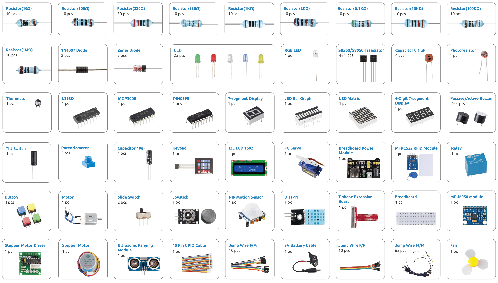

.. note::

    Bonjour et bienvenue dans la communauté SunFounder Raspberry Pi & Arduino & ESP32 Enthusiasts sur Facebook ! Plongez plus profondément dans l'univers du Raspberry Pi, de l'Arduino et de l'ESP32 avec d'autres passionnés.

    **Pourquoi nous rejoindre ?**

    - **Support d'experts** : Résolvez les problèmes après-vente et les défis techniques avec l'aide de notre communauté et de notre équipe.
    - **Apprendre & Partager** : Échangez des astuces et des tutoriels pour améliorer vos compétences.
    - **Aperçus exclusifs** : Bénéficiez d'un accès anticipé aux annonces de nouveaux produits et aux avant-premières.
    - **Réductions spéciales** : Profitez de réductions exclusives sur nos nouveaux produits.
    - **Promotions festives et concours** : Participez à des concours et à des promotions spéciales pendant les fêtes.

    👉 Prêt à explorer et créer avec nous ? Cliquez sur [|link_sf_facebook|] et rejoignez-nous dès aujourd'hui !

Présentation des composants
================================================

Après ouverture de l’emballage, veuillez vérifier que tous les composants correspondent à la description du produit et vous assurer que chaque pièce est en bon état.

Cette section fournit une vue d’ensemble de chaque composant inclus dans le kit.  
Pour chaque élément, vous trouverez :

* Une brève présentation  
* Le principe de fonctionnement  
* Les projets dans lesquels le composant est utilisé  

**Basique**

.. toctree::
    :maxdepth: 1

    _shared/component/cpn_gpio_board
    _shared/component/cpn_breadboard
    _shared/component/cpn_resistor
    _shared/component/cpn_transistor
    _shared/component/cpn_capacitor
    _shared/component/cpn_diode
    _shared/component/cpn_wires

**Circuit intégré**

.. toctree::
    :maxdepth: 1

    _shared/component/cpn_74hc595
    _shared/component/cpn_l293d
    _shared/component/cpn_adc0834
    _shared/component/cpn_mcp3008

**Affichage**

.. toctree::
    :maxdepth: 1

    _shared/component/cpn_led
    _shared/component/cpn_rgb_led
    _shared/component/cpn_bar_graph
    _shared/component/cpn_7_segment
    _shared/component/cpn_4_digit
    _shared/component/cpn_led_matrix
    _shared/component/cpn_i2c_lcd

**Son**

.. toctree::
    :maxdepth: 1

    _shared/component/cpn_buzzer

**Pilote**

.. toctree::
    :maxdepth: 1

    _shared/component/cpn_motor_dc
    _shared/component/cpn_servo_sg90
    _shared/component/cpn_power_module
    _shared/component/cpn_stepper_motor
    _shared/component/cpn_relay_6pin
    

**Contrôleur**

.. toctree::
    :maxdepth: 1

    _shared/component/cpn_button
    _shared/component/cpn_slide_switch
    _shared/component/cpn_potentiometer
    _shared/component/cpn_joystick_module
    _shared/component/cpn_keypad

**Capteur**

.. toctree::
    :maxdepth: 1

    _shared/component/cpn_photoresistor
    _shared/component/cpn_thermistor
    _shared/component/cpn_tilt_switch
    _shared/component/cpn_pir_module
    _shared/component/cpn_ultrasonic_module
    _shared/component/cpn_dht11_module
    _shared/component/cpn_mpu6050_module
    _shared/component/cpn_mfrc522_module