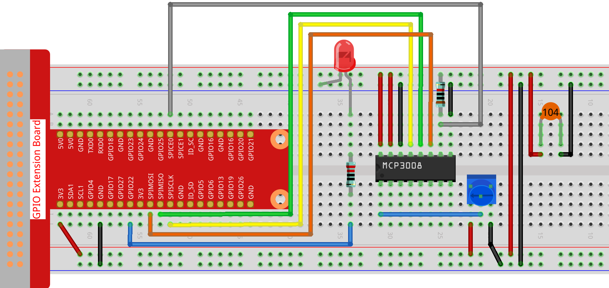

.. note::

    ¡Hola, bienvenido a la comunidad de entusiastas de SunFounder Raspberry Pi & Arduino & ESP32 en Facebook! Sumérgete más en Raspberry Pi, Arduino y ESP32 con otros entusiastas.

    **¿Por qué unirse?**

    - **Soporte experto**: Resuelve problemas postventa y desafíos técnicos con la ayuda de nuestra comunidad y equipo.
    - **Aprender y compartir**: Intercambia consejos y tutoriales para mejorar tus habilidades.
    - **Vistas previas exclusivas**: Obtén acceso anticipado a anuncios de nuevos productos y adelantos.
    - **Descuentos especiales**: Disfruta de descuentos exclusivos en nuestros productos más nuevos.
    - **Promociones y sorteos festivos**: Participa en sorteos y promociones de temporada.

    👉 ¿Listo para explorar y crear con nosotros? Haz clic en [|link_sf_facebook|] y únete hoy mismo.

.. _2.1.4_js_pi5_mcp3008:

2.1.4 Potenciómetro (MCP3008)
=============================

.. note::

   .. image:: ../img/mcp3008_and_adc0834.jpg
      :width: 25%
      :align: left
    

   Dependiendo de la versión de tu kit, identifica si tienes **ADC0834** o **MCP3008** y procede con la sección correspondiente.

Introducción
------------

La función ADC se utiliza para convertir señales analógicas en valores digitales.  
En este experimento, usamos el chip ADC MCP3008 para realizar esta conversión.  
Un potenciómetro se usa para generar un voltaje variable, el cual cambia la magnitud física.  
El MCP3008 convierte este voltaje analógico en un valor digital que puede ser leído y procesado por la Raspberry Pi.

Componentes necesarios
----------------------

En este proyecto, necesitaremos los siguientes componentes.

.. image:: ../img/list2_2.1.4_potentiometer.png

Diagrama esquemático
--------------------

.. list-table::
    :widths: 30 30 30 30
    :header-rows: 1

    *   - Nombre T-Board
        - Físico
        - WiringPi
        - BCM

    *   - SPICE0
        - pin24
        - 10
        - 8
    *   - SPIMOSI
        - pin19
        - 12
        - 10
    *   - SPIMISO
        - pin21
        - 13
        - 9
    *   - SPISCLK
        - pin23
        - 14
        - 11
    *   - GPIO22
        - pin15
        - 3
        - 22

.. image:: ../img/schematic_2.1.7_potentiometer_mcp3008.png

Procedimiento experimental
--------------------------

**Paso 1:** Montar el circuito.

.. note::
    Coloca el chip siguiendo la posición mostrada en la imagen correspondiente.  
    Ten en cuenta que la ranura del chip debe quedar a la izquierda al colocarlo.

**Paso 2:** Abrir el archivo de código.

.. raw:: html

   <run></run>

.. code-block::

    cd ~/davinci-kit-for-raspberry-pi/nodejs/

**Paso 3:** Ejecutar el código.

.. raw:: html

   <run></run>

.. code-block::

    sudo node potentionmeter-2.js

Después de ejecutar el código, gira la perilla del potenciómetro y la intensidad del LED cambiará en consecuencia.

**Código**

.. code-block:: js

    const Gpio = require('pigpio').Gpio;
    const mcpadc = require('mcp-spi-adc');

    // Abrir canal 0 del MCP3008 (entrada analógica CH0)
    const adc = mcpadc.openMcp3008(0, { speedHz: 1000000 }, (err) => {
    if (err) {
        console.error("No se pudo abrir el canal ADC:", err);
        process.exit(1);
    }

    console.log("Canal 0 del MCP3008 abierto correctamente.");

    // Inicializar LED en GPIO22 en modo de salida PWM
    const led = new Gpio(22, { mode: Gpio.OUTPUT });

    // Leer valor del ADC cada 100 ms y actualizar brillo del LED
    setInterval(() => {
        adc.read((err, reading) => {
        if (err) {
            console.error("Error al leer el ADC:", err);
            return;
        }

        // Convertir valor flotante (0.0–1.0) a rango PWM (0–255)
        const pwmVal = Math.round(reading.value * 255);

        console.log(`Valor analógico actual: ${pwmVal}`);

        // Actualizar brillo del LED usando PWM
        led.pwmWrite(pwmVal);
        });
    }, 100);
    });

**Explicación del código**

.. code-block:: js

    const Gpio = require('pigpio').Gpio;

Esta línea importa el módulo ``pigpio``, que permite un control preciso de PWM y GPIO en la Raspberry Pi.

.. code-block:: js

    const mcpadc = require('mcp-spi-adc');

Esta línea importa la librería ``mcp-spi-adc``, que habilita la comunicación con el MCP3008 a través de la interfaz SPI.

.. code-block:: js

    const adc = mcpadc.openMcp3008(0, { speedHz: 1000000 }, (err) => {
        if (err) {
            console.error("No se pudo abrir el canal ADC:", err);
            process.exit(1);
        }
    });

Inicializa el canal 0 de entrada analógica del MCP3008.  
Configura la velocidad de comunicación SPI a 1 MHz.  
Si la inicialización falla, muestra un error y finaliza el programa.

.. code-block:: js

    const led = new Gpio(22, { mode: Gpio.OUTPUT });

Crea un objeto GPIO para el pin 22 de la Raspberry Pi.  
Este pin se configura como salida y se usará para controlar el brillo de un LED mediante PWM.

.. code-block:: js

    setInterval(() => {
        adc.read((err, reading) => {
            if (err) {
                console.error("Error al leer el ADC:", err);
                return;
            }

            const pwmVal = Math.round(reading.value * 255);
            console.log(`Valor analógico actual: ${pwmVal}`);
            led.pwmWrite(pwmVal);
        });
    }, 100);

Cada 100 milisegundos, esta función lee el valor analógico del canal 0 del MCP3008.  
El ADC devuelve un valor flotante normalizado entre 0.0 y 1.0.  
Este valor se escala al rango 0–255 y se escribe en GPIO22 usando ``pwmWrite()`` para controlar el brillo del LED.  
El valor PWM también se imprime en la consola.
