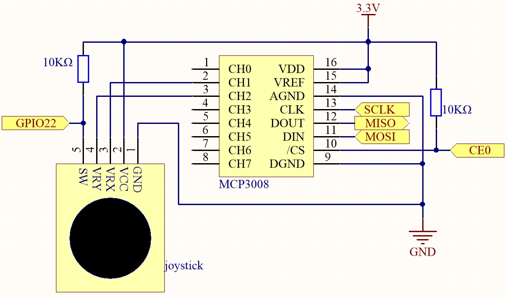
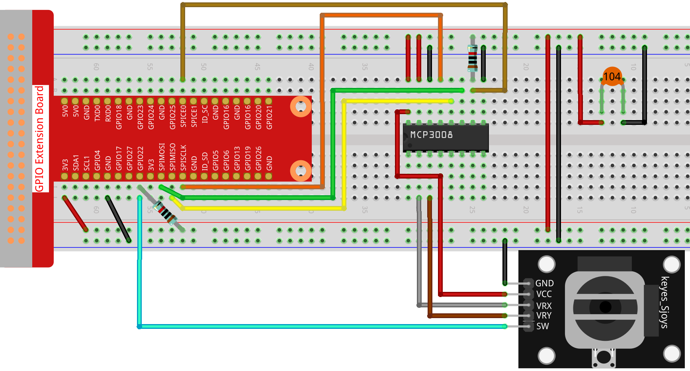

.. note::

    Bonjour et bienvenue dans la communauté SunFounder Raspberry Pi & Arduino & ESP32 Enthusiasts sur Facebook ! Plongez plus profondément dans l’univers du Raspberry Pi, Arduino et ESP32 avec d’autres passionnés.

    **Pourquoi rejoindre ?**

    - **Assistance experte** : Résolvez les problèmes après-vente et les défis techniques avec l’aide de notre communauté et de notre équipe.
    - **Apprendre & Partager** : Échangez des astuces et tutoriels pour améliorer vos compétences.
    - **Aperçus exclusifs** : Accédez en avant-première aux annonces et aperçus de nouveaux produits.
    - **Réductions spéciales** : Profitez de réductions exclusives sur nos derniers produits.
    - **Promotions et concours festifs** : Participez à des concours et promotions spéciales pendant les fêtes.

    👉 Prêt à explorer et créer avec nous ? Cliquez sur [|link_sf_facebook|] et rejoignez-nous dès aujourd’hui !

.. _2.1.6_js_pi5_mcp3008:

2.1.6 Joystick (MCP3008)
========================

Introduction
------------

Dans ce projet, nous allons apprendre comment fonctionne un joystick.  
Nous manipulons le joystick et affichons les résultats à l’écran.

Composants requis
-----------------

Dans ce projet, nous avons besoin des composants suivants. 

.. image:: ../img/image317-copy.png

Schéma de câblage
-----------------

Lors de la lecture des données du joystick, il existe quelques différences entre les axes :  
les données des axes X et Y sont analogiques, il est donc nécessaire d’utiliser le MCP3008 pour convertir la valeur analogique en valeur numérique.  
Les données de l’axe Z sont numériques, vous pouvez donc lire directement via le GPIO, ou également utiliser l’ADC.

.. .. image:: ../img/image319.png

    *   - Nom T-Board
        - Physique
        - WiringPi
        - BCM

    *   - SPICE0
        - pin24
        - 10
        - 8
    *   - SPIMOSI
        - pin19
        - 12
        - 10
    *   - SPIMISO
        - pin21
        - 13
        - 9
    *   - SPISCLK
        - pin23
        - 14
        - 11
    *   - GPIO22
        - pin15
        - 3
        - 22

Procédure expérimentale
-----------------------

**Étape 1 :** Construire le circuit.

**Étape 2 :** Accéder au dossier du code.

.. raw:: html

   <run></run>

.. code-block::

    cd ~/davinci-kit-for-raspberry-pi/nodejs/

**Étape 3 :** Exécuter le code.

.. raw:: html

   <run></run>

.. code-block::

    sudo node joystick-2.js

Après exécution du code, déplacez le joystick : les valeurs correspondantes de x, y et Btn s’afficheront à l’écran.

**Code**

.. code-block:: js

    const Gpio = require('pigpio').Gpio;
    const mcpadc = require('mcp-spi-adc');

    // Ouvrir le canal 1 (axe X)
    const xChannel = mcpadc.openMcp3008(1, { speedHz: 1350000 }, (err) => {
    if (err) {
        console.error('Échec de l’ouverture du canal X :', err);
        process.exit(1);
    }
    });

    // Ouvrir le canal 2 (axe Y)
    const yChannel = mcpadc.openMcp3008(2, { speedHz: 1350000 }, (err) => {
    if (err) {
        console.error('Échec de l’ouverture du canal Y :', err);
        process.exit(1);
    }
    });

    // Entrée bouton sur GPIO22 avec résistance pull-up
    const btn = new Gpio(22, {
    mode: Gpio.INPUT,
    pullUpDown: Gpio.PUD_UP,
    });

    // Boucle de lecture
    setInterval(() => {
    xChannel.read((errX, xReading) => {
        if (errX) {
        console.error('Erreur de lecture du canal X :', errX);
        return;
        }

        yChannel.read((errY, yReading) => {
        if (errY) {
            console.error('Erreur de lecture du canal Y :', errY);
            return;
        }

        const x_val = Math.round(xReading.value * 1023);
        const y_val = Math.round(yReading.value * 1023);
        const btn_val = btn.digitalRead();

        console.log(`x = ${x_val}, y = ${y_val}, btn = ${btn_val}\n`);
        });
    });
    }, 100);

**Explication du code**

.. code-block:: js

    const mcpadc = require('mcp-spi-adc');

Cette ligne importe le module ``mcp-spi-adc``, qui permet la communication avec le MCP3008 ADC en utilisant l’interface SPI matérielle du Raspberry Pi.

.. code-block:: js

    const xChannel = mcpadc.openMcp3008(1, { speedHz: 1350000 }, ...);
    const yChannel = mcpadc.openMcp3008(2, { speedHz: 1350000 }, ...);

Ces lignes ouvrent les canaux d’entrée analogiques 1 et 2 du MCP3008 pour lire respectivement les signaux des axes X et Y du joystick.  
La vitesse de communication SPI est définie à 1,35 MHz.

.. code-block:: js

    const btn = new Gpio(22, {
      mode: Gpio.INPUT,
      pullUpDown: Gpio.PUD_UP,
    });

Initialise la broche GPIO 22 comme entrée numérique avec une résistance pull-up interne activée.  
Cette broche est utilisée pour lire l’état d’un bouton-poussoir.

.. code-block:: js

    setInterval(() => {
      xChannel.read(...);
      yChannel.read(...);
    }, 100);

Cette fonction s’exécute toutes les 100 millisecondes.  
Elle lit les valeurs des axes X et Y du joystick via les canaux 1 et 2 du MCP3008 en utilisant SPI.  
Les valeurs flottantes (plage 0.0–1.0) sont converties en entiers 10 bits (0–1023).  
Elle lit également l’état du bouton à l’aide de ``digitalRead()`` sur GPIO22, retournant 0 lorsqu’il est pressé et 1 lorsqu’il est relâché.  
Toutes les valeurs sont affichées dans la console.
