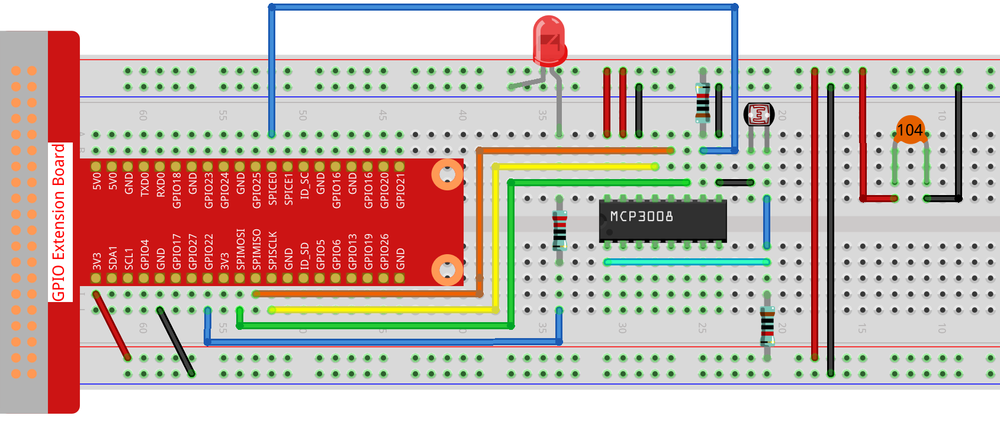

.. note::

    Ciao, benvenuto nella Community SunFounder Raspberry Pi & Arduino & ESP32 Enthusiasts su Facebook! Approfondisci Raspberry Pi, Arduino ed ESP32 con altri appassionati.

    **Perché unirsi?**

    - **Supporto esperto**: Risolvi problemi post-vendita e sfide tecniche con l’aiuto della community e del nostro team.
    - **Impara e condividi**: Scambia consigli e tutorial per migliorare le tue competenze.
    - **Anteprime esclusive**: Accedi in anteprima ai nuovi annunci di prodotti e alle anteprime speciali.
    - **Sconti speciali**: Godi di sconti esclusivi sui nostri prodotti più recenti.
    - **Promozioni e giveaway festivi**: Partecipa a concorsi e promozioni durante le festività.

    👉 Pronto a esplorare e creare con noi? Clicca [|link_sf_facebook|] e unisciti oggi stesso!

.. _2.2.1_js_pi5_mcp3008:

2.2.1 Fotoresistenza (MCP3008)
==============================

.. note::

   .. image:: ../img/mcp3008_and_adc0834.jpg
      :width: 25%
      :align: left
    

   A seconda della versione del kit, identifica se hai **ADC0834** o **MCP3008** e procedi con la sezione corrispondente.

Introduzione
------------

La fotoresistenza è un componente comunemente usato per rilevare l’intensità della luce ambientale.  
Aiuta il controllore a distinguere tra giorno e notte e a realizzare funzioni di controllo della luce, come una lampada notturna.  
Questo progetto è molto simile a quello del potenziometro: potresti pensare che funzioni modificando la tensione per rilevare la luce.

Componenti richiesti
--------------------

In questo progetto sono necessari i seguenti componenti.

.. image:: ../img/list2_2.2.1_photoresistor.png

Schema elettrico
----------------

.. list-table::
    :widths: 30 30 30 30
    :header-rows: 1

    *   - Nome T-Board
        - physical
        - WiringPi
        - BCM

    *   - SPICE0
        - pin24
        - 10
        - 8
    *   - SPIMOSI
        - pin19
        - 12
        - 10
    *   - SPIMISO
        - pin21
        - 13
        - 9
    *   - SPISCLK
        - pin23
        - 14
        - 11
    *   - GPIO22
        - pin15
        - 3
        - 22

.. image:: ../img/schematic_2.2.1_photoresistor_mcp3008.png

Procedura sperimentale
----------------------

**Passo 1:** Montare il circuito.

**Passo 2:** Accedere alla cartella del codice.

.. raw:: html

   <run></run>

.. code-block:: 

    cd ~/davinci-kit-for-raspberry-pi/nodejs/

**Passo 3:** Eseguire il codice.

.. raw:: html

   <run></run>

.. code-block:: 

    sudo node photoresistor-2.js

**Codice**

.. code-block:: js

    const Gpio = require('pigpio').Gpio;
    const mcpadc = require('mcp-spi-adc');

    // Apri il canale 0 di MCP3008 (ingresso analogico CH0)
    const adc = mcpadc.openMcp3008(0, { speedHz: 1350000 }, (err) => {
    if (err) {
        console.error("Impossibile aprire MCP3008:", err);
        process.exit(1);
    }

    console.log("MCP3008 inizializzato su SPI0/CE0.");

    // Inizializza LED su GPIO22 (compatibile PWM)
    const led = new Gpio(22, { mode: Gpio.OUTPUT });

    // Imposta un intervallo per leggere l'ADC e aggiornare la luminosità del LED ogni 100 ms
    const interval = setInterval(() => {
        adc.read((err, reading) => {
        if (err) {
            console.error("Errore lettura ADC:", err);
            return;
        }

        const adcValue = reading.value;               // Valore float tra 0.0 e 1.0
        const pwmValue = Math.round(adcValue * 255);  // Scala a 0–255

        console.log(`ADC = ${adcValue.toFixed(4)}, PWM = ${pwmValue}`);

        led.pwmWrite(pwmValue); // Aggiorna luminosità LED
        });
    }, 100);

    // Gestione Ctrl+C (SIGINT) per pulizia
    process.on('SIGINT', () => {
        console.log('\nArresto in corso...');
        clearInterval(interval);  // Ferma il ciclo
        led.digitalWrite(0);      // Spegni LED
        process.exit(0);
    });
    });

**Spiegazione del codice**

.. code-block:: js

    const Gpio = require('pigpio').Gpio;

Importa il modulo ``pigpio``, usato per controllare i pin GPIO del Raspberry Pi. Supporta l’uscita PWM necessaria per regolare la luminosità di un LED.

.. code-block:: js

    const mcpadc = require('mcp-spi-adc');

Importa la libreria ``mcp-spi-adc``, che consente la comunicazione con il convertitore analogico-digitale MCP3008 utilizzando l’interfaccia SPI hardware del Raspberry Pi.

.. code-block:: js

    const adc = mcpadc.openMcp3008(0, { speedHz: 1350000 }, (err) => { ... });

Apre il canale di ingresso analogico 0 del chip MCP3008 tramite SPI hardware.  
La velocità di clock SPI è impostata a 1,35 MHz. Se si verifica un errore durante l’apertura, il programma lo segnala e si chiude.

.. code-block:: js

    const led = new Gpio(22, { mode: Gpio.OUTPUT });

Inizializza il pin GPIO22 come uscita. Questo pin controlla la luminosità di un LED tramite PWM usando la libreria ``pigpio``.

.. code-block:: js

    setInterval(() => {
        adc.read((err, reading) => {
            ...
        });
    }, 100);

Imposta un ciclo ricorrente ogni 100 millisecondi. In ogni ciclo, legge il valore analogico dal canale 0 di MCP3008.  
Il risultato è un numero in virgola mobile compreso tra 0.0 e 1.0, che rappresenta il rapporto tra la tensione di ingresso e la tensione di riferimento.

.. code-block:: js

    const pwmValue = Math.round(adcValue * 255);
    led.pwmWrite(pwmValue);

Converte il valore analogico in un valore PWM a 8 bit compreso tra 0 e 255, quindi lo scrive su GPIO22 per regolare proporzionalmente la luminosità del LED.

.. code-block:: js

    process.on('SIGINT', () => {
        clearInterval(interval);
        led.digitalWrite(0);
        process.exit(0);
    });

Aggiunge un gestore del segnale per arrestare correttamente il programma quando si preme ``Ctrl+C``.  
Interrompe il ciclo, spegne il LED e chiude il programma in modo pulito.
