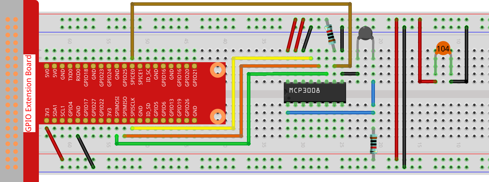

.. note::

    Hallo und willkommen in der SunFounder Raspberry Pi & Arduino & ESP32 Enthusiasten-Community auf Facebook! Tauche tiefer in Raspberry Pi, Arduino und ESP32 mit anderen Enthusiasten ein.

    **Warum beitreten?**

    - **Expertenunterstützung**: Löse Probleme nach dem Kauf und technische Herausforderungen mit Hilfe unserer Community und unseres Teams.
    - **Lernen & Teilen**: Tausche Tipps und Tutorials aus, um deine Fähigkeiten zu verbessern.
    - **Exklusive Vorschauen**: Erhalte frühzeitigen Zugang zu neuen Produktankündigungen und Vorschauen.
    - **Sonderrabatte**: Genieße exklusive Rabatte auf unsere neuesten Produkte.
    - **Festliche Aktionen und Verlosungen**: Nimm an Verlosungen und Feiertagsaktionen teil.

    👉 Bereit, mit uns zu entdecken und zu erschaffen? Klicke auf [|link_sf_facebook|] und tritt noch heute bei!

.. _2.2.2_js_pi5_mcp3008:

2.2.2 Thermistor (MCP3008)
==========================

.. note::

   .. image:: ../img/mcp3008_and_adc0834.jpg
      :width: 25%
      :align: left
   

   Je nach Kit-Version bitte prüfen, ob **ADC0834** oder **MCP3008** enthalten ist, und mit dem entsprechenden Abschnitt fortfahren.

Einführung
----------

Genau wie ein Fotowiderstand Licht erfassen kann, ist ein Thermistor ein temperaturabhängiges elektronisches Bauteil, das zur Realisierung von Temperaturregelungsfunktionen wie z. B. einer Hitze-Alarmfunktion eingesetzt werden kann.

Benötigte Komponenten
---------------------

In diesem Projekt benötigen wir die folgenden Komponenten.

.. image:: ../img/list2_2.2.2_thermistor.png

Schaltplan
----------

.. list-table::
    :widths: 30 30 30 30
    :header-rows: 1

    *   - T-Board-Name
        - Physical
        - WiringPi
        - BCM

    *   - SPICE0
        - pin24
        - 10
        - 8
    *   - SPIMOSI
        - pin19
        - 12
        - 10
    *   - SPIMISO
        - pin21
        - 13
        - 9
    *   - SPISCLK
        - pin23
        - 14
        - 11

.. image:: ../img/schematic_2.2.2_thermistor_mcp3008.png

Experimentelle Schritte
-----------------------

**Schritt 1:** Baue die Schaltung auf.

**Schritt 2:** Gehe in den Code-Ordner.

.. raw:: html

   <run></run>

.. code-block:: 

    cd ~/davinci-kit-for-raspberry-pi/nodejs/

**Schritt 3:** Führe den Code aus.

.. raw:: html

   <run></run>

.. code-block:: 

    sudo node thermistor-2.js

Wenn der Code ausgeführt wird, misst der Thermistor die Umgebungstemperatur,  
die nach Abschluss der Berechnung auf dem Bildschirm ausgegeben wird.

**Code**

.. code-block:: js

    const mcpadc = require('mcp-spi-adc');

    // Öffne MCP3008-Kanal 0 (CH0), analoger Eingang vom Thermistor-Spannungsteiler
    const adc = mcpadc.openMcp3008(0, { speedHz: 1350000 }, (err) => {
      if (err) {
        console.error('Fehler beim Öffnen des MCP3008-Kanals:', err);
        process.exit(1);
      }

      console.log('MCP3008-Thermistor-Kanal geöffnet.');

      setInterval(() => {
        adc.read((err, reading) => {
          if (err) {
            console.error('Fehler beim Lesen vom ADC:', err);
            return;
          }

          const adcValue = reading.value; // Float: 0.0–1.0
          const raw = Math.round(adcValue * 1023); // 10-Bit-Integerwert

          const Vr = 3.3 * raw / 1023; // In Spannung umrechnen (bei 3,3 V Referenz)
          const R0 = 10000;            // Festwiderstand: 10 kΩ
          const B = 3950;              // B-Konstante
          const Rt = R0 * Vr / (3.3 - Vr); // Thermistor-Widerstand

          const tempK = 1 / ((Math.log(Rt / R0) / B) + (1 / (273.15 + 25))); // Kelvin
          const tempC = tempK - 273.15; // Celsius
          const tempF = tempC * 1.8 + 32; // Fahrenheit

          console.log(`Celsius: ${tempC.toFixed(2)} °C  |  Fahrenheit: ${tempF.toFixed(2)} °F`);
        });
      }, 1000);
    });

**Code-Erklärung**

.. code-block:: js

    setInterval(() => {
      adc.read((err, reading) => {
        ...
      });
    }, 1000);

Richtet eine Schleife ein, die alle 1000 ms (1 Sekunde) vom MCP3008-Kanal 0 liest.  
Die Funktion `read` gibt einen analogen Wert zwischen 0,0 und 1,0 zurück.

.. code-block:: js

    const raw = Math.round(reading.value * 1023);

Wandelt den normalisierten Float-ADC-Wert in einen rohen 10-Bit-Integerwert (0–1023) um.

.. code-block:: js

    const Vr = 3.3 * raw / 1023;

Berechnet die Spannung am Thermistor (``Vr``) basierend auf der ADC-Messung.  
Es wird angenommen, dass die Referenzspannung des MCP3008 3,3 V beträgt.

.. code-block:: js

    const Rt = R0 * Vr / (3.3 - Vr);

Verwendet die Spannungsteilerformel zur Berechnung des Thermistorwiderstands ``Rt``,  
wobei ``R0`` der feste Serienwiderstand (10 kΩ) ist.

.. code-block:: js

    const tempK = 1 / ((Math.log(Rt / R0) / B) + (1 / (273.15 + 25)));

Wendet die **B-Parameter-Gleichung** (eine vereinfachte Form der Steinhart-Hart-Gleichung) an,  
um die Temperatur in Kelvin zu schätzen.

.. code-block:: js

    const tempC = tempK - 273.15;
    const tempF = tempC * 1.8 + 32;

Wandelt die Temperatur in Kelvin zunächst in Celsius und anschließend in Fahrenheit um.

.. code-block:: js

    console.log(`Celsius: ${tempC.toFixed(2)} °C  |  Fahrenheit: ${tempF.toFixed(2)} °F`);

Gibt die Temperaturwerte in Celsius und Fahrenheit mit zwei Nachkommastellen in der Konsole aus.
