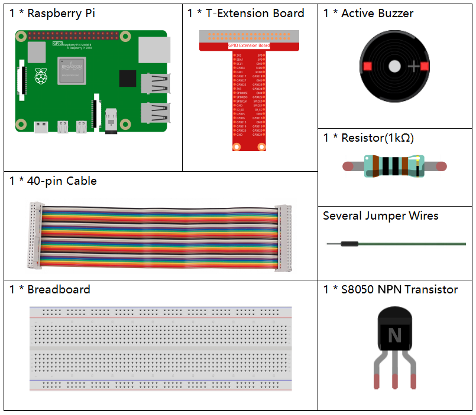

.. note::

    Ciao e benvenuto nella Community di Appassionati di SunFounder per Raspberry Pi, Arduino ed ESP32 su Facebook! Esplora a fondo il mondo di Raspberry Pi, Arduino ed ESP32 insieme a tanti altri appassionati.

    **Perché Unirsi?**

    - **Supporto da Esperti**: Risolvi problemi post-vendita e sfide tecniche con l’aiuto della nostra community e del nostro team.
    - **Impara e Condividi**: Scambia consigli e tutorial per migliorare le tue competenze.
    - **Anteprime Esclusive**: Ottieni accesso anticipato agli annunci dei nuovi prodotti e a contenuti inediti.
    - **Sconti Speciali**: Approfitta di sconti esclusivi sui nostri prodotti più recenti.
    - **Promozioni Festive e Giveaway**: Partecipa a concorsi e promozioni festive.

    👉 Pronto a esplorare e creare con noi? Clicca su [|link_sf_facebook|] e unisciti oggi stesso!

.. _1.2.1_py_pi5:

1.2.1 Buzzer Attivo
=====================

Introduzione
--------------

In questo progetto, impareremo a far emettere un suono a un buzzer attivo 
utilizzando un transistor NPN.

Componenti Necessari
-------------------------------

In questo progetto, abbiamo bisogno dei seguenti componenti.

.. raw:: html

    

Schema Elettrico
--------------------

In questo esperimento vengono utilizzati un buzzer attivo, un transistor NPN e una resistenza da 1 kΩ. La resistenza è posizionata tra il pin GPIO e la base del transistor per proteggerlo. Quando il GPIO17 del Raspberry Pi è impostato a livello basso (0 V), il transistor va in saturazione e conduce, facendo suonare il buzzer. Quando il GPIO17 è a livello alto, il transistor si spegne e il buzzer rimane silenzioso.

============ ======== ======== ===
T-Board Name physical wiringPi BCM
GPIO17       Pin 11   0        17
============ ======== ======== ===

.. image:: ../python_pi5/img/1.2.1_active_buzzer_schematic.png

Procedure Sperimentali
-------------------------

**Passo 1:** Costruisci il circuito. (Il buzzer attivo ha un’etichetta bianca sulla superficie e un retro nero.)

.. image:: ../python_pi5/img/1.2.1_ActiveBuzzer_circuit.png

**Passo 2**: Apri il file del codice.

.. raw:: html

   <run></run>

.. code-block::

    cd ~/davinci-kit-for-raspberry-pi/python-pi5

**Passo 3**: Esegui.

.. raw:: html

   <run></run>

.. code-block::

    sudo python3 1.2.1_ActiveBuzzer.py

Eseguendo il codice, il buzzer emetterà dei beep.

.. warning::

    Se compare l'errore ``RuntimeError: Cannot determine SOC peripheral base address``, consulta :ref:`faq_soc` 

**Codice**

.. note::

    Puoi **Modificare/Reimpostare/Copiare/Eseguire/Interrompere** il codice qui sotto. Prima di farlo, però, vai al percorso del codice sorgente, come ``davinci-kit-for-raspberry-pi/python-pi5``. Dopo aver modificato il codice, potrai eseguirlo direttamente per vedere il risultato.

.. raw:: html

    <run></run>

.. code-block:: python

   #!/usr/bin/env python3
   from gpiozero import Buzzer
   from time import sleep

   # Inizializza un oggetto Buzzer sul pin GPIO 17
   buzzer = Buzzer(17)

   try:
       while True:
           # Accende il buzzer
           print('Buzzer On')
           buzzer.on()
           sleep(0.1)  # Mantiene il buzzer acceso per 0,1 secondi

           # Spegne il buzzer
           print('Buzzer Off')
           buzzer.off()
           sleep(0.1)  # Mantiene il buzzer spento per 0,1 secondi

   except KeyboardInterrupt:
       # Gestisce l'interruzione da tastiera (Ctrl+C) per terminare lo script in modo pulito
       pass

**Spiegazione del Codice**

#. Queste righe importano la classe ``Buzzer`` dalla libreria ``gpiozero`` e la funzione ``sleep`` dal modulo ``time``.

   .. code-block:: python
       
       #!/usr/bin/env python3
       from gpiozero import Buzzer
       from time import sleep

#. Questa riga crea un oggetto ``Buzzer`` collegato al pin GPIO 17 sul Raspberry Pi.
    
   .. code-block:: python
       
       # Inizializza un oggetto Buzzer sul pin GPIO 17
       buzzer = Buzzer(17)
        
      

#. In un ciclo infinito (``while True``), il buzzer si accende e si spegne ogni 0,1 secondi. Le istruzioni ``print`` forniscono un output per ogni azione.
      
   .. code-block:: python
       
       try:
           while True:
               # Accende il buzzer
               print('Buzzer On')
               buzzer.on()
               sleep(0.1)  # Mantiene il buzzer acceso per 0,1 secondi

               # Spegne il buzzer
               print('Buzzer Off')
               buzzer.off()
               sleep(0.1)  # Mantiene il buzzer spento per 0,1 secondi

#. Questo segmento consente di terminare il programma in modo sicuro tramite un'interruzione da tastiera (Ctrl+C) senza generare errori.
      
   .. code-block:: python
       
       except KeyboardInterrupt:
       # Gestisce l'interruzione da tastiera (Ctrl+C) per terminare lo script in modo pulito
       pass
