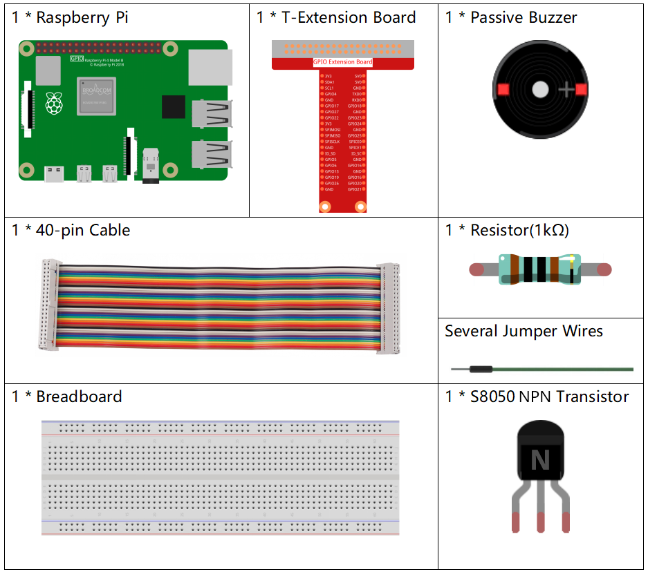
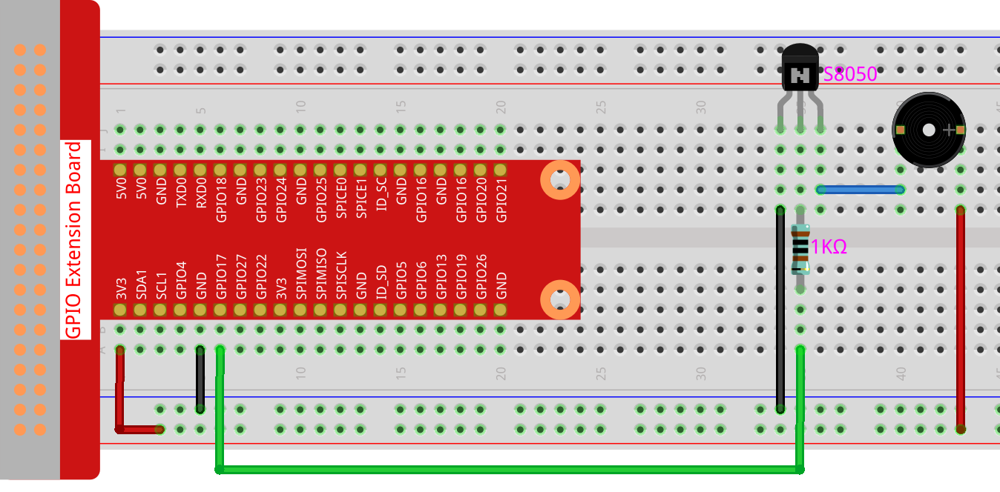

.. note::

    ¡Hola! Bienvenido a la Comunidad de Entusiastas de SunFounder para Raspberry Pi, Arduino y ESP32 en Facebook. Sumérgete en el mundo de Raspberry Pi, Arduino y ESP32 junto a otros entusiastas.

    **¿Por qué unirse?**

    - **Soporte Experto**: Resuelve problemas postventa y desafíos técnicos con la ayuda de nuestra comunidad y equipo.
    - **Aprende y Comparte**: Intercambia consejos y tutoriales para mejorar tus habilidades.
    - **Avances Exclusivos**: Accede anticipadamente a anuncios de nuevos productos y adelantos exclusivos.
    - **Descuentos Especiales**: Aprovecha descuentos exclusivos en nuestros productos más recientes.
    - **Promociones Festivas y Sorteos**: Participa en sorteos y promociones especiales.

    👉 ¿Listo para explorar y crear con nosotros? Haz clic en [|link_sf_facebook|] y únete hoy mismo.

.. _1.2.2_py_pi5:

1.2.2 Zumbador Pasivo
========================

Introducción
---------------

En este proyecto, aprenderemos a hacer que un zumbador pasivo reproduzca música.

Componentes Necesarios
-------------------------

Para este proyecto, necesitamos los siguientes componentes. 

.. raw:: html

    

Diagrama de Conexiones
------------------------

En este experimento, se utiliza un zumbador pasivo, un transistor NPN y una 
resistencia de 1k entre la base del transistor y el GPIO para proteger el transistor.

Al suministrar diferentes frecuencias al GPIO17, el zumbador pasivo emitirá 
sonidos de distintas tonalidades; de esta forma, el zumbador puede reproducir música.

============ ======== ======== ===
T-Board Name physical wiringPi BCM
GPIO17       Pin 11   0        17
============ ======== ======== ===

.. image:: ../python_pi5/img/1.2.2_passive_buzzer_schematic.png

Procedimientos del Experimento
----------------------------------

**Paso 1**: Construye el circuito. (El zumbador pasivo tiene una placa verde en la parte trasera).

**Paso 2:** Cambia al directorio correspondiente.

.. raw:: html

   <run></run>

.. code-block::

    cd ~/davinci-kit-for-raspberry-pi/python-pi5

**Paso 3:** Ejecuta el código.

.. raw:: html

   <run></run>

.. code-block::

    sudo python3 1.2.2_PassiveBuzzer.py

Tras ejecutar el código, el zumbador reproducirá una melodía.

.. warning::

    Si aparece el mensaje de error ``RuntimeError: Cannot determine SOC peripheral base address``, consulta :ref:`faq_soc` 

**Código**

.. note::

    Puedes **Modificar/Restablecer/Copiar/Ejecutar/Detener** el código a continuación. Antes de eso, asegúrate de estar en la ruta del código fuente, como ``davinci-kit-for-raspberry-pi/python-pi5``. Después de modificar el código, puedes ejecutarlo directamente para ver el efecto.

.. raw:: html

    <run></run>

.. code-block:: python

   #!/usr/bin/env python3
   from gpiozero import TonalBuzzer
   from time import sleep

   # Inicializa un TonalBuzzer conectado al pin GPIO 17
   tb = TonalBuzzer(17)  # Asegúrate de que este pin sea el correcto en tu configuración

   def play(tune):
       """
       Play a musical tune using the buzzer.
       :param tune: List of tuples (note, duration), where each tuple represents a note and its duration.
       """
       for note, duration in tune:
           print(note)  # Muestra en consola la nota actual
           tb.play(note)  # Reproduce la nota en el zumbador
           sleep(float(duration))  # Pausa durante la duración de la nota
       tb.stop()  # Detiene el sonido al completar la melodía

   # Define una melodía como una secuencia de notas y duraciones
   tune = [('C#4', 0.2), ('D4', 0.2), (None, 0.2),
       ('Eb4', 0.2), ('E4', 0.2), (None, 0.6),
       ('F#4', 0.2), ('G4', 0.2), (None, 0.6),
       ('Eb4', 0.2), ('E4', 0.2), (None, 0.2),
       ('F#4', 0.2), ('G4', 0.2), (None, 0.2),
       ('C4', 0.2), ('B4', 0.2), (None, 0.2),
       ('F#4', 0.2), ('G4', 0.2), (None, 0.2),
       ('B4', 0.2), ('Bb4', 0.5), (None, 0.6),
       ('A4', 0.2), ('G4', 0.2), ('E4', 0.2), 
       ('D4', 0.2), ('E4', 0.2)]

   try:
       play(tune)  # Ejecuta la función play para comenzar la melodía

   except KeyboardInterrupt:
       # Maneja la interrupción de teclado para una terminación limpia
       pass

**Explicación del Código**

1. Estas líneas importan la clase ``TonalBuzzer`` de la librería ``gpiozero`` para controlar el zumbador y la función ``sleep`` del módulo ``time`` para crear pausas.

   .. code-block:: python  

       #!/usr/bin/env python3
       from gpiozero import TonalBuzzer
       from time import sleep

2. Esta línea inicializa un objeto ``TonalBuzzer`` en el pin GPIO 17.
    
   .. code-block:: python
       
       # Inicializa un TonalBuzzer conectado al pin GPIO 17
       tb = TonalBuzzer(17)  # Asegúrate de que este pin sea el correcto en tu configuración

3. La función ``play`` recorre una lista de tuplas que representan notas musicales y sus duraciones. Cada nota se reproduce durante el tiempo especificado, y el zumbador se detiene después de completar la melodía.
    
   .. code-block:: python  

       def play(tune):
           """
           Play a musical tune using the buzzer.
           :param tune: List of tuples (note, duration), where each tuple represents a note and its duration.
           """
           for note, duration in tune:
               print(note)  # Muestra en consola la nota actual
               tb.play(note)  # Reproduce la nota en el zumbador
               sleep(float(duration))  # Pausa durante la duración de la nota
           tb.stop()  # Detiene el sonido al completar la melodía

4. La melodía se define como una secuencia de notas (frecuencia) y duraciones (segundos).
    
   .. code-block:: python

       # Define una melodía como una secuencia de notas y duraciones
       tune = [('C#4', 0.2), ('D4', 0.2), (None, 0.2),
           ('Eb4', 0.2), ('E4', 0.2), (None, 0.6),
           ('F#4', 0.2), ('G4', 0.2), (None, 0.6),
           ('Eb4', 0.2), ('E4', 0.2), (None, 0.2),
           ('F#4', 0.2), ('G4', 0.2), (None, 0.2),
           ('C4', 0.2), ('B4', 0.2), (None, 0.2),
           ('F#4', 0.2), ('G4', 0.2), (None, 0.2),
           ('B4', 0.2), ('Bb4', 0.5), (None, 0.6),
           ('A4', 0.2), ('G4', 0.2), ('E4', 0.2), 
           ('D4', 0.2), ('E4', 0.2)]  

5. La función ``play(tune)`` se llama dentro de un bloque ``try``. Una ``KeyboardInterrupt`` (Ctrl+C) detendrá el programa de manera segura.
    
   .. code-block:: python  
       
       try:
           play(tune)  # Ejecuta la función play para comenzar la melodía

       except KeyboardInterrupt:
           # Maneja la interrupción de teclado para una terminación limpia
           pass
