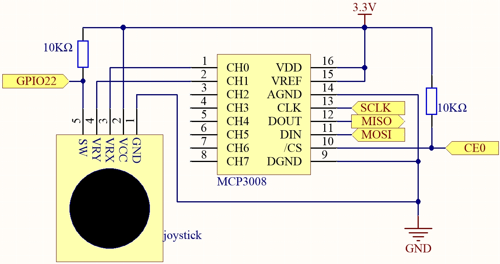
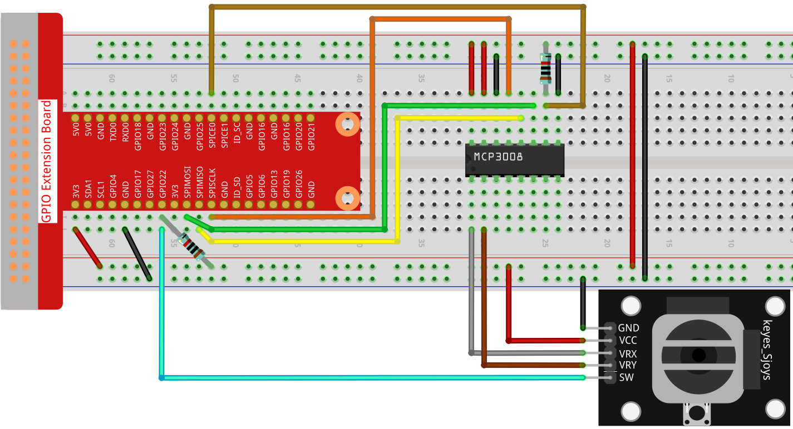

.. note::

    Bonjour et bienvenue dans la communauté SunFounder Raspberry Pi & Arduino & ESP32 sur Facebook ! Plongez plus profondément dans l’univers du Raspberry Pi, Arduino et ESP32 avec d’autres passionnés.

    **Pourquoi nous rejoindre ?**

    - **Assistance d’experts** : Résolvez les problèmes après-vente et surmontez les défis techniques avec l’aide de notre communauté et de notre équipe.
    - **Apprendre & Partager** : Échangez des conseils et tutoriels pour développer vos compétences.
    - **Aperçus exclusifs** : Profitez d’un accès anticipé aux annonces de nouveaux produits et à des avant-premières.
    - **Réductions spéciales** : Bénéficiez de remises exclusives sur nos derniers produits.
    - **Promotions festives et concours** : Participez à des concours et à des promotions spéciales.

    👉 Prêt à explorer et créer avec nous ? Cliquez sur [|link_sf_facebook|] et rejoignez-nous dès aujourd’hui !

.. _2.1.6_py_pi5_mcp3008:

2.1.6 Joystick (MCP3008)
========================

.. note::

   .. image:: ../img/mcp3008_and_adc0834.jpg
      :width: 25%
      :align: left
    

   Selon la version de votre kit, identifiez si vous disposez d’un **ADC0834** ou d’un **MCP3008** et suivez la section correspondante.

Introduction
------------

Dans ce projet, nous allons apprendre comment fonctionne un joystick. Nous manipulerons  
le joystick et afficherons les résultats à l’écran.

Composants requis
-----------------

Dans ce projet, nous avons besoin des composants suivants :  

.. image:: ../python_pi5/img/image317-copy.png

Schéma de câblage
-----------------

Lors de la lecture des données du joystick, il existe quelques différences entre les axes :  
les données des axes X et Y sont analogiques et nécessitent l’utilisation du MCP3008  
pour convertir la valeur analogique en valeur numérique.  
Les données de l’axe Z sont numériques, vous pouvez donc les lire directement via le GPIO,  
ou bien utiliser l’ADC pour la lecture.

.. list-table::
    :widths: 30 30 30 30
    :header-rows: 1

    *   - Nom sur la T-Board
        - physique
        - WiringPi
        - BCM

    *   - SPICE0
        - pin24
        - 10
        - 8
    *   - SPIMOSI
        - pin19
        - 12
        - 10
    *   - SPIMISO
        - pin21
        - 13
        - 9
    *   - SPISCLK
        - pin23
        - 14
        - 11
    *   - GPIO22
        - pin15
        - 3
        - 22

Procédures expérimentales
-------------------------

**Étape 1 :** Construire le circuit.

**Étape 2 :** Configurer l’interface SPI et installer la bibliothèque ``spidev`` (voir :ref:`spi_configuration` pour des instructions détaillées). Si vous avez déjà effectué ces étapes, vous pouvez les ignorer.

**Étape 3 :** Aller dans le dossier du code.

.. raw:: html

   <run></run>

.. code-block::

    cd ~/davinci-kit-for-raspberry-pi/python-pi5

**Étape 4 :** Exécuter.

.. raw:: html

   <run></run>

.. code-block::

    sudo python3 2.1.6-2_Joystick_zero.py

Après exécution du code, déplacez le joystick : les valeurs correspondantes de X, Y et Btn s’afficheront à l’écran.

.. warning::

    Si un message d’erreur ``RuntimeError: Cannot determine SOC peripheral base address`` apparaît, veuillez consulter :ref:`faq_soc`

**Code**

.. note::

    Vous pouvez **Modifier/Réinitialiser/Copier/Exécuter/Arrêter** le code ci-dessous.  
    Mais avant cela, vous devez vous rendre dans le chemin du code source comme  
    ``davinci-kit-for-raspberry-pi/python-pi5``. Après modification, vous pouvez exécuter  
    le code directement pour voir l’effet.

.. raw:: html

    <run></run>

.. code-block:: python

    #!/usr/bin/env python3

    from gpiozero import Button
    import spidev
    import time

    # Initialiser le bouton connecté à la broche GPIO22 (broche SW du joystick)
    BtnPin = Button(22)

    # Initialiser la communication SPI avec MCP3008
    spi = spidev.SpiDev()
    spi.open(0, 0)  # Ouvrir le bus SPI 0, périphérique CE0
    spi.max_speed_hz = 1000000  # Régler la vitesse SPI à 1 MHz

    def read_adc(channel):
        """
        Lire la valeur analogique depuis le canal MCP3008 spécifié (0–7)
        :param channel: numéro du canal ADC (0–7)
        :return: valeur entière sur 10 bits (0–1023)
        """
        if channel < 0 or channel > 7:
            return -1
        adc = spi.xfer2([1, (8 + channel) << 4, 0])
        value = ((adc[1] & 0x03) << 8) | adc[2]
        return value

    try:
        # Boucle principale pour lire et afficher les valeurs du joystick et l’état du bouton
        while True:
            # Lire les valeurs X et Y depuis les canaux 0 et 1 du MCP3008
            x_val = read_adc(0)  # Joystick VRX connecté au CH0
            y_val = read_adc(1)  # Joystick VRY connecté au CH1

            # Lire l’état du bouton du joystick (SW)
            Btn_val = BtnPin.value  # 0 = pressé, 1 = relâché

            # Afficher les valeurs lues
            print('X: %d  Y: %d  Btn: %d' % (x_val, y_val, Btn_val))

            # Attendre 0,2 seconde avant la prochaine lecture
            time.sleep(0.2)

    # Gestion propre de l’interruption Ctrl+C
    except KeyboardInterrupt:
        spi.close()

**Explication du code**

#. Cette section importe les bibliothèques nécessaires :

   * ``gpiozero.Button`` est utilisé pour lire l’état numérique du bouton du joystick (broche SW).
   * ``spidev`` est utilisé pour la communication SPI avec la puce ADC MCP3008.
   * ``time`` est utilisé pour introduire un délai entre les lectures.

   .. code-block:: python

       #!/usr/bin/env python3
       from gpiozero import Button
       import spidev
       import time

#. Initialise le bouton connecté à GPIO22 (broche SW du joystick) et configure l’interface SPI sur le bus 0, chip select 0 (CE0). La vitesse SPI est réglée à 1 MHz.

   .. code-block:: python

       # Initialiser le bouton connecté à la broche GPIO22 (broche SW du joystick)
       BtnPin = Button(22)

       # Initialiser la communication SPI avec MCP3008
       spi = spidev.SpiDev()
       spi.open(0, 0)  # Ouvrir le bus SPI 0, périphérique CE0
       spi.max_speed_hz = 1000000  # Régler la vitesse SPI à 1 MHz

#. Définit une fonction ``read_adc(channel)`` pour lire la valeur analogique depuis un canal spécifique du MCP3008 (0–7). Elle envoie trois octets via le protocole SPI et retourne une valeur sur 10 bits (0–1023).

   .. code-block:: python

       def read_adc(channel):
           """
           Lire la valeur analogique depuis le canal MCP3008 spécifié (0–7)
           :param channel: numéro du canal ADC (0–7)
           :return: valeur entière sur 10 bits (0–1023)
           """
           if channel < 0 or channel > 7:
               return -1
           adc = spi.xfer2([1, (8 + channel) << 4, 0])
           value = ((adc[1] & 0x03) << 8) | adc[2]
           return value

#. Dans la boucle principale, on lit les valeurs analogiques de VRX (CH0) et VRY (CH1), ainsi que l’état du bouton du joystick. Les valeurs sont affichées sur la console toutes les 0,2 secondes.  
   Lorsque Ctrl+C est pressé, l’interface SPI est fermée proprement.

   .. code-block:: python

       try:
           # Boucle principale pour lire et afficher les valeurs du joystick et l’état du bouton
           while True:
               # Lire les valeurs X et Y depuis les canaux 0 et 1 du MCP3008
               x_val = read_adc(0)  # Joystick VRX connecté au CH0
               y_val = read_adc(1)  # Joystick VRY connecté au CH1

               # Lire l’état du bouton du joystick (SW)
               Btn_val = BtnPin.value  # 0 = pressé, 1 = relâché

               # Afficher les valeurs lues
               print('X: %d  Y: %d  Btn: %d' % (x_val, y_val, Btn_val))

               # Attendre 0,2 seconde avant la prochaine lecture
               time.sleep(0.2)

       # Gestion propre de l’interruption Ctrl+C
       except KeyboardInterrupt:
           spi.close()
