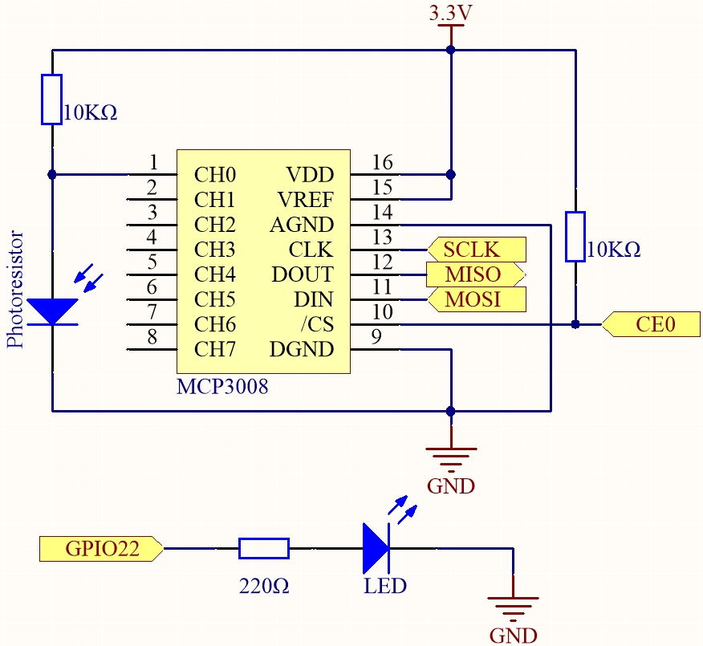

.. note::

    Hallo, willkommen in der SunFounder Raspberry Pi & Arduino & ESP32 Enthusiasten-Community auf Facebook! Tauche tiefer in Raspberry Pi, Arduino und ESP32 mit anderen Enthusiasten ein.

    **Warum beitreten?**

    - **Expertenunterstützung**: Löse Probleme nach dem Kauf und technische Herausforderungen mit Hilfe unserer Community und unseres Teams.
    - **Lernen & Teilen**: Tausche Tipps und Tutorials aus, um deine Fähigkeiten zu verbessern.
    - **Exklusive Vorschauen**: Erhalte frühzeitigen Zugang zu neuen Produktankündigungen und Vorschauen.
    - **Spezielle Rabatte**: Genieße exklusive Rabatte auf unsere neuesten Produkte.
    - **Festliche Aktionen und Gewinnspiele**: Nimm an Gewinnspielen und saisonalen Aktionen teil.

    👉 Bereit, mit uns zu erkunden und zu kreieren? Klicke auf [|link_sf_facebook|] und tritt noch heute bei!

.. _2.2.1_py_pi5_mcp3008:

2.2.1 Fotowiderstand (MCP3008)
===============================

.. note::

   .. image:: ../img/mcp3008_and_adc0834.jpg
      :width: 25%
      :align: left
    

   Abhängig von deiner Bausatzversion überprüfe bitte, ob du **ADC0834** oder **MCP3008** hast, und fahre mit dem entsprechenden Abschnitt fort.

Einführung
----------

Der Fotowiderstand ist eine häufig verwendete Komponente zur Erkennung der Umgebungslichtintensität.  
Er hilft dem Controller, Tag und Nacht zu erkennen und Lichtsteuerungsfunktionen wie eine Nachtlampe zu realisieren.  
Dieses Projekt ist dem Potentiometer sehr ähnlich – du könntest sagen, es wandelt die Spannung in Lichtmessung um.

Benötigte Komponenten
----------------------

In diesem Projekt benötigen wir die folgenden Komponenten.

.. image:: ../python_pi5/img/list2_2.2.1_photoresistor.png

Schaltplan
----------

.. .. image:: ../python_pi5/img/2.2.1_photoresistor_schematic_1.png

.. list-table::
    :widths: 30 30 30 30
    :header-rows: 1

    *   - T-Board Name
        - Physisch
        - WiringPi
        - BCM

    *   - SPICE0
        - pin24
        - 10
        - 8
    *   - SPIMOSI
        - pin19
        - 12
        - 10
    *   - SPIMISO
        - pin21
        - 13
        - 9
    *   - SPISCLK
        - pin23
        - 14
        - 11
    *   - GPIO22
        - pin15
        - 3
        - 22

Experimentelle Schritte
-----------------------

**Schritt 1:** Baue die Schaltung auf.

.. image:: ../python_pi5/img/july24_2.2.1_photoresistor_mcp3008.png

**Schritt 2:** Richte die SPI-Schnittstelle ein und installiere die Bibliothek ``spidev`` (siehe :ref:`spi_configuration` für detaillierte Anweisungen). Wenn du diese Schritte bereits abgeschlossen hast, kannst du diesen Schritt überspringen.

**Schritt 3:** Gehe in den Code-Ordner.

.. raw:: html

   <run></run>

.. code-block::

    cd ~/davinci-kit-for-raspberry-pi/python-pi5

**Schritt 4:** Führe die ausführbare Datei aus.

.. raw:: html

   <run></run>

.. code-block::

    sudo python3 2.2.1-2_Photoresistor_zero.py

Während der Code läuft, ändert sich die Helligkeit der LED entsprechend der vom Fotowiderstand erfassten Lichtintensität.

.. warning::

    Falls die Fehlermeldung ``RuntimeError: Cannot determine SOC peripheral base address`` erscheint, siehe :ref:`faq_soc`

**Code**

.. note::

    Du kannst den untenstehenden Code **Ändern/Zurücksetzen/Kopieren/Ausführen/Stoppen**.  
    Bevor du dies tust, musst du jedoch den Quellcode-Pfad wie ``davinci-kit-for-raspberry-pi/python-pi5`` aufrufen.  
    Nachdem du den Code geändert hast, kannst du ihn direkt ausführen, um den Effekt zu sehen.

.. raw:: html

    <run></run>

.. code-block:: python

    #!/usr/bin/env python3
    import spidev
    import time
    from gpiozero import PWMLED

    # Initialisiere eine PWM-LED an GPIO-Pin 22
    led = PWMLED(22)

    # Initialisiere SPI-Kommunikation (Bus 0, CE0 -> GPIO8)
    spi = spidev.SpiDev()
    spi.open(0, 0)  # Bus 0, CS0
    spi.max_speed_hz = 1000000  # 1 MHz

    # Funktion zum Lesen von MCP3008-Kanal (0–7)
    def read_adc(channel):
        """
        Analogen Wert vom MCP3008 lesen (0–1023)
        """
        if channel < 0 or channel > 7:
            return -1
        # MCP3008-Protokoll: Startbit, Single-Ended-Modus, Kanal (3 Bit), Füller
        r = spi.xfer2([1, (8 + channel) << 4, 0])
        value = ((r[1] & 3) << 8) | r[2]
        return value

    # Funktion zum Umrechnen eines Wertes von einem Bereich in einen anderen
    def MAP(x, in_min, in_max, out_min, out_max):
        return (x - in_min) * (out_max - out_min) / (in_max - in_min) + out_min

    # Hauptschleife zum Lesen des ADC-Werts und Steuern der LED-Helligkeit
    def loop():
        while True:
            # Analogen Wert von Kanal 0 des MCP3008 lesen
            analogVal = read_adc(0)
            print('value = %d' % analogVal)

            # 0–1023 auf PWM-Bereich 0.0–1.0 umrechnen
            led.value = analogVal / 1023.0

            # 0,2 Sekunden warten
            time.sleep(0.2)

    # Hauptschleife ausführen und KeyboardInterrupt für sauberes Beenden behandeln
    try:
        loop()
    except KeyboardInterrupt:
        led.value = 0  # LED vor dem Beenden ausschalten

**Code-Erklärung**

#. Dieser Abschnitt importiert die Klasse ``PWMLED`` aus der Bibliothek ``gpiozero`` zur Steuerung von PWM-LEDs, ``spidev`` für die SPI-Kommunikation mit dem MCP3008 und ``time`` für Pausen/Verzögerungen.

   .. code-block:: python

       #!/usr/bin/env python3
       import spidev
       import time
       from gpiozero import PWMLED

#. Initialisiert eine PWM-LED, die mit GPIO-Pin 22 verbunden ist, und richtet die SPI-Schnittstelle für den MCP3008 ein (Bus 0, CE0). Die SPI-Taktfrequenz wird auf 1 MHz gesetzt.

   .. code-block:: python

       # Initialisiere eine PWM-LED an GPIO-Pin 22
       led = PWMLED(22)

       # Initialisiere SPI-Kommunikation (Bus 0, CE0 -> GPIO8)
       spi = spidev.SpiDev()
       spi.open(0, 0)  # Bus 0, CS0
       spi.max_speed_hz = 1000000  # 1 MHz

#. Definiert eine Funktion zum Lesen von einem bestimmten MCP3008-ADC-Kanal. Sie sendet einen 3-Byte-Befehl über SPI und extrahiert einen 10-Bit-Wert (0–1023) aus der Antwort.

   .. code-block:: python

       # Funktion zum Lesen von MCP3008-Kanal (0–7)
       def read_adc(channel):
           """
           Analogen Wert vom MCP3008 lesen (0–1023)
           """
           if channel < 0 or channel > 7:
               return -1
           # MCP3008-Protokoll: Startbit, Single-Ended-Modus, Kanal (3 Bit), Füller
           r = spi.xfer2([1, (8 + channel) << 4, 0])
           value = ((r[1] & 3) << 8) | r[2]
           return value

#. Definiert eine Hilfsfunktion ``MAP()``, die eine Zahl von einem Wertebereich in einen anderen umrechnet. Dies ist nützlich, um rohe ADC-Werte in einen geeigneten PWM-Bereich umzuwandeln.

   .. code-block:: python

       # Funktion zum Umrechnen eines Wertes von einem Bereich in einen anderen
       def MAP(x, in_min, in_max, out_min, out_max):
           return (x - in_min) * (out_max - out_min) / (in_max - in_min) + out_min

#. Implementiert eine Schleife, die wiederholt einen analogen Wert von Kanal 0 des MCP3008 liest, ihn auf einen PWM-Helligkeitswert (0.0–1.0) umrechnet und auf die LED anwendet. Die Schleife pausiert 0,2 Sekunden zwischen den Messungen.

   .. code-block:: python

       # Hauptschleife zum Lesen des ADC-Werts und Steuern der LED-Helligkeit
       def loop():
           while True:
               # Analogen Wert von Kanal 0 des MCP3008 lesen
               analogVal = read_adc(0)
               print('value = %d' % analogVal)

               # 0–1023 auf PWM-Bereich 0.0–1.0 umrechnen
               led.value = analogVal / 1023.0

               # 0,2 Sekunden warten
               time.sleep(0.2)

#. Führt die Schleife aus und behandelt ``KeyboardInterrupt`` sauber. Wenn der Benutzer das Programm stoppt (Ctrl+C), wird die LED vor dem Beenden ausgeschaltet.

   .. code-block:: python

       # Hauptschleife ausführen und KeyboardInterrupt für sauberes Beenden behandeln
       try:
           loop()
       except KeyboardInterrupt:
           # LED vor dem Beenden ausschalten
           led.value = 0
