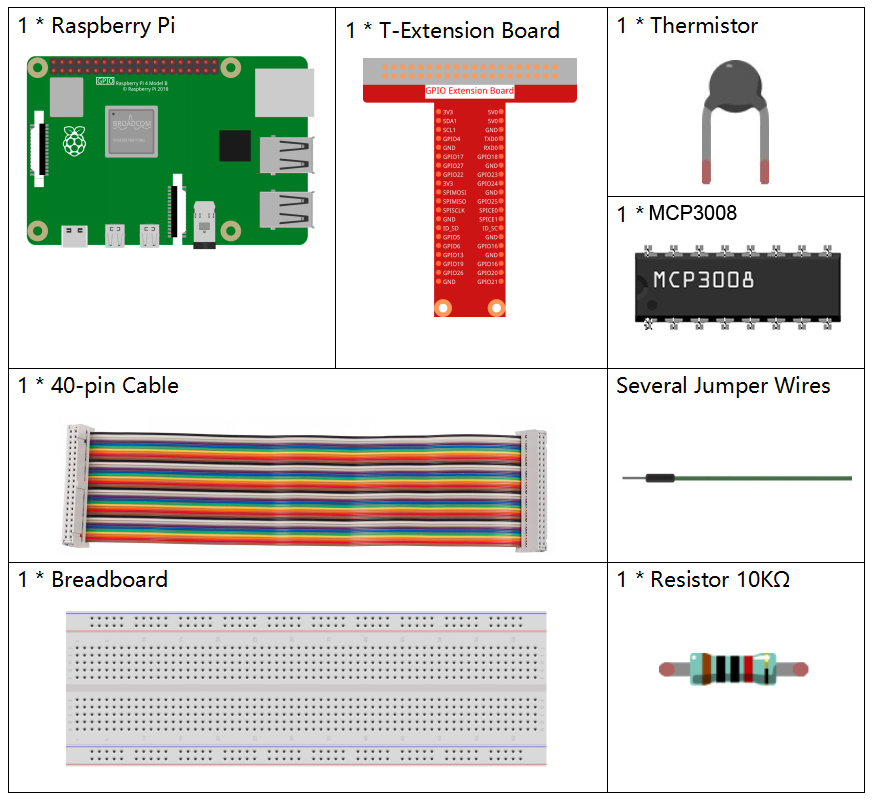
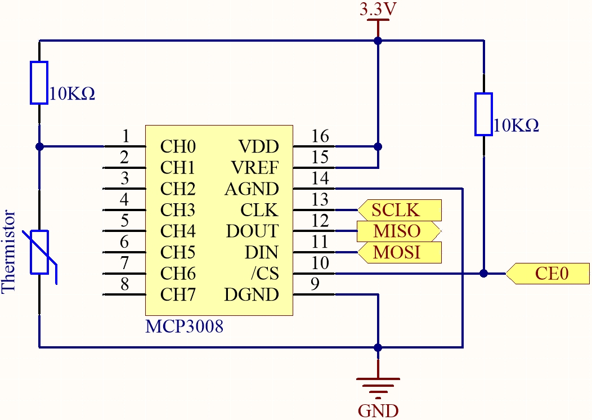
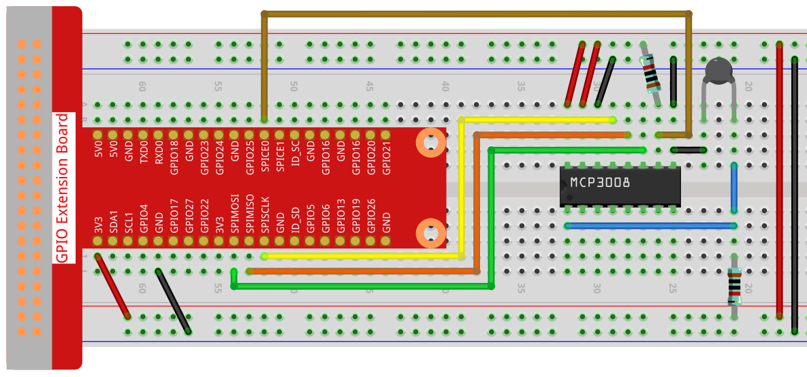

.. note::

    こんにちは、SunFounder Raspberry Pi & Arduino & ESP32 愛好家コミュニティ（Facebook）へようこそ！  
    Raspberry Pi、Arduino、ESP32 を仲間と一緒にさらに深く探求しましょう。

    **参加する理由**

    - **専門的なサポート**: 購入後の問題や技術的課題を、コミュニティとチームがサポートします。
    - **学びと共有**: ヒントやチュートリアルを交換してスキルを向上できます。
    - **限定プレビュー**: 新製品の発表やプレビューに早くアクセスできます。
    - **特別割引**: 最新製品を会員限定の割引価格で購入できます。
    - **季節イベントと景品企画**: プレゼントや季節ごとのイベントに参加できます。

    👉 一緒に探求と創造を始めましょう。[|link_sf_facebook|] をクリックして今すぐ参加！

.. _2.2.2_py_pi5_mcp3008:

2.2.2 サーミスタ(MCP3008)
============================

.. note::

   .. image:: ../img/mcp3008_and_adc0834.jpg
      :width: 25%
      :align: left
    

   キットのバージョンにより、 **ADC0834** または **MCP3008** が含まれています。  
   該当するセクションを参照してください。

はじめに
--------

フォトレジスタが光を検出できるのと同様に、サーミスタは温度に応じて抵抗値が変化する電子部品です。  
温度制御、例えば過熱警報などの機能を実現できます。

必要な部品
----------

このプロジェクトで使用する部品は以下の通りです。

回路図
------

.. list-table::
    :widths: 30 30 30 30
    :header-rows: 1

    *   - T-Board 名
        - 物理ピン
        - WiringPi
        - BCM

    *   - SPICE0
        - pin24
        - 10
        - 8
    *   - SPIMOSI
        - pin19
        - 12
        - 10
    *   - SPIMISO
        - pin21
        - 13
        - 9
    *   - SPISCLK
        - pin23
        - 14
        - 11

実験手順
--------

**手順1:** 回路を組み立てます。

**手順2:** SPI インターフェースを設定し、 ``spidev`` ライブラリをインストールします（詳細は :ref:`spi_configuration` を参照）。すでに設定済みであれば省略できます。

**手順3:** コードのフォルダへ移動します。

.. code-block:: 

    cd ~/davinci-kit-for-raspberry-pi/python-pi5

**手順4:** 実行ファイルを起動します。

.. code-block:: 

    sudo python3 2.2.2-2_Thermistor_zero.py

コードが実行されると、サーミスタが周囲温度を検出し、計算後に温度が画面に表示されます。

.. warning::

    ``RuntimeError: Cannot determine SOC peripheral base address`` というエラーが出た場合は、:ref:`faq_soc` を参照してください。

コード
------

.. code-block:: python

    #!/usr/bin/env python3
    # -*- coding: utf-8 -*-

    import spidev
    import time
    import math

    # MCP3008 用 SPI 初期化（バス 0、CE0）
    spi = spidev.SpiDev()
    spi.open(0, 0)  # バス 0、デバイス 0 (CE0)
    spi.max_speed_hz = 1000000  # 1 MHz

    def read_adc(channel):
        """
        MCP3008 チャンネル (0–7) からアナログ値を読み取る
        """
        if channel < 0 or channel > 7:
            return -1
        # MCP3008 通信フォーマット
        adc = spi.xfer2([1, (8 + channel) << 4, 0])
        value = ((adc[1] & 0x03) << 8) | adc[2]
        return value

    try:
        while True:
            # MCP3008 の CH0 からアナログ値を取得
            analogVal = read_adc(0)

            # 電圧に変換（3.3V 基準）
            Vr = 3.3 * analogVal / 1023.0

            # サーミスタの抵抗値を計算
            Rt = 10000.0 * Vr / (3.3 - Vr)

            # Steinhart–Hart 近似式でケルビン温度を計算
            tempK = 1.0 / (((math.log(Rt / 10000.0)) / 3950.0) + (1.0 / (273.15 + 25.0)))

            # 摂氏と華氏に変換
            Cel = tempK - 273.15
            Fah = Cel * 1.8 + 32

            # 温度を表示
            print('Celsius: %.2f °C  Fahrenheit: %.2f °F' % (Cel, Fah))

            # 次の読み取りまで待機
            time.sleep(0.2)

    except KeyboardInterrupt:
        spi.close()

コード解説
----------

#. ``spidev`` モジュールで MCP3008 ADC と SPI 通信を行い、 ``time`` モジュールで待機処理、 ``math`` モジュールで温度計算に必要な対数計算を行います。

   .. code-block:: python

       import spidev
       import time
       import math

#. バス 0、デバイス 0 (CE0) で SPI を初期化し、最大クロック周波数を 1 MHz に設定します。

   .. code-block:: python

       spi = spidev.SpiDev()
       spi.open(0, 0)
       spi.max_speed_hz = 1000000

#. 指定チャンネル（0–7）の MCP3008 からアナログ値を読み取る ``read_adc()`` 関数を定義します。SPI プロトコルで通信し、0〜1023 の 10 ビット整数を返します。

   .. code-block:: python

       def read_adc(channel):
           if channel < 0 or channel > 7:
               return -1
           adc = spi.xfer2([1, (8 + channel) << 4, 0])
           value = ((adc[1] & 0x03) << 8) | adc[2]
           return value

#. サーミスタからの読み取り値を電圧に変換し、抵抗値を算出し、Steinhart–Hart 式で温度（ケルビン）に変換します。最後に摂氏と華氏を計算して表示します。  
   各読み取りの間に短い待機時間を入れます。

   .. code-block:: python

       analogVal = read_adc(0)
       Vr = 3.3 * analogVal / 1023.0
       Rt = 10000.0 * Vr / (3.3 - Vr)
       tempK = 1.0 / (((math.log(Rt / 10000.0)) / 3950.0) + (1.0 / (273.15 + 25.0)))
       Cel = tempK - 273.15
       Fah = Cel * 1.8 + 32

#. ``KeyboardInterrupt`` （Ctrl+C）を検出して安全に終了し、SPI 接続を閉じます。

   .. code-block:: python

       except KeyboardInterrupt:
           spi.close()
