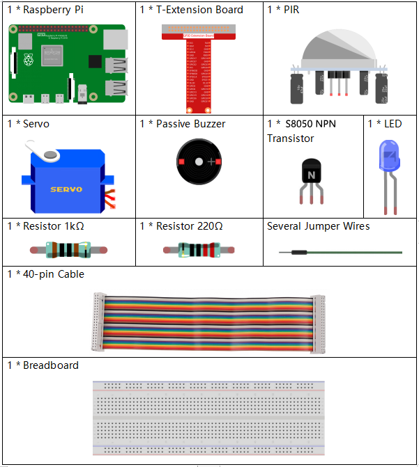
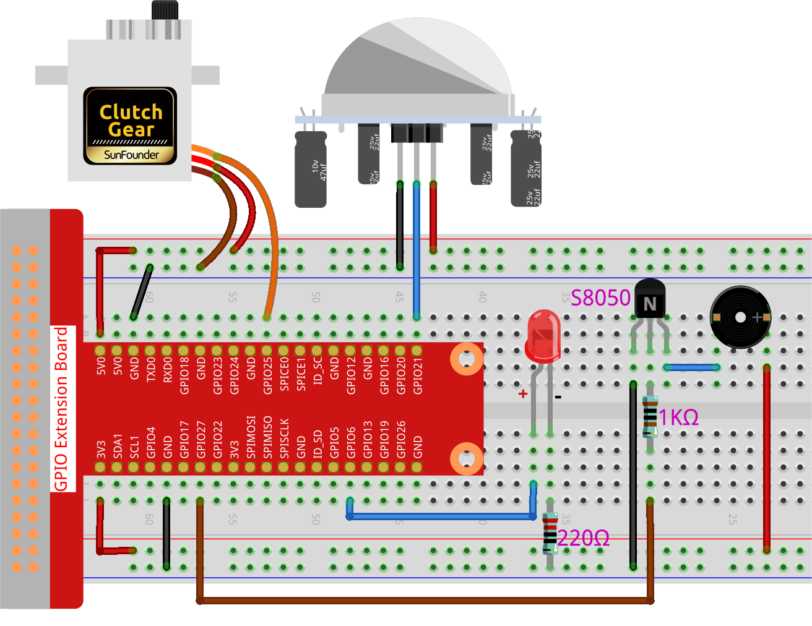

.. note::

    Bonjour, bienvenue dans la communauté SunFounder Raspberry Pi & Arduino & ESP32 sur Facebook ! Plongez dans l’univers du Raspberry Pi, de l’Arduino et de l’ESP32 avec d’autres passionnés.

    **Pourquoi nous rejoindre ?**

    - **Assistance d’experts** : Résolvez les problèmes après-vente et les défis techniques avec l’aide de notre communauté et de notre équipe.
    - **Apprendre et Partager** : Échangez des conseils et des tutoriels pour améliorer vos compétences.
    - **Aperçus exclusifs** : Bénéficiez d’un accès anticipé aux annonces de nouveaux produits et à des avant-premières exclusives.
    - **Réductions spéciales** : Profitez de remises exclusives sur nos derniers produits.
    - **Promotions festives et cadeaux** : Participez à des promotions festives et à des concours pour gagner des cadeaux.

    👉 Prêt à explorer et à créer avec nous ? Cliquez sur [|link_sf_facebook|] et rejoignez-nous dès aujourd’hui !

.. _py_pi5_welcome:

3.1.2 Bienvenue
===============================

Introduction
----------------

Dans ce projet, nous utiliserons un capteur PIR pour détecter les mouvements des 
piétons et utiliserons des servos, une LED et un buzzer pour simuler le fonctionnement 
d’une porte automatique de magasin. Lorsque le piéton entre dans la zone de détection 
du PIR, le voyant s’allume, la porte s’ouvre et le buzzer joue une mélodie d’accueil.

Composants nécessaires
------------------------------

Pour ce projet, nous aurons besoin des composants suivants.

.. Il est plus pratique d’acheter un kit complet, voici le lien :

.. .. list-table::
..     :widths: 20 20 20
..     :header-rows: 1

..     *   - Nom	
..         - ARTICLES DANS CE KIT
..         - LIEN
..     *   - Kit Raphael
..         - 337
..         - |link_Raphael_kit|

.. Vous pouvez également les acheter séparément via les liens ci-dessous.

.. .. list-table::
..     :widths: 30 20
..     :header-rows: 1

..     *   - INTRODUCTION AUX COMPOSANTS
..         - LIEN D'ACHAT

..     *   - :ref:`gpio_extension_board`
..         - |link_gpio_board_buy|
..     *   - :ref:`breadboard`
..         - |link_breadboard_buy|
..     *   - :ref:`wires`
..         - |link_wires_buy|
..     *   - :ref:`resistor`
..         - |link_resistor_buy|
..     *   - :ref:`led`
..         - |link_led_buy|
..     *   - :ref:`pir`
..         - \-
..     *   - :ref:`servo`
..         - |link_servo_buy|
..     *   - :ref:`Buzzer`
..         - |link_passive_buzzer_buy|
..     *   - :ref:`transistor`
..         - |link_transistor_buy|

Schéma de câblage
---------------------

============ ======== ======== ===
T-Board Name physical wiringPi BCM
GPIO18       Pin 12   1        18
GPIO17       Pin 11   0        17
GPIO27       Pin 13   2        27
GPIO22       Pin 15   3        22
============ ======== ======== ===

.. image:: ../python_pi5/img/4.1.8_welcome_schematic.png
   :align: center

Procédure expérimentale
----------------------------

**Étape 1 :** Construisez le circuit.

**Étape 2 :** Changez de répertoire.

.. raw:: html

   <run></run>

.. code-block::

    cd ~/davinci-kit-for-raspberry-pi/python-pi5

**Étape 3 :** Exécutez le fichier.

.. raw:: html

   <run></run>

.. code-block::

    sudo python3 3.1.2_Welcome.py

Une fois le code exécuté, si le capteur PIR détecte le passage de quelqu’un, 
la porte s’ouvre automatiquement (simulée par le servo), le voyant s’allume et 
la mélodie de la sonnette retentit. Après la mélodie, le système fermera 
automatiquement la porte, éteindra le voyant et attendra le passage de la 
prochaine personne.

Il y a deux potentiomètres sur le module PIR : l’un ajuste la sensibilité et 
l’autre la distance de détection. Pour optimiser le fonctionnement du module PIR, 
tournez-les tous les deux dans le sens inverse des aiguilles d'une montre jusqu'à la butée.

.. image:: ../python_pi5/img/4.1.8_PIR_TTE.png
    :width: 400
    :align: center

.. warning::

    Si un message d’erreur ``RuntimeError: Cannot determine SOC peripheral base address`` apparaît, veuillez consulter :ref:`faq_soc` 

**Code**

.. note::
    Vous pouvez **Modifier/Réinitialiser/Copier/Exécuter/Arrêter** le code ci-dessous. 
    Mais avant cela, vous devez accéder au chemin source comme ``davinci-kit-for-raspberry-pi/python-pi5``. 
    Après avoir modifié le code, vous pouvez l'exécuter directement pour voir l'effet.

.. raw:: html

    <run></run>

.. code-block:: python

   #!/usr/bin/env python3

   from gpiozero import LED, MotionSensor, Servo, TonalBuzzer
   import time

   # Configuration des broches GPIO pour la LED, le capteur de mouvement (PIR) et le buzzer
   ledPin = LED(6)
   pirPin = MotionSensor(21)
   buzPin = TonalBuzzer(27)

   # Facteur de correction de la largeur d'impulsion du servo et calcul
   myCorrection = 0.45
   maxPW = (2.0 + myCorrection) / 1000  # Largeur d'impulsion maximale
   minPW = (1.0 - myCorrection) / 1000  # Largeur d'impulsion minimale

   # Initialisation du servo avec des largeurs d'impulsion personnalisées
   servoPin = Servo(25, min_pulse_width=minPW, max_pulse_width=maxPW)

   # Mélodie musicale pour le buzzer, avec les notes et les durées correspondantes
   tune = [('C#4', 0.2), ('D4', 0.2), (None, 0.2),
           ('Eb4', 0.2), ('E4', 0.2), (None, 0.6),
           ('F#4', 0.2), ('G4', 0.2), (None, 0.6),
           ('Eb4', 0.2), ('E4', 0.2), (None, 0.2),
           ('F#4', 0.2), ('G4', 0.2), (None, 0.2),
           ('C4', 0.2), ('B4', 0.2), (None, 0.2),
           ('F#4', 0.2), ('G4', 0.2), (None, 0.2),
           ('B4', 0.2), ('Bb4', 0.5), (None, 0.6),
           ('A4', 0.2), ('G4', 0.2), ('E4', 0.2), 
           ('D4', 0.2), ('E4', 0.2)]

   def setAngle(angle):
       """
       Move the servo to a specified angle.
       :param angle: Angle in degrees (0-180).
       """
       value = float(angle / 180)  # Convertit l'angle en valeur servo
       servoPin.value = value      # Définit la position du servo
       time.sleep(0.001)           # Courte pause pour permettre le mouvement du servo

   def doorbell():
       """
       Play a musical tune using the buzzer.
       """
       for note, duration in tune:
           buzPin.play(note)       # Jouer la note
           time.sleep(float(duration))  # Durée de la note
       buzPin.stop()               # Arrêter le buzzer après avoir joué la mélodie

   def closedoor():
       # Éteindre la LED et déplacer le servo pour fermer la porte
       ledPin.off()
       for i in range(180, -1, -1):
           setAngle(i)             # Déplacer le servo de 180 à 0 degrés
           time.sleep(0.001)       # Courte pause pour un mouvement fluide
       time.sleep(1)               # Attente après la fermeture de la porte

   def opendoor():
       # Allumer la LED, ouvrir la porte (déplacer le servo), jouer la mélodie et refermer la porte
       ledPin.on()
       for i in range(0, 181):
           setAngle(i)             # Déplacer le servo de 0 à 180 degrés
           time.sleep(0.001)       # Courte pause pour un mouvement fluide
       time.sleep(1)               # Attendre avant de jouer la mélodie
       doorbell()                  # Jouer la mélodie de la sonnette
       closedoor()                 # Fermer la porte après la mélodie

   def loop():
       # Boucle principale pour vérifier la détection de mouvement et faire fonctionner la porte
       while True:
           if pirPin.motion_detected:
               opendoor()               # Ouvrir la porte si un mouvement est détecté
           time.sleep(0.1)              # Courte pause dans la boucle

   try:
       loop()
   except KeyboardInterrupt:
       # Nettoyer les GPIO en cas d'interruption par l'utilisateur (ex: Ctrl+C)
       buzPin.stop()
       ledPin.off()

**Explication du Code**

#. Le script commence par importer les modules nécessaires. La bibliothèque ``gpiozero`` est utilisée pour interfacer la LED, le capteur de mouvement, le servo-moteur et le buzzer tonal. Le module ``time`` est utilisé pour gérer les fonctions liées au temps.

   .. code-block:: python

       #!/usr/bin/env python3
       from gpiozero import LED, MotionSensor, Servo, TonalBuzzer
       import time

#. Initialisation des broches GPIO pour la LED, le capteur de mouvement PIR et le buzzer tonal.

   .. code-block:: python

       # Configuration des broches GPIO pour la LED, le capteur de mouvement (PIR) et le buzzer
       ledPin = LED(6)
       pirPin = MotionSensor(21)
       buzPin = TonalBuzzer(27)

#. Calcule les largeurs d'impulsion maximale et minimale pour le servo-moteur, en intégrant un facteur de correction pour un positionnement précis.

   .. code-block:: python

       # Facteur de correction de la largeur d'impulsion du servo et calcul
       myCorrection = 0.45
       maxPW = (2.0 + myCorrection) / 1000  # Largeur d'impulsion maximale
       minPW = (1.0 - myCorrection) / 1000  # Largeur d'impulsion minimale

#. Initialise le servo-moteur sur la broche GPIO 25 avec des largeurs d'impulsion personnalisées pour un positionnement précis.

   .. code-block:: python

       # Initialisation du servo avec des largeurs d'impulsion personnalisées
       servoPin = Servo(25, min_pulse_width=minPW, max_pulse_width=maxPW)

#. La mélodie est définie comme une séquence de notes (fréquences) et de durées (en secondes).

   .. code-block:: python

       # Mélodie musicale pour le buzzer, avec notes et durées
       tune = [('C#4', 0.2), ('D4', 0.2), (None, 0.2),
               ('Eb4', 0.2), ('E4', 0.2), (None, 0.6),
               ('F#4', 0.2), ('G4', 0.2), (None, 0.6),
               ('Eb4', 0.2), ('E4', 0.2), (None, 0.2),
               ('F#4', 0.2), ('G4', 0.2), (None, 0.2),
               ('C4', 0.2), ('B4', 0.2), (None, 0.2),
               ('F#4', 0.2), ('G4', 0.2), (None, 0.2),
               ('B4', 0.2), ('Bb4', 0.5), (None, 0.6),
               ('A4', 0.2), ('G4', 0.2), ('E4', 0.2), 
               ('D4', 0.2), ('E4', 0.2)]

#. Fonction pour déplacer le servo à un angle spécifié. Convertit l'angle en une valeur comprise entre 0 et 1 pour le positionnement du servo.

   .. code-block:: python

       def setAngle(angle):
           """
           Move the servo to a specified angle.
           :param angle: Angle in degrees (0-180).
           """
           value = float(angle / 180)  # Convertit l'angle en valeur servo
           servoPin.value = value      # Définit la position du servo
           time.sleep(0.001)           # Courte pause pour permettre le mouvement du servo

#. Fonction pour jouer une mélodie musicale à l'aide du buzzer. Itère à travers la liste ``tune``, jouant chaque note pour sa durée spécifiée.

   .. code-block:: python

       def doorbell():
           """
           Play a musical tune using the buzzer.
           """
           for note, duration in tune:
               buzPin.play(note)       # Jouer la note
               time.sleep(float(duration))  # Durée de la note
           buzPin.stop()               # Arrêter le buzzer après avoir joué la mélodie

#. Fonctions pour ouvrir et fermer la porte à l'aide du servo-moteur. La fonction ``opendoor`` allume la LED, ouvre la porte, joue la mélodie, puis referme la porte.

   .. code-block:: python

       def closedoor():
           # Éteindre la LED et déplacer le servo pour fermer la porte
           ledPin.off()
           for i in range(180, -1, -1):
               setAngle(i)             # Déplacer le servo de 180 à 0 degrés
               time.sleep(0.001)       # Courte pause pour un mouvement fluide
           time.sleep(1)               # Attendre après la fermeture de la porte

       def opendoor():
           # Allumer la LED, ouvrir la porte (déplacer le servo), jouer la mélodie et refermer la porte
           ledPin.on()
           for i in range(0, 181):
               setAngle(i)             # Déplacer le servo de 0 à 180 degrés
               time.sleep(0.001)       # Courte pause pour un mouvement fluide
           time.sleep(1)               # Attendre avant de jouer la mélodie
           doorbell()                  # Jouer la mélodie de la sonnette
           closedoor()                 # Fermer la porte après la mélodie

#. Boucle principale qui vérifie en continu la détection de mouvement. Lorsqu'un mouvement est détecté, elle déclenche la fonction ``opendoor``.

   .. code-block:: python

       def loop():
           # Boucle principale pour vérifier la détection de mouvement et faire fonctionner la porte
           while True:
               if pirPin.motion_detected:
                   opendoor()               # Ouvrir la porte si un mouvement est détecté
               time.sleep(0.1)              # Courte pause dans la boucle

#. Exécute la boucle principale et s'assure que le script peut être arrêté avec un signal clavier (Ctrl+C), désactivant le buzzer et la LED pour une sortie propre.

   .. code-block:: python

       try:
           loop()
       except KeyboardInterrupt:
           # Nettoyer les GPIO en cas d'interruption par l'utilisateur (ex: Ctrl+C)
           buzPin.stop()
           ledPin.off()

