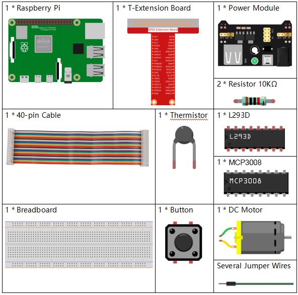

.. note::

    Hallo und willkommen in der SunFounder Raspberry Pi & Arduino & ESP32 Enthusiasten-Community auf Facebook!  
    Tauche tiefer in Raspberry Pi, Arduino und ESP32 mit anderen Enthusiasten ein.

    **Warum beitreten?**

    - **Expertenunterstützung**: Löse Probleme nach dem Kauf und technische Herausforderungen mit Hilfe unserer Community und unseres Teams.
    - **Lernen & Teilen**: Tausche Tipps und Tutorials aus, um deine Fähigkeiten zu verbessern.
    - **Exklusive Vorschauen**: Erhalte frühzeitigen Zugang zu neuen Produktankündigungen und Vorschauen.
    - **Sonderrabatte**: Genieße exklusive Rabatte auf unsere neuesten Produkte.
    - **Festliche Aktionen und Verlosungen**: Nimm an Verlosungen und Feiertagsaktionen teil.

    👉 Bereit, mit uns zu entdecken und zu erschaffen? Klicke auf [|link_sf_facebook|] und tritt noch heute bei!

.. _3.1.4_py_pi5_mcp3008:

3.1.4 Intelligenter Ventilator (MCP3008)
========================================

.. note::

   .. image:: ../img/mcp3008_and_adc0834.jpg
      :width: 25%
      :align: left
   

   Je nach Kit-Version bitte prüfen, ob **ADC0834** oder **MCP3008** enthalten ist, und mit dem entsprechenden Abschnitt fortfahren.

Einführung
----------

In diesem Projekt werden wir Motoren, Tasten und Thermistoren verwenden,  
um einen manuellen + automatischen intelligenten Ventilator mit einstellbarer Windgeschwindigkeit zu bauen.

Benötigte Komponenten
----------------------

In diesem Projekt benötigen wir die folgenden Komponenten.

Schaltplan
----------

============ ======== ======== ===
T-Board-Name Physical WiringPi BCM
SPICE0       Pin 24   10       8
SPIMOSI      Pin 19   12       10
SPIMISO      Pin 21   13       9
SPISCLK      Pin 23   14       11
GPIO22       Pin 15   3        22
GPIO5        Pin 29   21       5
GPIO6        Pin 31   22       6
GPIO13       Pin 33   23       13
============ ======== ======== ===

.. image:: ../python_pi5/img/schematic_3.1.4_smart_fan_mcp3008.png
    :align: center
    :width: 800

Experimentelle Schritte
------------------------

**Schritt 1:** Baue die Schaltung auf.

.. image:: ../python_pi5/img/july24_3.1.4_smart_fan_mcp3008.png
    :width: 800

.. note::
    Das Strommodul kann mit einer 9V-Batterie und dem im Kit enthaltenen 9V-Batterieclip betrieben werden.

.. image:: ../python_pi5/img/4.1.10_smart_fan_battery.jpeg
    :align: center

**Schritt 2:** Richte die SPI-Schnittstelle ein und installiere die ``spidev``-Bibliothek (siehe :ref:`spi_configuration` für detaillierte Anweisungen). Falls diese Schritte bereits erledigt sind, kannst du sie überspringen.

**Schritt 3:** Wechsle in den Ordner mit dem Code.

.. raw:: html

   <run></run>

.. code-block:: 

    cd ~/davinci-kit-for-raspberry-pi/python-pi5

**Schritt 4:** Ausführen.

.. raw:: html

   <run></run>

.. code-block:: 

    sudo python3 4.1.10-2_SmartFan_zero.py

Wenn der Code läuft, starte den Ventilator durch Drücken der Taste.  
Jedes Mal, wenn du drückst, wird die Geschwindigkeit um eine Stufe erhöht oder verringert.  
Es gibt **5** Geschwindigkeitsstufen: **0~4**.  
Wenn die 4\ :sup:`te` Stufe eingestellt ist und du erneut drückst, stoppt der Ventilator mit einer Windgeschwindigkeit von **0**.

Sobald die Temperatur um mehr als 2℃ steigt oder fällt, erhöht oder verringert sich die Geschwindigkeit automatisch um eine Stufe.

Code
----

.. note::
    Du kannst den folgenden Code **Ändern/Zurücksetzen/Kopieren/Ausführen/Stoppen**.  
    Vorher musst du jedoch in das Quellcode-Verzeichnis (z. B. ``davinci-kit-for-raspberry-pi/python-pi5``) wechseln.  
    Nach einer Änderung kannst du den Code direkt ausführen, um den Effekt zu sehen.

.. raw:: html

    <run></run>

.. code-block:: python

    #!/usr/bin/env python3

    from gpiozero import Motor, Button
    from time import sleep
    import spidev
    import math

    # SPI für MCP3008 initialisieren
    spi = spidev.SpiDev()
    spi.open(0, 0)  # Bus 0, CE0 (GPIO8 / physikalischer Pin 24)
    spi.max_speed_hz = 1000000  # 1 MHz

    # GPIO-Pins für Taste und Motorsteuerung initialisieren
    BtnPin = Button(22)  # GPIO22 (physikalischer Pin 15)
    motor = Motor(forward=5, backward=6, enable=13)  # GPIO5, GPIO6, GPIO13

    # Variablen für Geschwindigkeitsstufe und Temperatur
    level = 0
    currentTemp = 0
    markTemp = 0

    def read_adc(channel):
        """
        Liest den analogen Wert vom MCP3008-Kanal (0–7).
        """
        if channel < 0 or channel > 7:
            return -1
        adc = spi.xfer2([1, (8 + channel) << 4, 0])
        value = ((adc[1] & 0x03) << 8) | adc[2]
        return value

    def temperature():
        """
        Liest und berechnet die aktuelle Temperatur vom Sensor.
        Rückgabe:
            float: Aktuelle Temperatur in Celsius.
        """
        analogVal = read_adc(0)  # Thermistor an CH0
        Vr = 3.3 * analogVal / 1023.0  # Für 3,3V-System
        Rt = 10000.0 * Vr / (3.3 - Vr)
        temp = 1 / (((math.log(Rt / 10000.0)) / 3950.0) + (1 / (273.15 + 25.0)))
        Cel = temp - 273.15
        return Cel

    def motor_run(level):
        """
        Stellt die Motorgeschwindigkeit basierend auf der angegebenen Stufe ein.
        Argumente:
            level (int): Gewünschte Motorgeschwindigkeitsstufe.
        Rückgabe:
            int: Angepasste Motorgeschwindigkeitsstufe.
        """
        if level == 0:
            motor.stop()
            return 0
        if level >= 4:
            level = 4
        motor.forward(speed=float(level / 4))
        return level

    def changeLevel():
        """
        Ändert die Motorgeschwindigkeitsstufe bei Tastendruck und aktualisiert die Referenztemperatur.
        """
        global level, currentTemp, markTemp
        print("Taste gedrückt")
        level = (level + 1) % 5
        markTemp = currentTemp

    # Taste mit changeLevel-Funktion verknüpfen
    BtnPin.when_pressed = changeLevel

    def main():
        """
        Hauptfunktion zur kontinuierlichen Temperaturüberwachung und Anpassung der Motorgeschwindigkeit.
        """
        global level, currentTemp, markTemp
        markTemp = temperature()
        while True:
            currentTemp = temperature()
            if level != 0:
                if currentTemp - markTemp <= -2:
                    level -= 1
                    markTemp = currentTemp
                elif currentTemp - markTemp >= 2:
                    if level < 4:
                        level += 1
                    markTemp = currentTemp
            level = motor_run(level)
            sleep(0.2)

    # Hauptfunktion ausführen und bei Tastenkombination Strg+C sauber beenden
    try:
        main()
    except KeyboardInterrupt:
        motor.stop()
        spi.close()

Code-Erklärung
--------------

#. Importiert Bibliotheken zur Steuerung von Motor und Taste, für die SPI-Kommunikation mit MCP3008 sowie mathematische Berechnungen.  
   ``gpiozero`` steuert die GPIO-Geräte, ``spidev`` die SPI-Kommunikation mit dem MCP3008-ADC, und ``math`` wird für Temperaturberechnungen aus Widerstandswerten verwendet.

   .. code-block:: python

       from gpiozero import Motor, Button
       from time import sleep
       import spidev
       import math

#. Initialisiert die SPI-Kommunikation auf Bus 0, Gerät 0 (CE0) für den MCP3008-ADC.

   .. code-block:: python

       spi = spidev.SpiDev()
       spi.open(0, 0)
       spi.max_speed_hz = 1000000

#. Richtet GPIO-Pin 22 als Taste ein und konfiguriert den Motor mit GPIO5 (vorwärts), GPIO6 (rückwärts) und GPIO13 (Enable).  
   Legt außerdem Variablen zur Verfolgung der Geschwindigkeitsstufe und Temperatur fest.

   .. code-block:: python

       BtnPin = Button(22)
       motor = Motor(forward=5, backward=6, enable=13)
       level = 0
       currentTemp = 0
       markTemp = 0

#. Funktion zum Auslesen eines analogen Wertes (0–1023) vom MCP3008 über SPI.

   .. code-block:: python

       def read_adc(channel):
           if channel < 0 or channel > 7:
               return -1
           adc = spi.xfer2([1, (8 + channel) << 4, 0])
           value = ((adc[1] & 0x03) << 8) | adc[2]
           return value

#. Funktion zum Messen der Temperatur über den Thermistor an CH0.  
   Wandelt den ADC-Wert in Spannung um, berechnet den Widerstand und dann die Temperatur in °C (Steinhart-Hart).

   .. code-block:: python

       def temperature():
           analogVal = read_adc(0)
           Vr = 3.3 * analogVal / 1023.0
           Rt = 10000.0 * Vr / (3.3 - Vr)
           temp = 1 / (((math.log(Rt / 10000.0)) / 3950.0) + (1 / (273.15 + 25.0)))
           Cel = temp - 273.15
           return Cel

#. Funktion zur Einstellung der Motorgeschwindigkeit basierend auf ``level`` (0–4).  
   Bei 0 stoppt der Motor, bei 1–4 wird die PWM-Geschwindigkeit proportional gesetzt.

   .. code-block:: python

       def motor_run(level):
           if level == 0:
               motor.stop()
               return 0
           if level >= 4:
               level = 4
           motor.forward(speed=float(level / 4))
           return level

#. Event-Handler für Tastendruck: erhöht die Geschwindigkeitsstufe zyklisch von 0 bis 4 und aktualisiert die Referenztemperatur.

   .. code-block:: python

       def changeLevel():
           global level, currentTemp, markTemp
           level = (level + 1) % 5
           markTemp = currentTemp

       BtnPin.when_pressed = changeLevel

#. Hauptschleife: überwacht kontinuierlich die Temperatur.  
   Bei ±2°C Abweichung zur Referenz wird die Geschwindigkeitsstufe automatisch angepasst.

   .. code-block:: python

       def main():
           global level, currentTemp, markTemp
           markTemp = temperature()
           while True:
               currentTemp = temperature()
               if level != 0:
                   if currentTemp - markTemp <= -2:
                       level -= 1
                       markTemp = currentTemp
                   elif currentTemp - markTemp >= 2:
                       if level < 4:
                           level += 1
                       markTemp = currentTemp
               level = motor_run(level)
               sleep(0.2)

#. Führt die Hauptfunktion aus und beendet Motor & SPI sauber bei Strg+C.

   .. code-block:: python

       try:
           main()
       except KeyboardInterrupt:
           motor.stop()
           spi.close()
