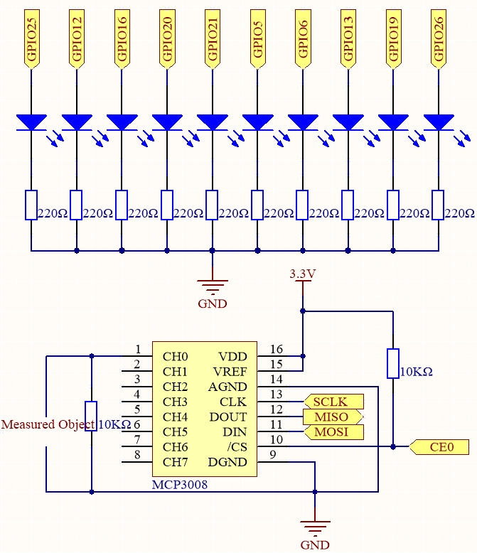

.. note::

    Hallo und willkommen in der SunFounder Raspberry Pi & Arduino & ESP32 Enthusiasten-Community auf Facebook!  
    Tauche tiefer in Raspberry Pi, Arduino und ESP32 mit anderen Enthusiasten ein.

    **Warum beitreten?**

    - **Expertenunterstützung**: Löse Probleme nach dem Kauf und technische Herausforderungen mit Hilfe unserer Community und unseres Teams.
    - **Lernen & Teilen**: Tausche Tipps und Tutorials aus, um deine Fähigkeiten zu verbessern.
    - **Exklusive Vorschauen**: Erhalte frühzeitigen Zugang zu neuen Produktankündigungen und Vorschauen.
    - **Sonderrabatte**: Genieße exklusive Rabatte auf unsere neuesten Produkte.
    - **Festliche Aktionen und Verlosungen**: Nimm an Verlosungen und Feiertagsaktionen teil.

    👉 Bereit, mit uns zu entdecken und zu erschaffen? Klicke auf [|link_sf_facebook|] und tritt noch heute bei!

.. _3.1.5_py_pi5_mcp3008:

3.1.5 Batterieanzeige (MCP3008)
================================

.. note::

   .. image:: ../img/mcp3008_and_adc0834.jpg
      :width: 25%
      :align: left
   

   Je nach Kit-Version bitte prüfen, ob **ADC0834** oder **MCP3008** enthalten ist, und mit dem entsprechenden Abschnitt fortfahren.

Einführung
----------

In diesem Projekt bauen wir ein Batterieanzeigegerät, das den Batteriestand  
visuell auf einer LED-Balkenanzeige darstellen kann.

.. warning::

    Verwende keine Batterien mit einer Spannung von mehr als 3,3 V,  
    um eine Überlastung und mögliche Schäden am Chip oder Raspberry Pi zu vermeiden.

Benötigte Komponenten
----------------------

In diesem Projekt benötigen wir die folgenden Komponenten.

.. image:: ../python_pi5/img/list2_Battery_Indicator.png
    :align: center

Schaltplan
----------

============ ======== ======== ===
T-Board-Name Physical WiringPi BCM
SPICE0       Pin 24   10       8
SPIMOSI      Pin 19   12       10
SPIMISO      Pin 21   13       9
SPISCLK      Pin 23   14       11
GPIO25       Pin 22   6        25
GPIO12       Pin 32   26       12
GPIO16       Pin 36   27       16
GPIO20       Pin 38   28       20
GPIO21       Pin 40   29       21
GPIO5        Pin 29   21       5
GPIO6        Pin 31   22       6
GPIO13       Pin 33   23       13
GPIO19       Pin 35   24       19
GPIO26       Pin 37   25       26
============ ======== ======== ===

Experimentelle Schritte
------------------------

**Schritt 1:** Baue die Schaltung auf.

.. image:: ../python_pi5/img/july24_3.1.5_battery_indicator_mcp3008.png
   :width: 800

**Schritt 2:** Richte die SPI-Schnittstelle ein und installiere die ``spidev``-Bibliothek (siehe :ref:`spi_configuration` für detaillierte Anweisungen). Falls diese Schritte bereits erledigt sind, kannst du sie überspringen.

**Schritt 3:** Wechsle in den Ordner mit dem Code.

.. raw:: html

    <run></run>

.. code-block::

    cd ~/davinci-kit-for-raspberry-pi/python-pi5

**Schritt 4:** Führe die Programmdatei aus.

.. raw:: html

    <run></run>

.. code-block::

    sudo python3 4.1.11-2_Battery_indicator_zero.py

Nachdem das Programm gestartet ist, verbinde den dritten Pin des MCP3008 und GND  
jeweils mit den beiden Polen einer Batterie.  
Du wirst sehen, dass die entsprechende LED auf der LED-Balkenanzeige leuchtet,  
um den Batteriestand anzuzeigen (Messbereich: 0–5 V).

.. warning::

    Falls die Fehlermeldung ``RuntimeError: Cannot determine SOC peripheral base address`` erscheint, siehe :ref:`faq_soc`

**Code**

.. note::
    Du kannst den folgenden Code **Ändern/Zurücksetzen/Kopieren/Ausführen/Stoppen**.  
    Vorher musst du jedoch in das Quellcode-Verzeichnis wechseln (z. B. ``davinci-kit-for-raspberry-pi/python-pi5``).  
    Nach einer Änderung kannst du den Code direkt ausführen, um den Effekt zu sehen.

.. raw:: html

    <run></run>

.. code-block:: python

    #!/usr/bin/env python3

    import LCD1602
    from gpiozero import LED, Buzzer, Button
    import spidev
    import time
    import math

    # Joystick-Taste, Summer und LED initialisieren
    Joy_BtnPin = Button(22)  # GPIO22, Pin15
    buzzPin = Buzzer(23)     # GPIO23, Pin16
    ledPin = LED(24)         # GPIO24, Pin18

    # Anfangswert für obere Temperaturgrenze
    upperTem = 40

    # SPI für MCP3008 initialisieren (Bus 0, CE0 -> GPIO8 / Pin24)
    spi = spidev.SpiDev()
    spi.open(0, 0)
    spi.max_speed_hz = 1000000  # 1 MHz

    # LCD initialisieren (I2C-Adresse 0x27, Hintergrundbeleuchtung an)
    LCD1602.init(0x27, 1)

    def read_adc(channel):
        """
        Liest den analogen Wert vom MCP3008.
        """
        if channel < 0 or channel > 7:
            return -1
        adc = spi.xfer2([1, (8 + channel) << 4, 0])
        value = ((adc[1] & 0x03) << 8) | adc[2]
        return value

    def get_joystick_value():
        """
        Liest die Joystick-Werte und gibt eine Änderungszahl je nach Joystick-Position zurück.
        """
        x_val = read_adc(1)
        y_val = read_adc(2)
        if x_val > 800:
            return 1
        elif x_val < 200:
            return -1
        elif y_val > 800:
            return -10
        elif y_val < 200:
            return 10
        else:
            return 0

    def upper_tem_setting():
        """
        Passt die obere Temperaturgrenze an und zeigt sie auf dem LCD an.
        """
        global upperTem
        LCD1602.write(0, 0, 'Upper Adjust: ')
        change = int(get_joystick_value())
        upperTem += change
        strUpperTem = str(upperTem)
        LCD1602.write(0, 1, strUpperTem)
        LCD1602.write(len(strUpperTem), 1, '              ')
        time.sleep(0.1)

    def temperature():
        """
        Liest die aktuelle Temperatur vom Sensor und gibt sie in Celsius zurück.
        """
        analogVal = read_adc(0)
        Vr = 3.3 * analogVal / 1023.0  # Spannung über dem Festwiderstand
        if Vr == 0:
            return 0  # Division durch null vermeiden
        Rt = 10000.0 * (3.3 - Vr) / Vr
        temp = 1 / (((math.log(Rt / 10000.0)) / 3950.0) + (1 / (273.15 + 25.0)))
        Cel = temp - 273.15
        return round(Cel, 2)

    def monitoring_temp():
        """
        Überwacht und zeigt die aktuelle Temperatur und die obere Temperaturgrenze an.
        Aktiviert Summer und LED, wenn die Temperatur die Obergrenze überschreitet.
        """
        global upperTem
        Cel = temperature()
        LCD1602.write(0, 0, 'Temp: ')
        LCD1602.write(0, 1, 'Upper: ')
        LCD1602.write(6, 0, str(Cel))
        LCD1602.write(7, 1, str(upperTem))
        time.sleep(0.1)
        if Cel >= upperTem:
            buzzPin.on()
            ledPin.on()
        else:
            buzzPin.off()
            ledPin.off()

    # Hauptprogrammschleife
    try:
        lastState = 1
        stage = 0
        while True:
            currentState = Joy_BtnPin.value
            if currentState == 1 and lastState == 0:
                stage = (stage + 1) % 2
                time.sleep(0.1)
                LCD1602.clear()
            lastState = currentState
            if stage == 1:
                upper_tem_setting()
            else:
                monitoring_temp()
    except KeyboardInterrupt:
        LCD1602.clear()
        spi.close()

**Code-Erklärung**

Dieses Python-Programm läuft auf einem Raspberry Pi.  
Es verwendet den MCP3008-Analog-Digital-Wandler, um Temperaturdaten von einem analogen Sensor zu lesen.  
Ein Joystick wird genutzt, um die Temperaturgrenze einzustellen, und ein LCD1602 zeigt die aktuelle Temperatur und den Grenzwert an.  
Ein Summer und eine LED werden aktiviert, wenn die Temperatur die Grenze überschreitet.

1. **Benötigte Bibliotheken importieren**

   .. code-block:: python

       import RPi.GPIO as GPIO
       import spidev
       import time
       import math
       import LCD1602

   * ``RPi.GPIO``: Steuerung der GPIO-Pins  
   * ``spidev``: Kommunikation mit MCP3008 über SPI  
   * ``math``: Temperaturberechnung  
   * ``LCD1602``: Steuerung des LCD-Displays

2. **GPIO-Setup**

   .. code-block:: python

       JOY_BTN_PIN = 22
       BUZZER_PIN = 23
       LED_PIN = 24

       GPIO.setmode(GPIO.BCM)
       GPIO.setup(JOY_BTN_PIN, GPIO.IN, pull_up_down=GPIO.PUD_UP)
       GPIO.setup(BUZZER_PIN, GPIO.OUT)
       GPIO.setup(LED_PIN, GPIO.OUT)

   * Weist Pins für Joystick-Taste, Summer und LED zu  
   * Konfiguriert die Joystick-Taste mit Pull-up-Widerstand  
   * Setzt Ausgangspins auf LOW

3. **SPI- und LCD-Initialisierung**

   .. code-block:: python

       upperTem = 40
       spi = spidev.SpiDev()
       spi.open(0, 0)
       spi.max_speed_hz = 1000000
       LCD1602.init(0x27, 1)

   * Initialisiert SPI für MCP3008  
   * Initialisiert LCD1602 über I²C-Adresse ``0x27``

4. **ADC-Kanal lesen**

   .. code-block:: python

       def read_adc(channel):
           if channel < 0 or channel > 7:
               return -1
           adc = spi.xfer2([1, (8 + channel) << 4, 0])
           value = ((adc[1] & 0x03) << 8) | adc[2]
           return value

   * Liest analoge Spannung vom MCP3008-Kanal (0–7)  
   * Gibt einen Wert zwischen 0 und 1023 zurück

5. **Joystick-Richtung lesen**

   .. code-block:: python

       def get_joystick_value():
           x_val = read_adc(1)
           y_val = read_adc(2)
           ...

   * Liest X- und Y-Achse des Joysticks  
   * Wandelt Bewegung in Änderung des Grenzwerts um (+/- 1 oder +/- 10)

6. **Temperaturgrenze anpassen**

   .. code-block:: python

       def upper_tem_setting():
           global upperTem
           ...

   * Passt ``upperTem`` per Joystick an  
   * Zeigt den aktuellen Wert auf dem LCD an

7. **Temperatur berechnen**

   .. code-block:: python

       def temperature():
           analogVal = read_adc(0)
           ...

   * Wandelt Spannung in Widerstand und dann in Temperatur um  
   * Nutzt die Steinhart-Hart-Gleichung

8. **Überwachungsmodus**

   .. code-block:: python

       def monitoring_temp():
           global upperTem
           ...

   * Zeigt aktuelle Temperatur und Grenzwert  
   * Aktiviert Summer und LED, wenn Temperatur ≥ Grenzwert

9. **Hauptschleife**

   .. code-block:: python

       try:
           lastState = GPIO.input(JOY_BTN_PIN)
           stage = 0
           ...

   * Wechselt mit Joystick-Taste zwischen  
     * ``stage 0``: Temperaturüberwachung  
     * ``stage 1``: Grenzwertanpassung

10. **Beenden und Aufräumen**

   .. code-block:: python

       except KeyboardInterrupt:
           pass
       finally:
           LCD1602.clear()
           GPIO.cleanup()
           spi.close()

   * Stellt sicher, dass GPIO und LCD nach Programmende zurückgesetzt werden
