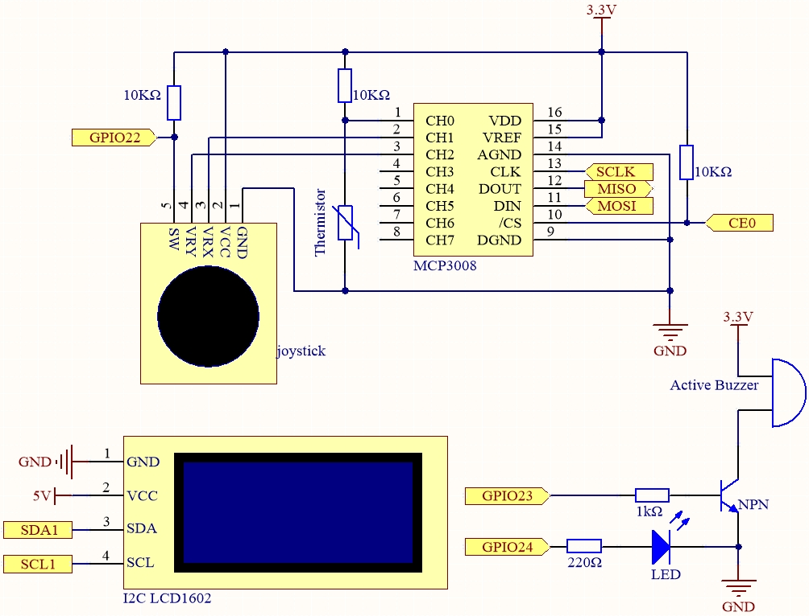
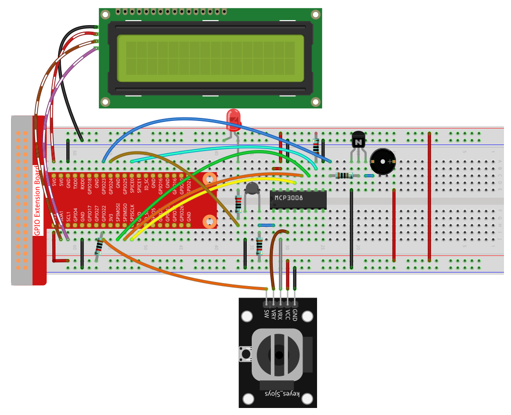

.. note::

    ¡Hola! Bienvenido a la Comunidad de Entusiastas de SunFounder Raspberry Pi & Arduino & ESP32 en Facebook. Profundiza en Raspberry Pi, Arduino y ESP32 junto con otros entusiastas.

    **¿Por qué unirse?**

    - **Soporte experto**: Resuelve problemas postventa y desafíos técnicos con la ayuda de nuestra comunidad y equipo.
    - **Aprender y compartir**: Intercambia consejos y tutoriales para mejorar tus habilidades.
    - **Vistas previas exclusivas**: Obtén acceso anticipado a nuevos anuncios de productos y adelantos.
    - **Descuentos especiales**: Disfruta de descuentos exclusivos en nuestros productos más recientes.
    - **Promociones y sorteos festivos**: Participa en sorteos y promociones de temporada.

    👉 ¿Listo para explorar y crear con nosotros? Haz clic en [|link_sf_facebook|] y únete hoy mismo.

.. _3.1.8_py_pi5_mcp3008:

3.1.8 Monitor de sobrecalentamiento (MCP3008)
=============================================

.. note::

   .. image:: ../img/mcp3008_and_adc0834.jpg
      :width: 25%
      :align: left
    

   Dependiendo de la versión de tu kit, identifica si tienes **ADC0834** o **MCP3008** y procede con la sección correspondiente.

Introducción
------------

Podrías querer fabricar un dispositivo de monitoreo de sobrecalentamiento que se aplique a diversas situaciones, por ejemplo, en una fábrica, si queremos tener una alarma y el apagado automático de la máquina cuando un circuito se sobrecalienta. En este proyecto, usaremos un termistor, joystick, zumbador, LED y LCD para crear un dispositivo inteligente de monitoreo de temperatura cuyo umbral sea ajustable.

Componentes necesarios
-----------------------

En este proyecto, necesitamos los siguientes componentes.

.. image:: ../python_pi5/img/list2_Overheat_Monitor.png
    :width: 800
    :align: center

Diagrama esquemático
--------------------

============ ======== ======== ===
T-Board Name physical wiringPi BCM
SPICE0       Pin 24   10       8
SPIMOSI      Pin 19   12       10
SPIMISO      Pin 21   13       9
SPISCLK      Pin 23   14       11
GPIO22       Pin15    3        22
GPIO23       Pin16    4        23
GPIO24       Pin18    5        24
SDA1         Pin 3             
SCL1         Pin 5             
============ ======== ======== ===

Procedimientos experimentales
------------------------------

**Paso 1:** Construir el circuito.

**Paso 2:** Configurar la interfaz SPI e instalar la librería ``spidev`` (consulta :ref:`spi_configuration` para instrucciones detalladas). Si ya completaste estos pasos, puedes saltar este.

**Paso 3:** Ir a la carpeta del código.

.. raw:: html

   <run></run>

.. code-block:: 

    cd ~/davinci-kit-for-raspberry-pi/python-pi5

**Paso 4:** Ejecutar el archivo.

.. raw:: html

   <run></run>

.. code-block:: 

    sudo python3 3.1.8-2_OverheatMonitor_zero.py

Cuando el código se ejecute, la temperatura actual y el umbral de alta temperatura **40** se mostrarán en la **I2C LCD1602**. Si la temperatura actual es mayor que el umbral, el zumbador y el LED se activarán para avisarte.

El **joystick** aquí se utiliza para ajustar el umbral de alta temperatura. Mover el **joystick** en la dirección del eje X o Y ajusta (sube o baja) el umbral. Presionar el **joystick** nuevamente restablece el umbral a su valor inicial.

.. note::

    * Si recibes el error ``FileNotFoundError: [Errno 2] No such file or directory: '/dev/i2c-1'``, debes consultar :ref:`i2c_config` para habilitar el I2C.
    * Si recibes el error ``ModuleNotFoundError: No module named 'smbus2'``, ejecuta ``sudo pip3 install smbus2``.
    * Si aparece el error ``OSError: [Errno 121] Remote I/O error``, significa que el módulo está mal cableado o está dañado.
    * Si el código y el cableado son correctos, pero el LCD aún no muestra contenido, puedes girar el potenciómetro en la parte posterior para aumentar el contraste.

.. warning::

    Si aparece el error ``RuntimeError: Cannot determine SOC peripheral base address``, consulta :ref:`faq_soc`

Código
------

.. note::
    Puedes **Modificar/Restablecer/Copiar/Ejecutar/Detener** el código de abajo. Pero antes, debes ir a la ruta del código fuente como ``davinci-kit-for-raspberry-pi/python``. Después de modificarlo, puedes ejecutarlo directamente para ver el efecto.

.. raw:: html

    <run></run>

.. code-block:: python

    #!/usr/bin/env python3

    import LCD1602
    from gpiozero import LED, Buzzer, Button
    import spidev
    import time
    import math

    # Inicializar botón del joystick, zumbador y LED
    Joy_BtnPin = Button(22)  # GPIO22, Pin15
    buzzPin = Buzzer(23)     # GPIO23, Pin16
    ledPin = LED(24)         # GPIO24, Pin18

    # Umbral superior de temperatura inicial
    upperTem = 40

    # Inicializar SPI para MCP3008 (Bus 0, CE0 -> GPIO8 / Pin24)
    spi = spidev.SpiDev()
    spi.open(0, 0)
    spi.max_speed_hz = 1000000  # 1 MHz

    # Inicializar LCD (dirección I2C 0x27, retroiluminación encendida)
    LCD1602.init(0x27, 1)

    def read_adc(channel):
        """
        Lee valor analógico del MCP3008 (0–7)
        """
        if channel < 0 or channel > 7:
            return -1
        adc = spi.xfer2([1, (8 + channel) << 4, 0])
        value = ((adc[1] & 0x03) << 8) | adc[2]
        return value

    def get_joystick_value():
        """
        Lee los valores del joystick y retorna un cambio según su posición.
        """
        x_val = read_adc(1)
        y_val = read_adc(2)
        if x_val > 800:
            return 1
        elif x_val < 200:
            return -1
        elif y_val > 800:
            return -10
        elif y_val < 200:
            return 10
        else:
            return 0

    def upper_tem_setting():
        """
        Ajusta y muestra en el LCD el umbral superior de temperatura.
        """
        global upperTem
        LCD1602.write(0, 0, 'Upper Adjust: ')
        change = int(get_joystick_value())
        upperTem += change
        strUpperTem = str(upperTem)
        LCD1602.write(0, 1, strUpperTem)
        LCD1602.write(len(strUpperTem), 1, '              ')
        time.sleep(0.1)

    def temperature():
        """
        Lee la temperatura actual del sensor y la retorna en Celsius.
        """
        analogVal = read_adc(0)
        Vr = 3.3 * analogVal / 1023.0  # Voltaje a través de la resistencia fija
        if Vr == 0:
            return 0  # Evita división por cero
        Rt = 10000.0 * Vr / (3.3 - Vr)  # Fórmula ajustada: voltaje del termistor es (3.3 - Vr)
        temp = 1 / (((math.log(Rt / 10000.0)) / 3950.0) + (1 / (273.15 + 25.0)))
        Cel = temp - 273.15
        return round(Cel, 2)

    def monitoring_temp():
        """
        Monitorea y muestra la temperatura y el umbral en el LCD.
        Activa zumbador y LED si la temperatura supera el límite.
        """
        global upperTem
        Cel = temperature()
        LCD1602.write(0, 0, 'Temp: ')
        LCD1602.write(0, 1, 'Upper: ')
        LCD1602.write(6, 0, str(Cel))
        LCD1602.write(7, 1, str(upperTem))
        time.sleep(0.1)
        if Cel >= upperTem:
            buzzPin.on()
            ledPin.on()
        else:
            buzzPin.off()
            ledPin.off()

    # Bucle principal
    try:
        lastState = 1
        stage = 0
        while True:
            currentState = Joy_BtnPin.value
            if currentState == 1 and lastState == 0:
                stage = (stage + 1) % 2
                time.sleep(0.1)
                LCD1602.clear()
            lastState = currentState
            if stage == 1:
                upper_tem_setting()
            else:
                monitoring_temp()
    except KeyboardInterrupt:
        LCD1602.clear()
        spi.close()

Explicación del código
----------------------

#. Esta sección importa las librerías necesarias. ``LCD1602`` es para la pantalla LCD vía I2C, ``gpiozero`` provee soporte para el LED, zumbador y botón, ``spidev`` se usa para comunicarse con el ADC MCP3008 y las librerías estándar ``time`` y ``math`` se usan para retardos y cálculos de temperatura.

   .. code-block:: python

       #!/usr/bin/env python3

       import LCD1602
       from gpiozero import LED, Buzzer, Button
       import spidev
       import time
       import math

#. Inicializa los componentes de hardware conectados a los pines GPIO:

   * ``Button(22)`` conecta el botón del joystick.
   * ``Buzzer(23)`` y ``LED(24)`` sirven como indicadores de sobrecalentamiento.

   .. code-block:: python

       Joy_BtnPin = Button(22)  # GPIO22, Pin15
       buzzPin = Buzzer(23)     # GPIO23, Pin16
       ledPin = LED(24)         # GPIO24, Pin18

#. Establece el umbral superior de temperatura por defecto e inicializa SPI para MCP3008 y la pantalla LCD1602.

   .. code-block:: python

       upperTem = 40

       spi = spidev.SpiDev()
       spi.open(0, 0)
       spi.max_speed_hz = 1000000

       LCD1602.init(0x27, 1)

#. ``read_adc`` lee el valor analógico de un canal específico (0–7) del MCP3008 y retorna un valor de 10 bits.

   .. code-block:: python

       def read_adc(channel):
           if channel < 0 or channel > 7:
               return -1
           adc = spi.xfer2([1, (8 + channel) << 4, 0])
           value = ((adc[1] & 0x03) << 8) | adc[2]
           return value

#. ``get_joystick_value`` evalúa la posición del joystick leyendo los canales 1 y 2 del MCP3008 y retorna valores diferentes para ajustes de umbral según la dirección del movimiento.

   .. code-block:: python

       def get_joystick_value():
           x_val = read_adc(1)
           y_val = read_adc(2)
           if x_val > 800:
               return 1
           elif x_val < 200:
               return -1
           elif y_val > 800:
               return -10
           elif y_val < 200:
               return 10
           else:
               return 0

#. ``upper_tem_setting`` ajusta el umbral superior con el joystick y lo muestra en el LCD, asegurando un formato limpio.

   .. code-block:: python

       def upper_tem_setting():
           global upperTem
           LCD1602.write(0, 0, 'Upper Adjust: ')
           change = int(get_joystick_value())
           upperTem += change
           strUpperTem = str(upperTem)
           LCD1602.write(0, 1, strUpperTem)
           LCD1602.write(len(strUpperTem), 1, '              ')
           time.sleep(0.1)

#. ``temperature`` lee el valor analógico del canal 0 (termistor), calcula el voltaje, la resistencia y finalmente la temperatura en Celsius usando la aproximación de Steinhart–Hart.

   .. code-block:: python

        def temperature():
            """
            Reads the current temperature from the sensor and returns it in Celsius.
            """
            analogVal = read_adc(0)
            Vr = 3.3 * analogVal / 1023.0  # Voltage across the fixed resistor
            if Vr == 0:
                return 0  # Prevent division by zero
            Rt = 10000.0 * Vr / (3.3 - Vr)  # Adjusted formula: thermistor voltage is (3.3 - Vr)
            temp = 1 / (((math.log(Rt / 10000.0)) / 3950.0) + (1 / (273.15 + 25.0)))
            Cel = temp - 273.15
            return round(Cel, 2)

#. ``monitoring_temp`` lee continuamente la temperatura actual, la compara con el umbral y muestra ambos valores en el LCD. Si la temperatura excede el umbral, enciende el zumbador y el LED.

   .. code-block:: python

       def monitoring_temp():
           global upperTem
           Cel = temperature()
           LCD1602.write(0, 0, 'Temp: ')
           LCD1602.write(0, 1, 'Upper: ')
           LCD1602.write(6, 0, str(Cel))
           LCD1602.write(7, 1, str(upperTem))
           time.sleep(0.1)
           if Cel >= upperTem:
               buzzPin.on()
               ledPin.on()
           else:
               buzzPin.off()
               ledPin.off()

#. El bucle principal alterna entre modo de ajuste y modo de monitoreo usando el botón del joystick. Una pulsación cambia de modo. En ajuste, se modifica el umbral; en monitoreo, se verifica la temperatura.

   .. code-block:: python

       try:
           lastState = 1
           stage = 0
           while True:
               currentState = Joy_BtnPin.value
               if currentState == 1 and lastState == 0:
                   stage = (stage + 1) % 2
                   time.sleep(0.1)
                   LCD1602.clear()
               lastState = currentState
               if stage == 1:
                   upper_tem_setting()
               else:
                   monitoring_temp()

#. Al salir con interrupción de teclado, se limpia la pantalla LCD y se cierra la comunicación SPI.

   .. code-block:: python

       except KeyboardInterrupt:
           LCD1602.clear()
           spi.close()
